# GR00T 1.6 Architecture and Pipeline Documentation

This document provides a comprehensive technical overview of GR00T 1.6, covering the model architecture, data pipeline, training mechanism, and inference workflow for the SO-101 robot.

---

## Table of Contents

1. [Architecture Overview](#1-architecture-overview)
2. [Model Components Deep Dive](#2-model-components-deep-dive)
3. [Data Pipeline](#3-data-pipeline)
4. [Configuration System](#4-configuration-system)
5. [Training Pipeline](#5-training-pipeline)
6. [Inference Pipeline](#6-inference-pipeline)
7. [Walkthrough Example](#7-walkthrough-example)
8. [Key Files Reference](#8-key-files-reference)

---

## 1. Architecture Overview

GR00T 1.6 is a Vision-Language-Action (VLA) model that combines a powerful vision-language backbone with a diffusion-based action head using **Flow Matching** for smooth, multi-step action prediction.

### High-Level Architecture

```mermaid
graph TB
    subgraph Inputs
        IMG[Camera Images<br/>640x480 RGB]
        STATE[Robot State<br/>6D: 5 arm + 1 gripper]
        LANG[Task Description<br/>"pick the red cube"]
    end

    subgraph "GR00T 1.6 Model"
        subgraph "Eagle Backbone (2B params)"
            VE[SigLIP Vision Encoder<br/>400M params]
            LLM[Qwen2.5 LLM<br/>3B params]
        end

        subgraph "Action Head (32-layer DiT)"
            SE[State Encoder<br/>CategorySpecificMLP]
            AE[Action Encoder<br/>MultiEmbodimentEncoder]
            DIT[AlternateVLDiT<br/>32 transformer blocks]
            AD[Action Decoder<br/>CategorySpecificMLP]
        end
    end

    subgraph Outputs
        ACT[Action Prediction<br/>16 steps × 6D]
    end

    IMG --> VE
    LANG --> LLM
    VE --> LLM
    LLM -->|"backbone_features<br/>[B, seq, 3584]"| DIT
    STATE --> SE
    SE -->|"state_features<br/>[B, 1, 1024]"| DIT
    DIT --> AD
    AD --> ACT
```

### Key Specifications

| Component | Specification |
|-----------|---------------|
| **Total Parameters** | ~3B (backbone) + ~400M (action head) |
| **Backbone** | Eagle-Block2A-2B-v2 (NVEagle) |
| **Vision Encoder** | SigLIP-SO400M-patch14-384 |
| **Language Model** | Qwen2.5-3B-Instruct |
| **Action Head** | 32-layer AlternateVLDiT |
| **Hidden Dimension** | 1024 |
| **Action Horizon** | 16 steps |
| **Inference Denoising Steps** | 4 (default) |

---

## 2. Model Components Deep Dive

### 2.1 Eagle Backbone

The Eagle backbone combines vision and language understanding:

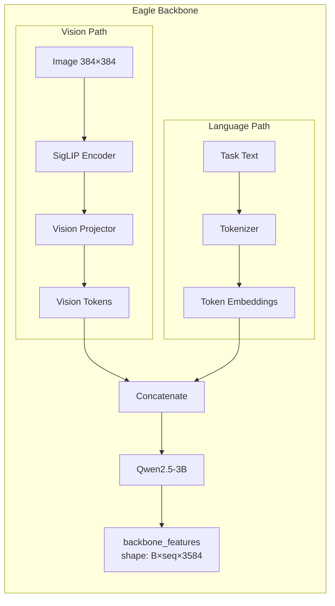

**File:** `gr00t/model/modules/eagle_backbone.py`

```python
class EagleBackbone(nn.Module):
    def __init__(self, model_name, tune_llm, tune_visual, ...):
        self.model = AutoModel.from_pretrained(model_name)
        # SigLIP vision encoder + Qwen2.5 LLM
```

### 2.2 Action Head (AlternateVLDiT)

The action head uses **Flow Matching** (not traditional diffusion) for action generation:

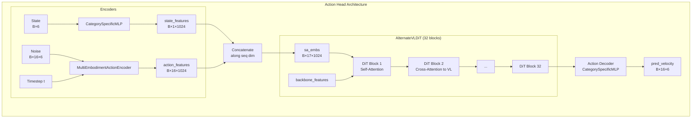

**Key Insight:** AlternateVLDiT alternates between self-attention (within state+action) and cross-attention (to vision-language features) every N blocks.

**File:** `gr00t/model/modules/dit.py`

```python
class AlternateVLDiT(nn.Module):
    """DiT with alternating attention to vision-language features."""
    # attend_text_every_n_blocks controls cross-attention frequency
```

### 2.3 Multi-Embodiment Conditioning

GR00T supports multiple robot types through embodiment-conditioned MLPs:

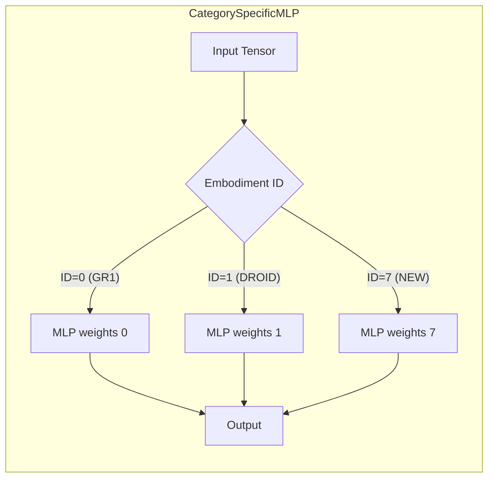

**File:** `gr00t/model/modules/embodiment_conditioned_mlp.py`

This allows the same base model to handle different robots with different action/state dimensions.

---

## 3. Data Pipeline

### 3.1 Data Flow Overview

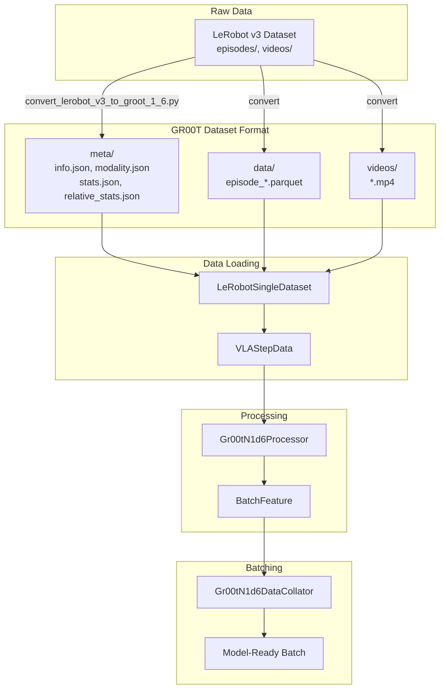

### 3.2 VLAStepData Structure

The core data structure returned by dataset loaders:

```python
@dataclass
class VLAStepData:
    images: dict[str, list[np.ndarray]]  # {"head": [img], "wrist": [img]}
    states: dict[str, np.ndarray]        # {"single_arm": [5], "gripper": [1]}
    actions: dict[str, np.ndarray]       # {"single_arm": [16,5], "gripper": [16,1]}
    text: str | None                     # "pick the red cube"
    embodiment: EmbodimentTag            # EmbodimentTag.NEW_EMBODIMENT
```

**File:** `gr00t/data/types.py`

### 3.3 Processing Pipeline

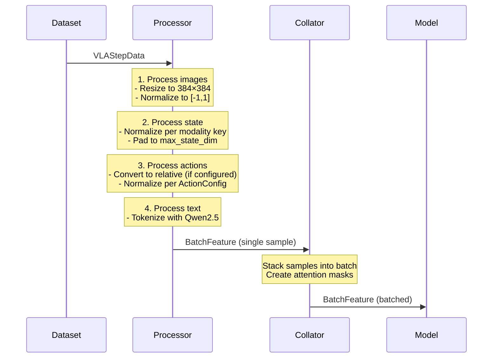

**Files:**
- `gr00t/model/gr00t_n1d6/processing_gr00t_n1d6.py` - Gr00tN1d6Processor
- `gr00t/data/collate.py` - Gr00tN1d6DataCollator

### 3.4 Input/Output Data Formats

#### Raw Input (from dataset)

```python
# VLAStepData example for SO-101
{
    "images": {
        "head": [np.array([480, 640, 3], dtype=uint8)],
        "wrist": [np.array([480, 640, 3], dtype=uint8)]
    },
    "states": {
        "single_arm": np.array([0.1, 0.2, 0.3, 0.4, 0.5]),  # 5 joint angles (radians)
        "gripper": np.array([0.8])                           # gripper position [0-1]
    },
    "actions": {
        "single_arm": np.array([[0.01, 0.02, ...], ...]),   # shape: [16, 5]
        "gripper": np.array([[0.05], ...])                   # shape: [16, 1]
    },
    "text": "pick up the red cube from the table"
}
```

#### After Processing (BatchFeature)

```python
# BatchFeature ready for model
{
    "pixel_values": tensor([B, 2, 3, 384, 384]),  # 2 cameras, normalized
    "input_ids": tensor([B, seq_len]),            # tokenized text
    "attention_mask": tensor([B, seq_len]),       # text attention mask
    "state": tensor([B, max_state_dim]),          # padded, normalized state
    "action": tensor([B, 16, max_action_dim]),    # padded, normalized actions
    "action_mask": tensor([B, 16, max_action_dim]), # which dims are valid
    "embodiment_id": tensor([B]),                 # embodiment index (e.g., 7)
}
```

---

## 4. Configuration System

### 4.1 Configuration Hierarchy

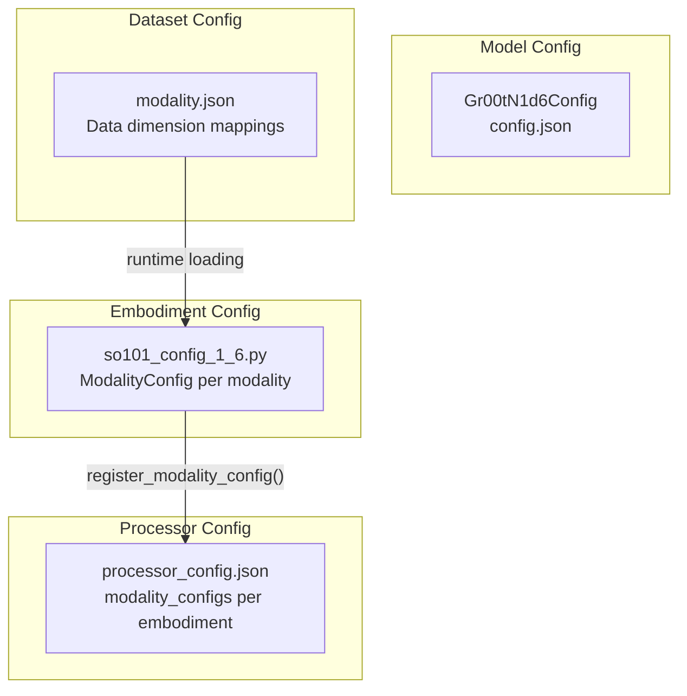

### 4.2 modality.json (Dataset Level)

Defines how raw data dimensions map to modality keys:

```json
{
  "state": {
    "single_arm": {"start": 0, "end": 5},
    "gripper": {"start": 5, "end": 6}
  },
  "action": {
    "single_arm": {"start": 0, "end": 5},
    "gripper": {"start": 5, "end": 6}
  },
  "video": {
    "head": {"original_key": "observation.images.head"},
    "wrist": {"original_key": "observation.images.left_wrist"}
  },
  "annotation": {
    "human.action.task_description": {"original_key": "task_index"}
  }
}
```

**Location:** `datasets/so101_pick_place_groot/meta/modality.json`

### 4.3 ModalityConfig (Embodiment Level)

Defines how the processor should handle each modality:

```python
# so101_config_1_6.py
so101_config = {
    "video": ModalityConfig(
        delta_indices=[0],                    # Current frame only
        modality_keys=["head", "wrist"],      # Match modality.json
    ),
    "state": ModalityConfig(
        delta_indices=[0],                    # Current state only
        modality_keys=["single_arm", "gripper"],
    ),
    "action": ModalityConfig(
        delta_indices=list(range(16)),        # 16-step horizon
        modality_keys=["single_arm", "gripper"],
        action_configs=[
            ActionConfig(
                rep=ActionRepresentation.RELATIVE,  # Delta from current
                type=ActionType.NON_EEF,            # Joint space
                format=ActionFormat.DEFAULT,
            ),
            ActionConfig(
                rep=ActionRepresentation.ABSOLUTE,  # Direct position
                type=ActionType.NON_EEF,
                format=ActionFormat.DEFAULT,
            ),
        ],
    ),
    "language": ModalityConfig(
        delta_indices=[0],
        modality_keys=["annotation.human.action.task_description"],
    ),
}
```

**File:** `custom/scripts/ver1_6/so101_config_1_6.py`

### 4.4 ActionConfig Details

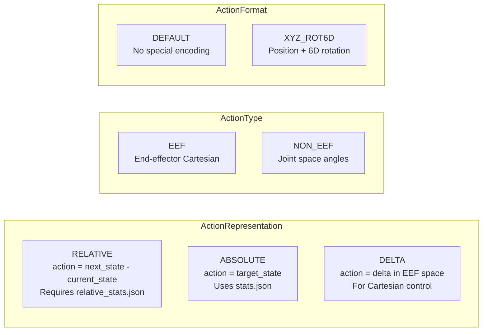

### 4.5 Statistics Files

#### stats.json (Absolute Statistics)

```json
{
  "single_arm": {
    "min": [-1.5, -0.5, -1.2, -1.5, -3.14],
    "max": [1.5, 2.5, 1.2, 1.5, 3.14],
    "mean": [0.0, 1.0, 0.0, 0.0, 0.0],
    "std": [0.5, 0.3, 0.4, 0.5, 1.0]
  },
  "gripper": {
    "min": [0.0],
    "max": [1.0],
    "mean": [0.5],
    "std": [0.25]
  }
}
```

#### relative_stats.json (For Relative Actions)

**CRITICAL for GR00T 1.6 with `ActionRepresentation.RELATIVE`**

```json
{
  "single_arm": {
    "single_arm": {
      "min": [-0.1, -0.1, -0.1, -0.1, -0.2],
      "max": [0.1, 0.1, 0.1, 0.1, 0.2],
      "mean": [0.0, 0.0, 0.0, 0.0, 0.0],
      "std": [0.02, 0.02, 0.02, 0.02, 0.05]
    }
  }
}
```

The nested structure `single_arm.single_arm` exists because relative stats track state-action pairs.

---

## 5. Training Pipeline

### 5.1 Training Flow

```mermaid
sequenceDiagram
    participant CFG as Config
    participant DS as Dataset
    participant MODEL as Gr00tN1d6
    participant BACK as Backbone
    participant HEAD as ActionHead
    participant OPT as Optimizer

    CFG->>DS: Load dataset with ModalityConfig
    loop Each Training Step
        DS->>MODEL: BatchFeature (images, state, action, text)
        MODEL->>BACK: Forward pass
        Note over BACK: Process images + text<br/>Return backbone_features
        BACK->>HEAD: backbone_features + action_input
        Note over HEAD: 1. Encode state<br/>2. Sample noise t ~ Beta(α,β)<br/>3. Create noisy_trajectory<br/>4. Forward through DiT<br/>5. Predict velocity<br/>6. Compute MSE loss
        HEAD->>MODEL: loss, action_loss
        MODEL->>OPT: loss.backward()
        OPT->>MODEL: optimizer.step()
    end
```

### 5.2 Flow Matching Training

GR00T 1.6 uses **Flow Matching** instead of traditional diffusion:

```mermaid
graph LR
    subgraph "Flow Matching Loss"
        A0[Pure Noise<br/>x_0] -->|"t=0"| PATH[Linear Path]
        PATH -->|"t=1"| A1[Ground Truth<br/>x_1 = action]

        T[Sample t ~ Beta] --> INTERP[Interpolate]
        A0 --> INTERP
        A1 --> INTERP
        INTERP --> NT[Noisy Trajectory<br/>x_t = (1-t)x_0 + t*x_1]

        NT --> MODEL[DiT Model]
        MODEL --> VPRED[Predicted Velocity<br/>v_pred]

        A1 --> VTRUE[True Velocity<br/>v = x_1 - x_0]
        A0 --> VTRUE

        VPRED --> LOSS[MSE Loss]
        VTRUE --> LOSS
    end
```

**Key equations:**
```
x_t = (1-t) * noise + t * action       # Interpolation
v_true = action - noise                  # True velocity
loss = MSE(v_pred, v_true) * action_mask
```

### 5.3 Finetuning Mechanism

GR00T 1.6 uses **selective parameter freezing** (not LoRA):

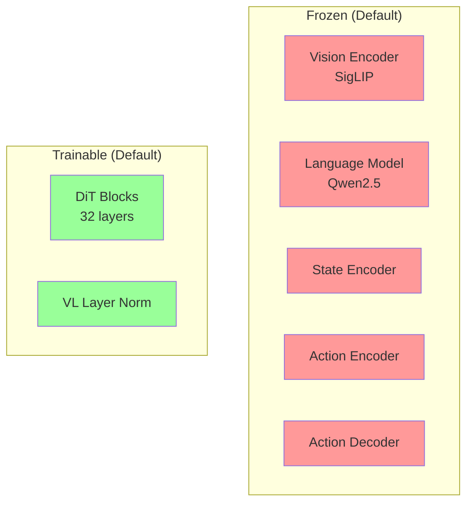

**Configuration in `Gr00tN1d6Config`:**
```python
tune_llm: bool = False           # Freeze LLM
tune_visual: bool = False        # Freeze vision encoder
tune_projector: bool = False     # Freeze state/action encoders
tune_diffusion_model: bool = True  # Train DiT blocks
tune_vlln: bool = True           # Train VL layer norm
```

This approach:
- Preserves pretrained vision-language understanding
- Trains only the action generation components
- Reduces VRAM from 60GB+ to ~18-22GB
- Prevents catastrophic forgetting

### 5.4 Training Script

```bash
# custom/scripts/ver1_6/train_groot_so101_1_6.sh
MAX_STEPS=10000 \
LEARNING_RATE=1e-4 \
GLOBAL_BATCH_SIZE=16 \
bash custom/scripts/ver1_6/train_groot_so101_1_6.sh
```

---

## 6. Inference Pipeline

### 6.1 Inference Flow

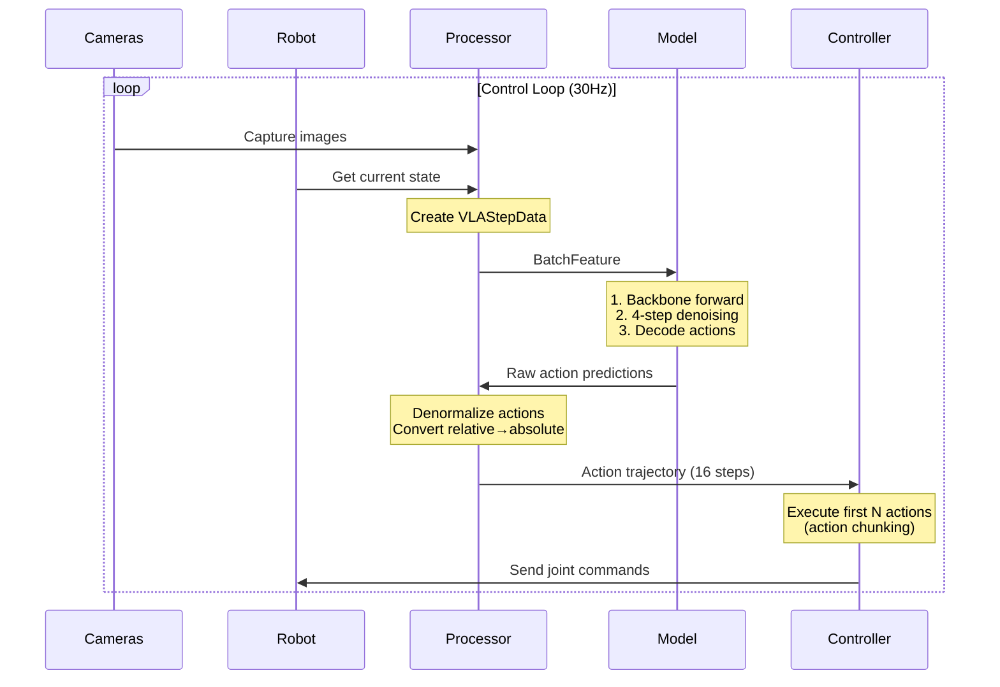

### 6.2 Flow Matching Denoising (Inference)

```mermaid
graph TB
    subgraph "4-Step Euler Integration"
        X0[x_0 = Random Noise<br/>shape: B×16×6] --> STEP1

        subgraph STEP1[Step 1: t=0.00]
            T1[t_disc = 0] --> DIT1[DiT Forward]
            DIT1 --> V1[v_pred_1]
            V1 --> UPD1[x_1 = x_0 + 0.25 * v_1]
        end

        UPD1 --> STEP2
        subgraph STEP2[Step 2: t=0.25]
            T2[t_disc = 25] --> DIT2[DiT Forward]
            DIT2 --> V2[v_pred_2]
            V2 --> UPD2[x_2 = x_1 + 0.25 * v_2]
        end

        UPD2 --> STEP3
        subgraph STEP3[Step 3: t=0.50]
            T3[t_disc = 50] --> DIT3[DiT Forward]
            DIT3 --> V3[v_pred_3]
            V3 --> UPD3[x_3 = x_2 + 0.25 * v_3]
        end

        UPD3 --> STEP4
        subgraph STEP4[Step 4: t=0.75]
            T4[t_disc = 75] --> DIT4[DiT Forward]
            DIT4 --> V4[v_pred_4]
            V4 --> UPD4[x_4 = x_3 + 0.25 * v_4]
        end

        UPD4 --> XFINAL[x_final = Predicted Actions<br/>shape: B×16×6]
    end
```

**Code from `gr00t_n1d6.py`:**
```python
@torch.no_grad()
def get_action_with_features(...):
    # Initialize with random noise
    actions = torch.randn(size=(B, action_horizon, action_dim))

    dt = 1.0 / num_inference_timesteps  # dt = 0.25 for 4 steps

    for t in range(num_inference_timesteps):
        t_cont = t / num_inference_timesteps  # 0, 0.25, 0.5, 0.75
        # Forward through DiT
        pred_velocity = model(...)
        # Euler integration
        actions = actions + dt * pred_velocity

    return actions
```

### 6.3 Action Denormalization

After getting normalized predictions, convert back to robot-space:

```mermaid
graph LR
    subgraph "Relative Action Denormalization"
        NORM[Normalized Action<br/>[-1, 1]] --> SCALE[Scale by stats]
        STATS[relative_stats.json] --> SCALE
        SCALE --> DELTA[Delta Action<br/>radians]
        CURR[Current State] --> ADD[Add]
        DELTA --> ADD
        ADD --> ABS[Absolute Target<br/>joint angles]
    end
```

```python
# Denormalization formula for RELATIVE actions
delta = normalized_action * (max - min) / 2 + (max + min) / 2  # Or using mean/std
absolute_action = current_state + delta
```

### 6.4 Action Chunking

Only execute first N steps, then re-predict:

```
Prediction: [a0, a1, a2, a3, a4, a5, a6, a7, a8, a9, a10, a11, a12, a13, a14, a15]
                 ↑↑↑ Execute first 4 actions, then re-predict
```

This provides:
- Temporal smoothing
- Error correction through replanning
- Balance between reactivity and smoothness

---

## 7. Walkthrough Example

### 7.1 Complete Data Flow for One Training Step

Let's trace a single training step with concrete values:

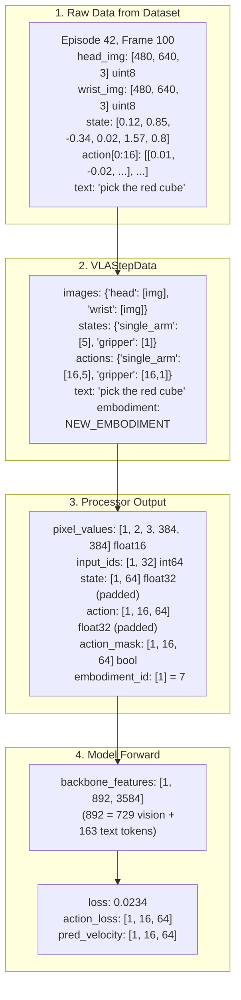

### 7.2 Detailed Processing Steps

#### Step 1: Image Processing

```python
# Input: head_img [480, 640, 3] uint8, values [0, 255]

# 1. Resize to 384x384
img_resized = cv2.resize(head_img, (384, 384))

# 2. Convert to float and normalize to [-1, 1]
# SigLIP normalization
img_normalized = (img_resized / 255.0 - 0.5) / 0.5

# 3. Transpose to [C, H, W]
pixel_values = img_normalized.transpose(2, 0, 1)

# Output: [3, 384, 384] float32, values [-1, 1]
```

#### Step 2: State Processing

```python
# Input: state = [0.12, 0.85, -0.34, 0.02, 1.57, 0.8]
#        indices: [shoulder_pan, shoulder_lift, elbow, wrist_flex, wrist_roll, gripper]

# 1. Split by modality key
single_arm = state[0:5]  # [0.12, 0.85, -0.34, 0.02, 1.57]
gripper = state[5:6]     # [0.8]

# 2. Normalize using stats.json
# min-max normalization to [-1, 1]
single_arm_norm = 2 * (single_arm - min) / (max - min) - 1
gripper_norm = 2 * (gripper - min) / (max - min) - 1

# 3. Concatenate and pad to max_state_dim (64)
state_final = np.zeros(64)
state_final[0:5] = single_arm_norm
state_final[5:6] = gripper_norm

# Output: [64] float32, values [-1, 1]
```

#### Step 3: Action Processing (RELATIVE)

```python
# Input: raw_actions [16, 6] - next 16 target positions
# Current state: [0.12, 0.85, -0.34, 0.02, 1.57, 0.8]

# 1. Convert to relative (delta) for single_arm
for t in range(16):
    delta = raw_actions[t, 0:5] - current_state[0:5]
    relative_actions[t, 0:5] = delta

# 2. Keep gripper as absolute
relative_actions[:, 5:6] = raw_actions[:, 5:6]

# 3. Normalize using relative_stats.json for arm
arm_norm = (relative_actions[:, 0:5] - mean) / std
# Normalize using stats.json for gripper
grip_norm = 2 * (relative_actions[:, 5:6] - min) / (max - min) - 1

# 4. Pad to max_action_dim (64)
action_final = np.zeros((16, 64))
action_final[:, 0:5] = arm_norm
action_final[:, 5:6] = grip_norm

# 5. Create action_mask
action_mask = np.zeros((16, 64), dtype=bool)
action_mask[:, 0:6] = True  # Only first 6 dims are valid

# Output: action [16, 64], action_mask [16, 64]
```

#### Step 4: Backbone Forward

```python
# Inputs:
#   pixel_values: [B, 2, 3, 384, 384]  # 2 cameras
#   input_ids: [B, 32]                  # tokenized text

# Vision encoding
# SigLIP processes 384x384 → 27x27 = 729 patches per image
# 2 images × 729 patches = 1458 vision tokens
# After projection: [B, 1458, 3584]

# Text encoding
# Qwen2.5 tokenizes "pick the red cube" → 163 tokens
# [B, 163, 3584]

# Concatenate and process through LLM
backbone_features = qwen2_5(concat(vision_tokens, text_tokens))
# Output: [B, 892, 3584]  # Some tokens merged/compressed
```

#### Step 5: Action Head Forward (Training)

```python
# Inputs:
#   backbone_features: [B, 892, 3584]
#   state: [B, 64]
#   action: [B, 16, 64]
#   embodiment_id: [B] = 7

# 1. Encode state
state_features = state_encoder(state, embodiment_id)  # [B, 1, 1024]

# 2. Sample timestep
t = Beta(0.5, 0.5).sample()  # e.g., t = 0.7

# 3. Create noisy trajectory
noise = torch.randn(B, 16, 64)
noisy_trajectory = (1 - t) * noise + t * action  # Interpolate

# 4. Encode noisy action
t_discrete = int(t * 100)  # = 70
action_features = action_encoder(noisy_trajectory, t_discrete, embodiment_id)
# [B, 16, 1024]

# 5. Concatenate state + action features
sa_embeds = torch.cat([state_features, action_features], dim=1)  # [B, 17, 1024]

# 6. Forward through DiT with cross-attention to backbone
for block in dit_blocks:
    if block.is_self_attention:
        sa_embeds = block.self_attn(sa_embeds)
    else:
        sa_embeds = block.cross_attn(sa_embeds, backbone_features)

# 7. Decode to velocity prediction
pred = action_decoder(sa_embeds, embodiment_id)  # [B, 17, 64]
pred_velocity = pred[:, 1:]  # Take action part [B, 16, 64]

# 8. Compute loss
true_velocity = action - noise
loss = MSE(pred_velocity, true_velocity) * action_mask
loss = loss.sum() / action_mask.sum()

# Output: loss = 0.0234
```

### 7.3 Inference Example

```python
# During robot operation:

# 1. Capture current observation
head_img = camera_head.capture()
wrist_img = camera_wrist.capture()
current_state = robot.get_joint_positions()  # [6]

# 2. Create VLAStepData (no ground truth actions)
step_data = VLAStepData(
    images={"head": [head_img], "wrist": [wrist_img]},
    states={"single_arm": current_state[:5], "gripper": current_state[5:6]},
    actions={},  # Empty during inference
    text="pick the red cube",
    embodiment=EmbodimentTag.NEW_EMBODIMENT,
)

# 3. Process through model
batch = processor(step_data)
with torch.no_grad():
    output = model.get_action(batch)

# output["action_pred"]: [1, 16, 64] normalized actions

# 4. Denormalize
pred_actions = processor.decode_actions(
    output["action_pred"],
    reference_state=current_state,  # For relative→absolute conversion
)
# pred_actions: [16, 6] absolute joint targets

# 5. Execute first few actions
for i in range(4):  # Execute 4 steps then re-predict
    robot.move_to(pred_actions[i])
    time.sleep(1/30)  # 30Hz control
```

---

## 8. Key Files Reference

### 8.1 Model Files

| File | Description |
|------|-------------|
| `gr00t/model/gr00t_n1d6/gr00t_n1d6.py` | Main model: `Gr00tN1d6`, `Gr00tN1d6ActionHead` |
| `gr00t/model/modules/eagle_backbone.py` | Vision-language backbone |
| `gr00t/model/modules/dit.py` | DiT and AlternateVLDiT diffusion models |
| `gr00t/model/modules/embodiment_conditioned_mlp.py` | `CategorySpecificMLP`, `MultiEmbodimentActionEncoder` |
| `gr00t/configs/model/gr00t_n1d6.py` | `Gr00tN1d6Config` |

### 8.2 Data Files

| File | Description |
|------|-------------|
| `gr00t/data/types.py` | `VLAStepData`, `ModalityConfig`, `ActionConfig` |
| `gr00t/data/embodiment_tags.py` | `EmbodimentTag` enum |
| `gr00t/data/stats.py` | Statistics generation utilities |
| `gr00t/data/dataset/lerobot_episode_loader.py` | Dataset loading |
| `gr00t/model/gr00t_n1d6/processing_gr00t_n1d6.py` | Processor and collator |

### 8.3 Training Files

| File | Description |
|------|-------------|
| `gr00t/policy/gr00t_policy.py` | `Gr00tPolicy` wrapper for training |
| `scripts/train.py` | Official training script |
| `custom/scripts/ver1_6/train_groot_so101_1_6.sh` | SO-101 training launcher |

### 8.4 Configuration Files

| File | Description |
|------|-------------|
| `custom/scripts/ver1_6/so101_config_1_6.py` | SO-101 modality config |
| `custom/cfgs/so101_modality.json` | Template modality.json |
| `datasets/*/meta/modality.json` | Dataset-specific modality mapping |
| `datasets/*/meta/stats.json` | Absolute statistics |
| `datasets/*/meta/relative_stats.json` | Relative action statistics |

### 8.5 Inference Files

| File | Description |
|------|-------------|
| `custom/scripts/ver1_6/verify_zeroshot_1_6.py` | Zero-shot verification |
| `custom/scripts/ver1_6/eval_openloop_1_6.py` | Open-loop evaluation |
| `custom/scripts/ver1_6/infer_groot_so101_1_6.py` | Robot inference |

---

## Appendix: Quick Reference Diagrams

### A. Complete System Architecture

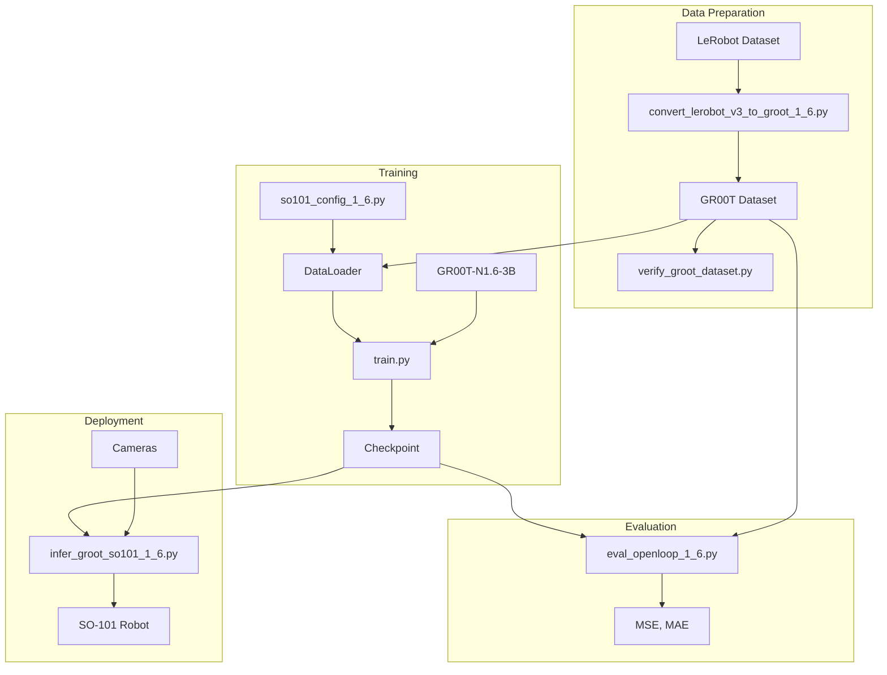

### B. Model Forward Pass

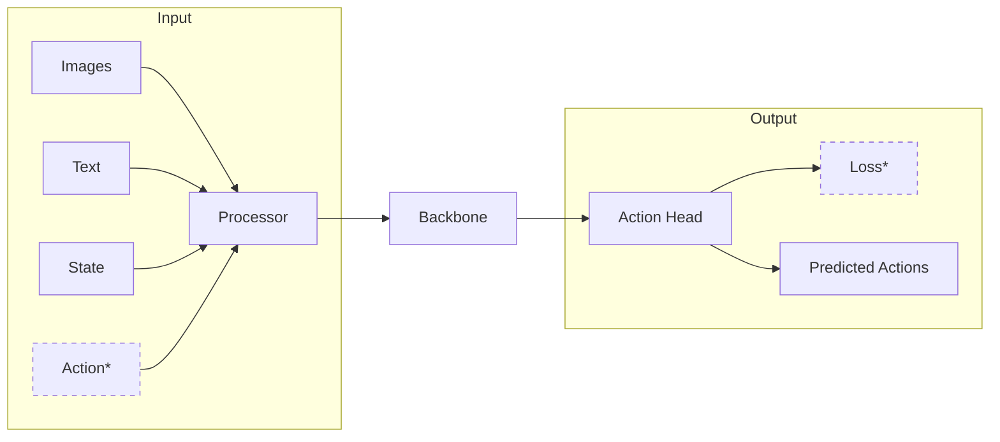
*Training only

---

*Document created: 2025-12-18*
*GR00T Version: 1.6 (GR00T-N1.6-3B)*
*Robot: SO-101 (5-DOF arm + 1-DOF gripper)*
