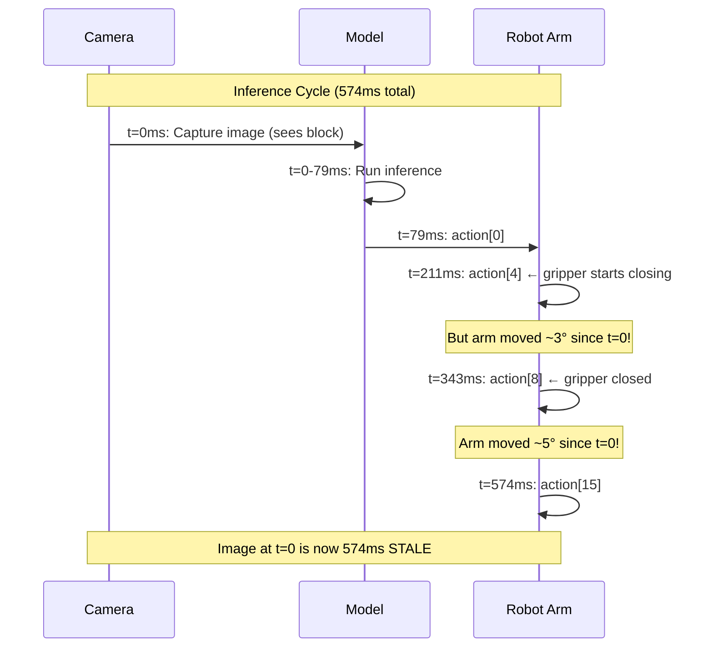
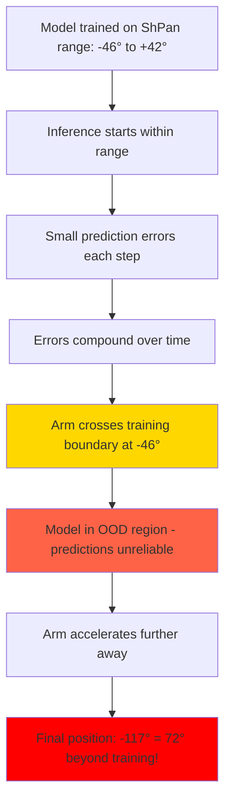

# GR00T 1.6 Inference Mismatch Investigation

## Table of Contents

1. [Executive Summary](#executive-summary)
2. [Referenced Files](#referenced-files)
3. [Root Cause 1: Image Staleness](#root-cause-1-image-staleness-pick-up-in-air)
   - [Observed Symptom](#observed-symptom)
   - [Evidence: Step 368 Failed Grasp](#evidence-step-368-failed-grasp)
   - [Blocking Architecture Analysis](#blocking-architecture-analysis)
   - [Solution: Reduce action_horizon](#solution-reduce-action_horizon)
4. [Root Cause 2: Out-of-Distribution Trajectory Drift](#root-cause-2-out-of-distribution-trajectory-drift)
   - [Observed Symptom](#observed-symptom-1)
   - [Evidence: Arm Trajectory Divergence](#evidence-arm-trajectory-divergence)
   - [Scientific Experiment: Camera Ablation](#scientific-experiment-camera-ablation)
   - [The Real Root Cause: Compounding Errors](#the-real-root-cause-compounding-errors)
5. [Investigation: Is Horizontal Augmentation the Cause?](#investigation-is-horizontal-augmentation-the-cause)
   - [Augmentation Verification](#augmentation-verification)
   - [Training vs Inference Setup Comparison](#training-vs-inference-setup-comparison)
   - [Conclusion: Augmentation is NOT the Cause](#conclusion-augmentation-is-not-the-cause)
6. [NVIDIA Reference Comparison](#nvidia-reference-comparison)
7. [Recommended Fixes](#recommended-fixes)
8. [Appendix: Trace Configurations](#appendix-trace-configurations)

---

## Executive Summary

This document presents findings from detailed trace analysis showing **why the robot fails to pick up blocks** despite good open-loop evaluation metrics (MAE 2.28°).

### Two Root Causes Identified

| Root Cause | Symptom | Mechanism | Fix |
|------------|---------|-----------|-----|
| **Image Staleness** | "Pick up in air" | Grasp executes 300-500ms after image captured | Reduce `action_horizon` to 8 |
| **Out-of-Distribution Drift** | "Swing away" - arm goes to extreme positions | Compounding errors push arm beyond training distribution | Requires recovery training or action clipping |

### Key Scientific Findings

1. **Both cameras ARE being used** by the model (proven by ablation experiments)
2. **Horizontal augmentation is correct** - verified mathematically and visually
3. **The real problem**: In closed-loop, small prediction errors compound, pushing the arm beyond training distribution (ShPan goes to -117° when training max was -46°)
4. **Once out-of-distribution**, model predictions become unreliable and the arm never recovers

---

## Referenced Files

| File | Description |
|------|-------------|
| `outputs/inference_traces/trace_20251221_192557/` | horizon=16 trace (30s, 742 steps) |
| `outputs/inference_traces/trace_20251221_214617/` | horizon=4 trace (50s, 1251 steps) |
| `custom/scripts/ver1_6/infer_groot_so101_trace.py` | Tracing inference script |
| `custom/scripts/ver1_6/test_head_camera_usage.py` | Camera ablation experiment |
| `scripts/deployment/standalone_inference_script.py` | NVIDIA reference |

---

## Root Cause 1: Image Staleness ("Pick Up In Air")

### Observed Symptom

With `action_horizon=16`:
- Robot arm descends toward blocks
- Gripper closes at correct time in action sequence
- **No block grasped** - gripper closes on empty air
- Result: 0 successful picks in 30 seconds

### Evidence: Step 368 Failed Grasp

**What the model saw** (`step_0368_wrist.jpg`):
- Orange block directly in front of gripper
- Block appears within grasp reach

**What the model predicted**:
```
action[0]:  Grip=13.6° (start closing)
action[4]:  Grip=1.8°  (nearly closed)
action[8]:  Grip=0.1°  (closed)
```

**What actually happened**: All 6 blocks remained on table - grasp failed.

**Why it failed** - State change during 16-action execution:
```
ShLift: 90.9° → 86.0° (moved 4.9°!)
Grip:   27.7° → 1.6°  (closed correctly)
```

The arm moved **4.9° in shoulder_lift** while executing actions. By the time the gripper closed (t=343ms), the arm was no longer aligned with the block.

### Blocking Architecture Analysis



**Timing analysis**:

| Event | Time | Image Age | Arm Movement |
|-------|------|-----------|--------------|
| Image captured | t=0ms | Fresh | 0° |
| Inference complete | t=79ms | 79ms | ~1° |
| action[4] (grip close) | t=211ms | 211ms | ~3° |
| action[8] (grip closed) | t=343ms | 343ms | ~5° |

### Solution: Reduce action_horizon

With `action_horizon=8`:

| Metric | horizon=16 | horizon=8 | Improvement |
|--------|------------|-----------|-------------|
| Cycle time | 574ms | 343ms | 40% faster |
| Image age at grasp | ~343ms | ~200ms | 42% fresher |
| State drift per cycle | ~5° | ~3° | 40% less drift |

---

## Root Cause 2: Out-of-Distribution Trajectory Drift

### Observed Symptom

Even with reduced `action_horizon` (1, 2, or 4), a different failure mode:
- Arm starts near blocks, may even **successfully grasp** a block
- Arm moves toward plate but **overshoots** dramatically
- ShPan goes to **-117°** when training range was only [-46°, +42°]
- Arm **never recovers** - 72° beyond training distribution
- Result: Block dropped in wrong location or arm stuck at extreme position

### Evidence: Arm Trajectory Divergence

**trace_20251221_214755 (horizon=2)** - The most informative trace:

```
Step   | ShPan    | Gripper | Event
-------|----------|---------|------------------
     0 |   -1.5°  |  31.1°  | Start - arm centered
   432 |  +26.0°  |  32.1°  | Approaching blocks (RIGHT side)
   448 |  +24.3°  |   4.8°  | GRASP! Gripper closed
   464 |  +11.7°  |   4.5°  | Moving LEFT toward plate
   480 |   -1.9°  |   4.4°  | Crossed center
   496 |  -14.0°  |   4.1°  | Still holding block
   512 |  -25.6°  |   4.1°  | Approaching training boundary
   526 |  -48.0°  |   4.1°  | ⚠ OUT OF DISTRIBUTION (training max: -46°)
   544 |  -79.6°  |   4.1°  | Accelerating away!
   576 | -111.1°  |   3.9°  | 65° beyond training range!
  1249 | -117.5°  |   --    | End - arm stuck at extreme
```

**Key observation**: The robot **successfully grasped** a block at step 448 (ShPan=+24°), then correctly started moving LEFT toward the plate. But it **did not stop** at the plate position and kept accelerating until 72° beyond training distribution.

**Training data analysis:**
- Original episodes: Release at ShPan ≈ +13° to +20° (plate on RIGHT)
- Mirrored episodes: Release at ShPan ≈ -13° to -20° (plate on LEFT)
- Inference setup matches mirrored pattern (blocks LEFT, plate RIGHT in camera)
- Model correctly started going LEFT, but went to -117° instead of stopping at -15°

### Scientific Experiment: Camera Ablation

To test whether the model actually uses both cameras, we ran ablation experiments using `custom/scripts/ver1_6/test_head_camera_usage.py`:

**Step 800 (wrist=empty, head=blocks)**:

| Experiment | Head Camera | Wrist Camera | Mean Δ from Original |
|------------|-------------|--------------|---------------------|
| Original | Real (blocks) | Real (empty) | - |
| Ablated Head | BLACK | Real (empty) | **5.23°** |
| Ablated Wrist | Real (blocks) | BLACK | **3.42°** |
| Both Black | BLACK | BLACK | 5.51° |

**Conclusion**: Both cameras cause >3° change when ablated, proving **both cameras ARE being used by the model**.

### The Real Root Cause: Compounding Errors

The model processes both cameras correctly, but **small prediction errors compound in closed-loop**:



**Why this happens**:

1. **Open-loop evaluation masks the problem**: Evaluation feeds ground-truth states back, preventing error accumulation
2. **Closed-loop amplifies errors**: Each prediction is fed back as the next state
3. **No stop signal learned**: Training data shows trajectories, not explicit "stop at plate" behavior
4. **Out-of-distribution extrapolation fails**: Once beyond training range, model predictions become unreliable

**Quantitative evidence**:
```
Training ShPan range:  [-46°, +42°]
Inference reached:     -117°
Out of distribution by: 72° (157% beyond minimum)
```

---

## Investigation: Is Horizontal Augmentation the Cause?

A hypothesis was raised: Did the horizontal augmentation script (`custom/scripts/ver1_6/augment_dataset_horizontal.py`) introduce errors that caused the model to learn incorrectly?

### Augmentation Verification

**Joint transformation check** (Episode 0 → Episode 70):

| Joint | Original Range | Mirrored Range | Expected | Result |
|-------|---------------|----------------|----------|--------|
| shoulder_pan | [-41.55, 33.42] | [-33.42, 41.55] | Negated | ✓ CORRECT |
| shoulder_lift | [-100.00, 72.46] | [-100.00, 72.46] | Unchanged | ✓ CORRECT |
| elbow_flex | [-44.08, 99.82] | [-44.08, 99.82] | Unchanged | ✓ CORRECT |
| wrist_flex | [-35.19, 76.45] | [-35.19, 76.45] | Unchanged | ✓ CORRECT |
| wrist_roll | [-64.42, 5.74] | [-5.74, 64.42] | Negated | ✓ CORRECT |
| gripper | [0.00, 38.30] | [0.00, 38.30] | Unchanged | ✓ CORRECT |

**Video flip verification**:
- Compared `cv2.flip(original, 1)` with mirrored video frame
- Mean pixel difference: 1.39 (due to JPEG compression)
- Result: ✓ Videos correctly flipped horizontally

### Training vs Inference Setup Comparison

**Visual comparison of head camera views:**

| Dataset | Blocks Position | Plate Position |
|---------|-----------------|----------------|
| Original training (ep 0-69) | RIGHT in image | LEFT in image |
| Mirrored training (ep 70-139) | LEFT in image | RIGHT in image |
| **Inference setup** | LEFT in image | RIGHT in image |

The inference setup **visually matches the mirrored training pattern**.

**Grasp/Release positions in training data:**

| Pattern | Grasp ShPan | Release ShPan |
|---------|-------------|---------------|
| Original | ~-30° (LEFT) | ~+15° (RIGHT) |
| Mirrored | ~+30° (RIGHT) | ~-15° (LEFT) |
| Inference observed | +24° (correct) | -117° (WAY too far) |

### Conclusion: Augmentation is NOT the Cause

1. **Augmentation is mathematically correct**: Joint negation and video flipping are properly implemented
2. **Spatial relationships preserved**: Mirrored episodes have consistent camera-action correspondence
3. **Model learned both patterns**: Successfully grasps from correct side based on inference setup
4. **The problem is trajectory overshoot**: Model correctly identifies direction but doesn't know when to stop

The real issue is that:
- Training data shows complete trajectories from grasp to release
- But the model doesn't learn an explicit "stop at plate" signal
- In closed-loop, small errors compound and push the arm beyond training distribution
- Once OOD, the model cannot recover

---

## NVIDIA Reference Comparison

| Parameter | NVIDIA Reference | Our Implementation |
|-----------|------------------|-------------------|
| `n_action_steps` | **8** | 16 (was), now 8 |
| Architecture | Client-Server | Single-thread blocking |
| Cycle time | ~300ms | ~574ms (was), ~343ms (now) |

NVIDIA recommends executing only **8 actions** before re-inferencing, even though the model predicts 16.

---

## Recommended Fixes

### For Root Cause 1 (Image Staleness)

1. **Use action_horizon=8** (NVIDIA recommended)
2. Consider async architecture for further improvement

### For Root Cause 2 (Out-of-Distribution Drift)

**Short-term (inference-side):**

1. **Action clipping during inference**
   ```python
   # Clip ShPan predictions to stay within training distribution
   SHPAN_MIN, SHPAN_MAX = -46, 42  # Training range
   action[0] = np.clip(action[0], SHPAN_MIN, SHPAN_MAX)
   ```

2. **Delta clipping per step**
   ```python
   # Limit how much ShPan can change per inference
   MAX_DELTA = 5.0  # degrees
   delta = action[0] - current_state[0]
   if abs(delta) > MAX_DELTA:
       action[0] = current_state[0] + np.sign(delta) * MAX_DELTA
   ```

**Long-term (training-side):**

1. **Data augmentation with perturbations**
   - Add noise to starting positions
   - Include recovery trajectories from edge cases
   - Train on more diverse initial states

2. **Explicit task decomposition**
   - Separate "navigate to block" and "navigate to plate" sub-tasks
   - Add waypoint supervision

3. **Temporal action smoothing**
   - Use exponential moving average of predictions
   - Prevents sudden trajectory changes

### Testing Tools

- `custom/scripts/ver1_6/test_head_camera_usage.py` - Verify camera usage via ablation
- `custom/scripts/ver1_6/infer_groot_so101_trace.py` - Generate detailed inference traces

---

## Appendix: Trace Configurations

### Trace 1: horizon=16 (trace_20251221_192557)

```json
{
  "checkpoint": "outputs/groot_1_6_augmented_20251220_124942/checkpoint-45000",
  "task": "pick up the blocks and place them on the plate",
  "duration": 30.0,
  "action_horizon": 16,
  "action_interval": 0.033
}
```

**Statistics**: 742 steps, 47 inferences, 24.7Hz effective rate

### Trace 2: horizon=4 (trace_20251221_214617)

```json
{
  "checkpoint": "outputs/groot_1_6_augmented_20251220_124942/checkpoint-45000",
  "task": "pick up the blocks and place them on the plate",
  "duration": 50.0,
  "action_horizon": 4,
  "action_interval": 0.033
}
```

**Statistics**: 1251 steps, 79 inferences, 25.0Hz effective rate, mean inference 114.9ms

### Trace 3: horizon=2 (trace_20251221_214755)

```json
{
  "checkpoint": "outputs/groot_1_6_augmented_20251220_124942/checkpoint-45000",
  "task": "pick up the blocks and place them on the plate",
  "duration": 50.0,
  "action_horizon": 2,
  "action_interval": 0.033
}
```

**Statistics**: 1249 steps, ~625 inferences
**Key finding**: Successfully grasped block, then swung to -117° (72° beyond training distribution)

### Trace 4: horizon=1 (trace_20251221_215113)

```json
{
  "checkpoint": "outputs/groot_1_6_augmented_20251220_124942/checkpoint-45000",
  "task": "pick up the blocks and place them on the plate",
  "duration": 50.0,
  "action_horizon": 1,
  "action_interval": 0.033
}
```

**Statistics**: 1248 steps, 78 inferences, 25.0Hz effective rate
**Key finding**: Went to plate area empty, similar OOD behavior
