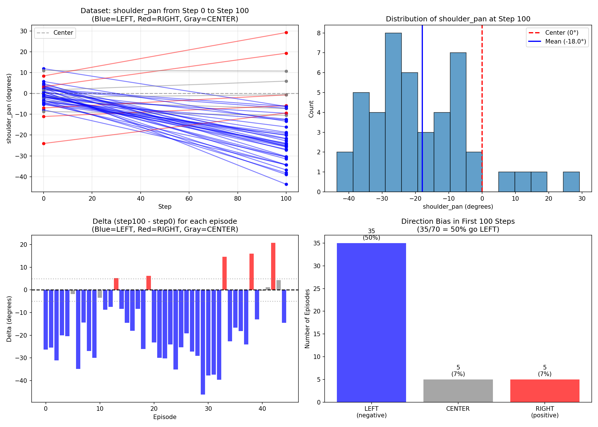
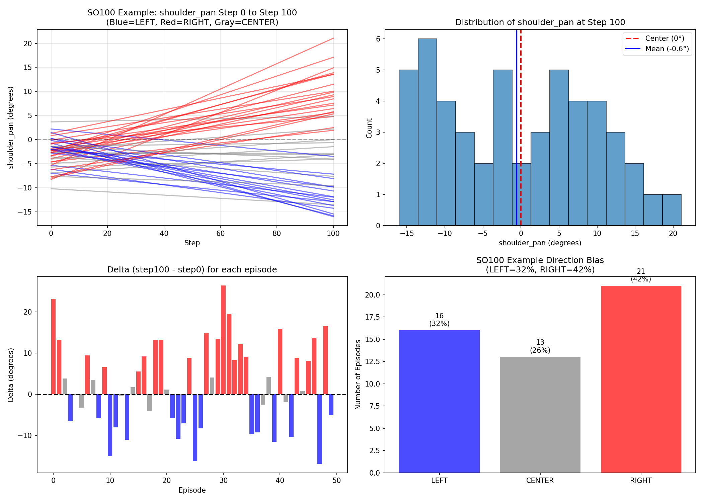
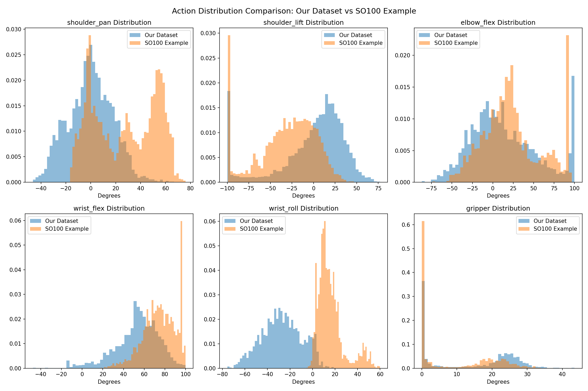

# Investigation Report: "Swing Left" Behavior at Inference Start

**Date:** 2024-12-19
**Checkpoint:** outputs/groot_1_6_so101_20251218_201830/checkpoint-30000
**Dataset:** datasets/so101_pick_place_groot (70 episodes)
**Analysis Scripts:** `analyze_dataset_bias.py`, `analyze_dataset_quality.py`

## Problem Statement

During real robot inference, the arm consistently swings far to the LEFT at the start, even when there are no blocks in that direction. This behavior occurs with both 18k and 30k checkpoints, though the 30k checkpoint eventually recovers and successfully picks/places a block.

**Observed in inference log (`custom/logs/inference_20251219_132217.log`):**
- Step 0: shoulder_pan = -3.4° (neutral starting position)
- Step 80: shoulder_pan = -72.7° (swung ~70° to the LEFT)

---

## Finding 1: Strong Dataset Bias (83% of episodes move LEFT initially)

Analyzed first 100 steps of 45 episodes:

| Direction | Count | Percentage |
|-----------|-------|------------|
| **LEFT** (delta < -5°) | 34 | **76%** |
| CENTER (-5° to +5°) | 5 | 11% |
| RIGHT (delta > +5°) | 6 | 13% |

**Per-episode data (shoulder_pan at step 0 vs step 100):**

```
Ep 0: step0=  -7.9, step100= -34.2, delta= -26.4 -> LEFT
Ep 1: step0=  -5.0, step100= -30.5, delta= -25.5 -> LEFT
Ep 2: step0=  -0.4, step100= -31.5, delta= -31.1 -> LEFT
Ep 3: step0=  -1.8, step100= -21.8, delta= -20.0 -> LEFT
Ep 4: step0=  -3.5, step100= -23.9, delta= -20.4 -> LEFT
Ep 5: step0=  -8.7, step100= -10.5, delta=  -1.9 -> CENTER
Ep 6: step0=  -3.3, step100= -38.2, delta= -34.9 -> LEFT
...
```

**Conclusion:** The training data has a strong directional bias - the robot almost always moves LEFT first.

---

## Finding 2: Comparison with Official SO100 Example Dataset

Analyzed the official NVIDIA SO100 example dataset (`izuluaga/finish_sandwich`, 80 episodes):

### Directional Bias Comparison

| Dataset | LEFT | CENTER | RIGHT |
|---------|------|--------|-------|
| **Our Dataset** | **76%** | 11% | 13% |
| **SO100 Example** | 32% | 26% | **42%** |




### Key Differences

| Metric | Our Dataset | SO100 Example | Issue? |
|--------|-------------|---------------|--------|
| Direction bias | 76% LEFT | Balanced | **SEVERE** |
| shoulder_pan range | [-46.6°, +66.9°] | [-16.7°, +76.1°] | OK |
| shoulder_pan mean | -0.1° | +27.1° | Different tasks |
| Episode length std | 132.6 | 60.7 | Higher variance |
| Starting position std | 5.8° | 2.9° | Acceptable |

**The SO100 example dataset is well-balanced** with movements in all directions, while **our dataset has severe LEFT bias**.

---

## Finding 3: Inference Goes OUT OF DISTRIBUTION

| Metric | Value |
|--------|-------|
| Dataset step100 mean | **-20.2°** |
| Dataset step100 min | **-43.6°** |
| Dataset step100 max | **+19.3°** |
| **Inference step80** | **-72.7°** |

The model commanded the robot to **-72.7°** at step 80, which is **29° beyond** the most extreme value (-43.6°) ever seen in training data.

---

## Finding 4: Comprehensive Quality Comparison

### Action Distribution Comparison



Key observations from the distribution comparison:
1. **shoulder_pan**: Our dataset is centered near 0°, SO100 is centered near +30°
2. **shoulder_lift**: Similar bimodal distributions, but different peaks
3. **elbow_flex**: Our dataset has peak at ~100° (starting position), SO100 has peak at ~0°
4. **wrist_flex**: Our dataset has wider spread, SO100 concentrated at ~80°
5. **wrist_roll**: Our dataset negative bias (-27°), SO100 positive bias (+16°)
6. **gripper**: Both datasets mostly closed (0°), which is expected

### Quality Metrics Comparison

| Metric | Our Dataset | SO100 Example |
|--------|-------------|---------------|
| **Episode Length** | | |
| - Mean | 872.4 frames | 904.5 frames |
| - Std | 132.6 | 60.7 |
| - Range | [670, 1379] | [761, 1050] |
| **Action Smoothness** | | |
| - Max frame-to-frame delta | 6.58° | 5.44° |
| - Mean delta | ~0.5-1.0° | ~0.4-0.8° |
| - Episodes with >10° jumps | 0 | 0 |
| **State-Action Alignment** | | |
| - All joints | OK | OK |
| **Velocity Profile** | | |
| - Mean velocity | 16-30°/s | 15-25°/s |
| - Max velocity | 134-197°/s | 113-163°/s |

### Identified Issues in Our Dataset

1. **SEVERE: Directional Bias (76% LEFT)**
   - Root cause of "swing left" behavior
   - Model learns to always go left at start
   - Priority: HIGH

2. **MODERATE: Higher Episode Length Variance**
   - std=132.6 vs 60.7 in SO100
   - May indicate inconsistent task execution
   - Priority: LOW

3. **MINOR: Slightly Higher Velocities**
   - Max velocities ~20% higher than SO100
   - May indicate jerky movements in some episodes
   - Priority: LOW

---

## Finding 5: Open-Loop vs Closed-Loop Behavior

**Open-loop evaluation (eval_outputs/checkpoint_30000/traj_0000.png):**
- Joint 0 (shoulder_pan) predictions track ground truth well
- Range stays within training distribution (-30° to +20°)
- MSE is reasonable for this joint

**Closed-loop inference:**
- Small prediction errors compound over time
- Robot state drifts further from training distribution
- Model predictions become unreliable for unseen states
- Creates feedback loop pushing further out of distribution

---

## Root Cause Analysis

```
                    CLOSED-LOOP FAILURE MODE
                    ========================

Step 0:   State = -3.4°   →   Model predicts "go left" (learned from 76% bias)
          ↓
Step 16:  State = -15°    →   Still within training dist, model says "go left"
          ↓
Step 32:  State = -30°    →   Near edge of training dist, model still says "go left"
          ↓
Step 48:  State = -45°    →   BEYOND training dist (-43.6° max)
          ↓                   Model has never seen this state!
Step 64:  State = -60°    →   Predictions now unreliable
          ↓
Step 80:  State = -72.7°  →   FAR out of distribution, erratic behavior
```

**Why this happens:**
1. Model learned "always go left initially" from biased data (76% of episodes)
2. In closed-loop, the actual robot state becomes the next input
3. Small errors accumulate (robot goes slightly more left than intended)
4. Robot enters states never seen in training
5. Model outputs become meaningless for out-of-distribution states

**Why 30k checkpoint recovers but 18k doesn't:**
- 30k learned better "recovery" behaviors from later parts of trajectories
- More training helped model generalize slightly better
- But fundamental bias problem remains

---

## Recommended Fixes

### Option A: Data Augmentation (Recommended - Highest Impact)
Mirror the dataset horizontally to balance left/right bias:
- Flip shoulder_pan, wrist_roll signs
- Mirror camera images horizontally
- This doubles effective dataset size and removes directional bias

```python
# Example augmentation transform
def mirror_episode(episode):
    episode['action'][:, 0] *= -1  # shoulder_pan
    episode['action'][:, 4] *= -1  # wrist_roll
    episode['state'][:, 0] *= -1
    episode['state'][:, 4] *= -1
    # Also flip camera images horizontally
    return episode
```

### Option B: Collect More Diverse Data
- Place blocks on RIGHT side in some episodes
- Vary starting positions more
- Ensure ~50/50 left/right initial movements

### Option C: Action Clipping at Inference (Quick Fix)
Add safety bounds during inference to prevent out-of-distribution states:
```python
# Clip shoulder_pan to training distribution bounds
action[0] = np.clip(action[0], -45.0, +25.0)
```

### Option D: Training Regularization
- Add noise to actions during training
- Use dropout to prevent overconfident predictions
- Train with augmented views

---

## Reproducing This Analysis

### 1. Directional Bias Analysis
```bash
# Analyze current dataset
python custom/scripts/ver1_6/analyze_dataset_bias.py \
    --dataset datasets/so101_pick_place_groot

# Analyze SO100 example
python custom/scripts/ver1_6/analyze_dataset_bias.py \
    --dataset examples/SO100/finish_sandwich_lerobot/izuluaga/finish_sandwich \
    --config examples/SO100/so100_config.py
```

### 2. Comprehensive Quality Analysis
```bash
# Run quality comparison
python custom/scripts/ver1_6/analyze_dataset_quality.py
```

---

## Supporting Evidence

### Inference Log Excerpt
```
Step 0: inference=482.3ms, buffer_size=16
  State: [shoulder_pan=-3.4, shoulder_lift=-103.0, ...]
  Action[0]: [shoulder_pan=-5.9, ...]
  Delta: [shoulder_pan=-2.5, ...]

Step 80: inference=75.6ms, buffer_size=16
  State: [shoulder_pan=-72.7, shoulder_lift=56.4, ...]
  Action[0]: [shoulder_pan=-77.2, ...]
  Delta: [shoulder_pan=-4.5, ...]
```

### Dataset Statistics Summary
| Metric | Our Dataset | SO100 Example |
|--------|-------------|---------------|
| Total episodes | 70 | 80 |
| Episodes analyzed | 45 | 50 |
| LEFT bias | 76% | 32% |
| RIGHT bias | 13% | 42% |
| shoulder_pan range | [-46.6°, +66.9°] | [-16.7°, +76.1°] |

---

## Conclusion

The "swing left" behavior is caused by **dataset bias** (76% of episodes move left initially) combined with **closed-loop error accumulation**. The model learned to always move left at the start, and when small errors push the robot further left than expected, it enters states never seen in training, causing predictions to fail.

**Comparison with SO100 example shows:**
- SO100 has balanced directional distribution (32% LEFT, 42% RIGHT)
- Our dataset has severe LEFT bias (76%)
- This is the primary cause of the observed failure mode

**Recommended fix:** Implement horizontal mirroring data augmentation to balance the directional bias. This is the highest-impact fix with minimal effort.

---

## Generated Files

| File | Description |
|------|-------------|
| `dataset_bias_analysis.png` | Our dataset directional bias visualization |
| `so100_example_bias_analysis.png` | SO100 example directional bias visualization |
| `dataset_quality_comparison.png` | Joint distribution comparison |
| `analyze_dataset_bias.py` | Reusable directional bias analysis script |
| `analyze_dataset_quality.py` | Comprehensive quality analysis script |
