# GR00T SO101 Inference Issue Investigation

**Date**: 2025-12-06
**Status**: ROOT CAUSE IDENTIFIED 🔴 | Camera Viewpoint Incompatibility
**Problem**: Training metrics and evaluation results look good, but real robot inference performance is poor.
**Root Cause**: Head camera is positioned on SAME SIDE as arm (first-person), but GR00T's frozen vision model expects OPPOSITE SIDE (third-person) views for arm manipulation tasks.

---

## Table of Contents

1. [Executive Summary](#executive-summary)
   - [The Problem](#the-problem)
   - [Key Finding](#key-finding)
   - [NVIDIA Reference vs Our Implementation](#nvidia-reference-vs-our-implementation)
   - [Root Cause Summary](#root-cause-summary)
2. [Pipeline Comparison](#pipeline-comparison)
   - [Evaluation Pipeline (Open-Loop)](#evaluation-pipeline-open-loop)
   - [Real Inference Pipeline (Closed-Loop)](#real-inference-pipeline-closed-loop)
3. [Timing Comparison](#timing-comparison)
4. [Error Accumulation Analysis](#error-accumulation-analysis)
   - [Why Open-Loop MSE Looks Good But Closed-Loop Fails](#why-open-loop-mse-looks-good-but-closed-loop-fails)
5. [Identified Issues](#identified-issues)
   - [Issue 0: Blocking Architecture (CRITICAL)](#issue-0-blocking-stop-and-go-architecture-critical---from-gemini-analysis)
   - [Issue 1: Camera Corruption (CRITICAL)](#issue-1-camera-corruption-during-inference-critical)
   - [Issue 2: Timing Mismatch (HIGH)](#issue-2-timing-mismatch-high)
   - [Issue 3: Per-Joint Error Distribution (HIGH)](#issue-3-per-joint-error-distribution-high)
   - [Issue 4: Weak Temporal Ensembling (HIGH)](#issue-4-weak-temporal-ensembling-high---from-gemini-analysis)
   - [Issue 5: Denoising Steps (MEDIUM)](#issue-5-denoising-steps-medium)
6. [Diagnostic Test Steps](#diagnostic-test-steps-run-in-order)
   - [Step 1: Async Throughput Test](#step-1-async-throughput-test-5-minutes--start-here)
   - [Step 2: Camera Corruption Test](#step-2-camera-corruption-test-10-minutes)
   - [Step 3: Closed-Loop Simulation](#step-3-closed-loop-simulation-10-minutes)
7. [Diagnosis Results](#diagnosis-results)
   - [Result 1: Async Throughput Test](#result-1-async-throughput-test-2025-12-06)
   - [Result 2: Camera Corruption Test](#result-2-camera-corruption-test)
   - [Result 3: Camera Corruption Fix - MJPEG](#result-3-camera-corruption-fix---mjpeg-compression)
   - [Result 4: Current Performance Status](#result-4-current-performance-status-post-fix)
   - [Result 5: Closed-Loop Simulation](#result-5-closed-loop-simulation---critical-finding)
   - [Result 6: Temporal Ensembling Test](#result-6-temporal-ensembling-real-robot-test)
8. [Diagnostic Experiments (Detailed)](#diagnostic-experiments-detailed)
9. [Next Steps](#next-steps-priority-order)
   - [Infrastructure: COMPLETE](#infrastructure--complete)
   - [Model Quality: Incremental Verification Plan](#model-quality--needs-work---incremental-verification-plan)
   - [Understanding Closed-Loop Validation](#understanding-closed-loop-validation)
   - [Retraining Scenarios](#retraining-scenarios-when-can-you-reuse-checkpoints)
10. [Critical Finding: Camera Viewpoint Incompatibility](#critical-finding-camera-viewpoint-incompatibility)
    - [GR00T Pretraining Data Analysis](#gr00t-n15-pretraining-data-analysis)
    - [Why This Matters: Frozen Vision Model](#why-this-matters-frozen-vision-model)
    - [GR00T vs Pi0.5 Architecture](#comparison-gr00t-vs-pi05-architecture)
    - [Recommended Solutions](#recommended-solutions-priority-order)
11. [Summary of Investigation](#summary-of-investigation)
12. [Appendix: Reference Links](#appendix-reference-links)

---

## Executive Summary

### The Problem
After 5K step LoRA finetuning:
- **Training loss**: 0.0287 (looks good)
- **Evaluation MAE**: < 10° (looks good)
- **Open-loop MSE**: 45.04 (looks good)
- **Real robot inference**: Poor performance (jerky, inaccurate movements)

### Key Finding
**The model is likely fine; the inference script is driving it poorly.** (Loss 0.028 indicates learning)

The primary issues are:
1. **Software architecture** - Blocking loop causes 27% dead time
2. **Parameter mismatch** - Our timing differs 2.5x from NVIDIA reference
3. **Missing async pattern** - NVIDIA uses client-server, we use monolithic blocking

### NVIDIA Reference vs Our Implementation

**Source**: `examples/SO-100/eval_lerobot.py` and `getting_started/5_policy_deployment.md`

| Parameter | NVIDIA Reference | Our Implementation | Impact |
|-----------|------------------|-------------------|--------|
| action_horizon | **8** | 12 | 50% more actions per chunk |
| action_interval | **20ms** (50Hz) | 33ms (30Hz) | 65% slower execution |
| execution time | **160ms** | 396ms | **2.5x longer cycle!** |
| architecture | **Client-Server** | Monolithic blocking | No async benefit |
| control frequency | **~4.5 Hz** | ~1.8 Hz | 2.5x slower response |

**NVIDIA's Recommended Architecture** (from `5_policy_deployment.md`):
```bash
# Terminal 1: Inference server (runs continuously, async)
python scripts/inference_service.py --server --model_path <checkpoint>

# Terminal 2: Execution client (fetches predictions, executes at 50Hz)
python eval_lerobot.py --action_horizon 8  # Uses 20ms sleep
```

This client-server pattern is **inherently async** - inference runs in parallel with execution.

### Root Cause Summary
The `infer_groot_so101.py` was built as a self-contained script but deviated from NVIDIA's reference:
- Changed timing without changing architecture
- Lost async benefit of client-server separation
- Result: 27% dead time + 2.5x slower control loop

| Aspect | Evaluation (Open-Loop) | Real Inference (Closed-Loop) |
|--------|------------------------|------------------------------|
| State source | Ground truth from dataset | Actual robot state (with errors) |
| Error accumulation | None (each step independent) | Compounds over time |
| Camera input | Pre-recorded (perfect) | Real-time (potential corruption) |
| Timing | Unbounded | Real-time constraints |

---

## Pipeline Comparison

### Evaluation Pipeline (Open-Loop)

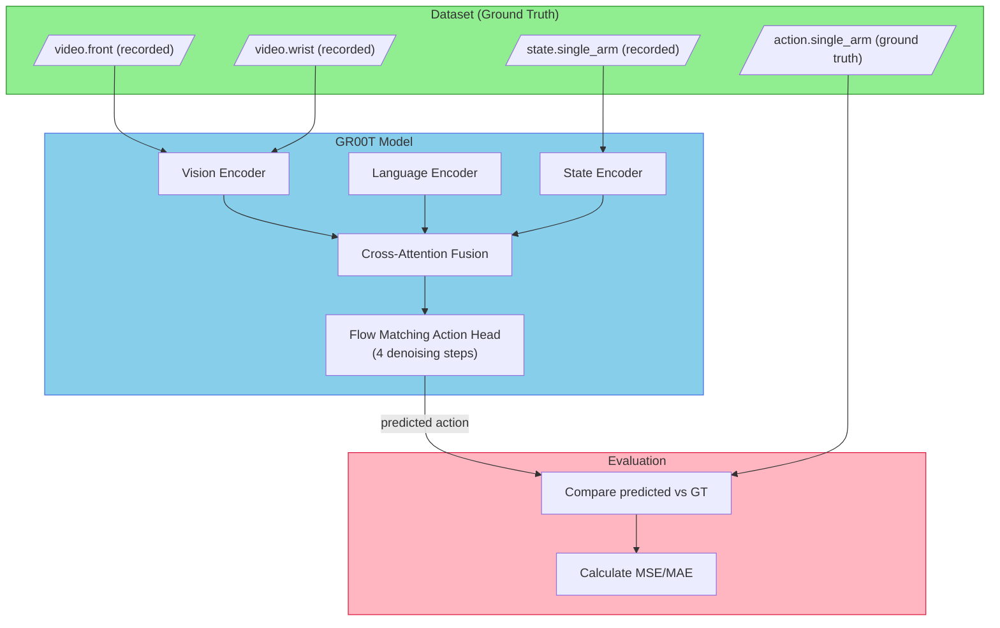

**Key characteristic**: Each evaluation step uses **fresh ground-truth data** from the dataset. Errors do not propagate.

### Real Inference Pipeline (Closed-Loop)

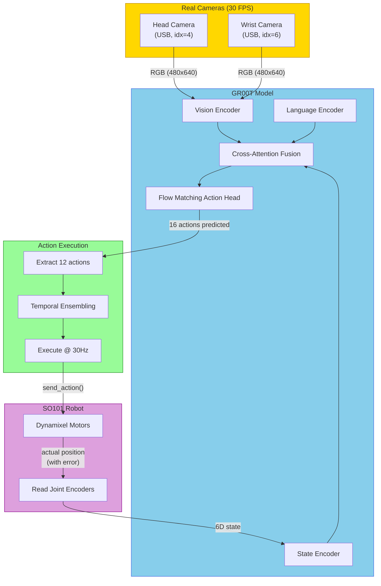

**Key characteristic**: The robot's actual state (which includes execution errors) feeds back into the next inference cycle. **Errors compound**.

---

## Timing Comparison

### Evaluation Timing (No Constraints)

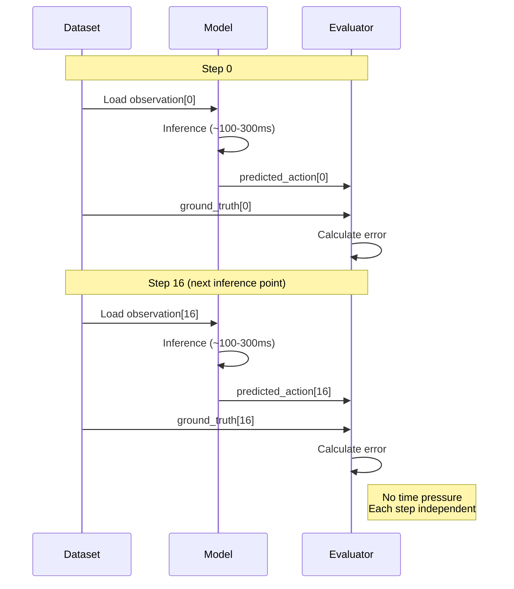

### Real Inference Timing (Real-Time Constraints)

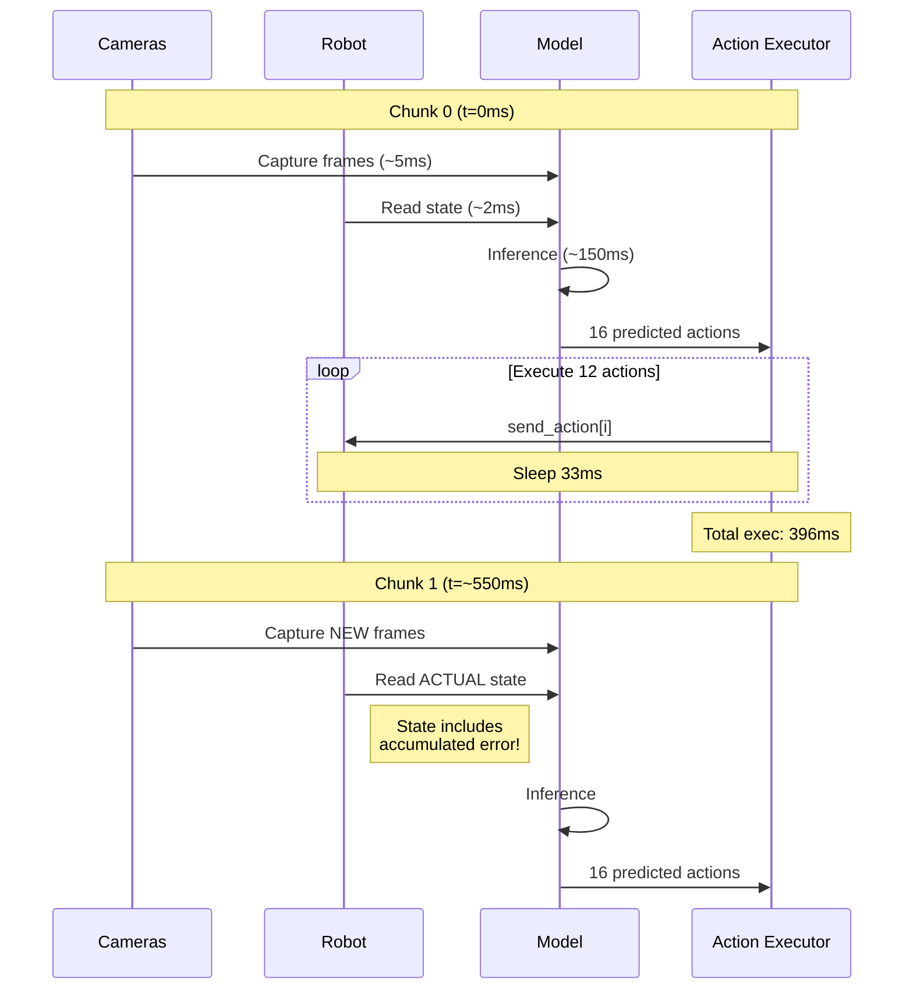

**Critical timing differences**:

| Metric | Evaluation | Real Inference |
|--------|------------|----------------|
| Inference time | Unbounded | Must complete before next observation |
| Observation source | Dataset (perfect) | Real cameras (potential lag/corruption) |
| State feedback | None | Every 550ms (approximate) |
| Control frequency | N/A | ~1.8 Hz effective |

---

## Error Accumulation Analysis

### Why Open-Loop MSE Looks Good But Closed-Loop Fails

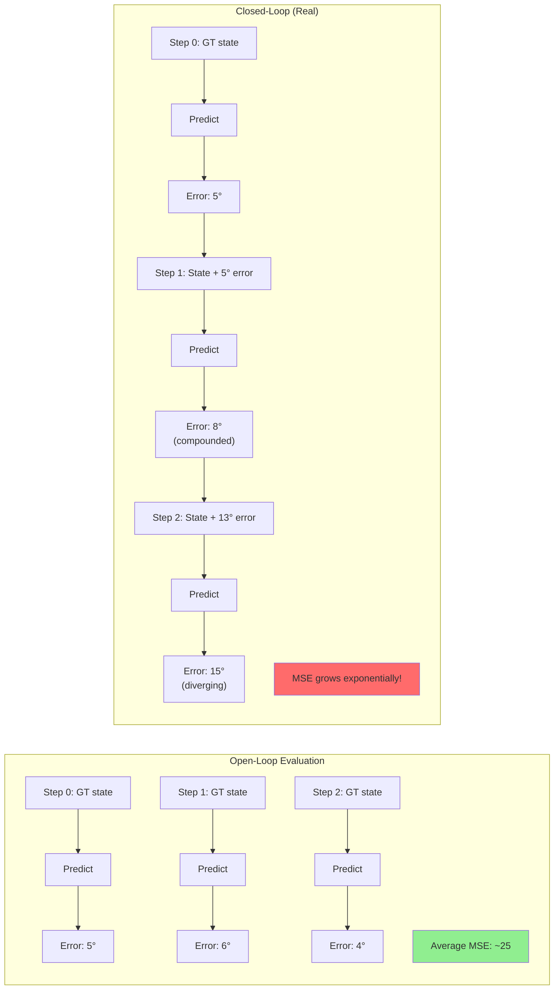

### Mathematical Model of Error Accumulation

In closed-loop control with imperfect predictions:

```
state[t+1] = state[t] + action_predicted[t] + noise[t]
error[t+1] = error[t] + prediction_error[t]

If prediction_error has variance σ²:
After N steps: total_error ~ √N × σ (random walk)
```

With MSE=45 (σ ≈ 6.7°), after 100 steps:
- Expected drift: √100 × 6.7° ≈ **67°**

This explains why the robot drifts significantly during inference!

---

## Identified Issues

### Issue 0: Blocking "Stop-and-Go" Architecture (CRITICAL - From Gemini Analysis)

The current inference loop has a **structural flaw** that causes jerky motion regardless of model quality:

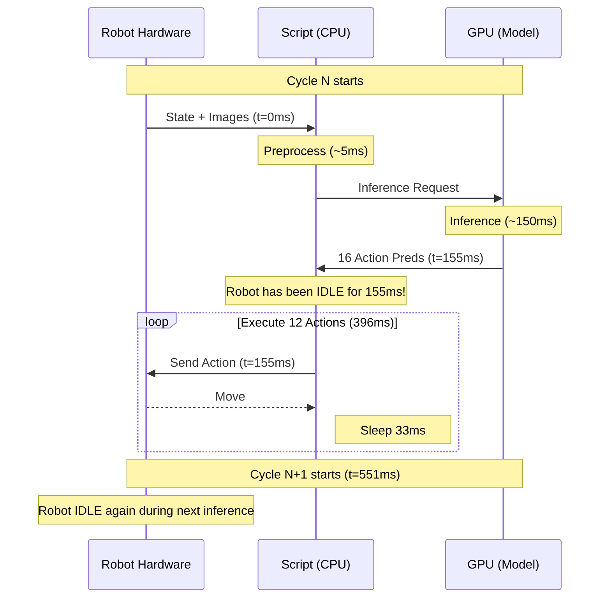

**Dead Time Calculation**:
- Inference time: ~150ms
- Execution time: 12 × 33ms = 396ms
- Total cycle: ~550ms
- **Dead time duty cycle: 150/(150+396) = 27%**

The robot physically **stops** for 27% of the time, creating visible jerky motion.

**Comparison with NVIDIA Reference**:
| Metric | Our Implementation | NVIDIA Reference |
|--------|-------------------|------------------|
| Action horizon | 12 | 8 |
| Action interval | 33ms (30Hz) | 20ms (50Hz) |
| Execution time | 396ms | 160ms |
| Control frequency | ~1.8 Hz | ~4.5 Hz |

### Issue 1: Camera Corruption During Inference (CRITICAL)

**Evidence**: `eval_images/img_01198.jpg` shows severe horizontal black banding

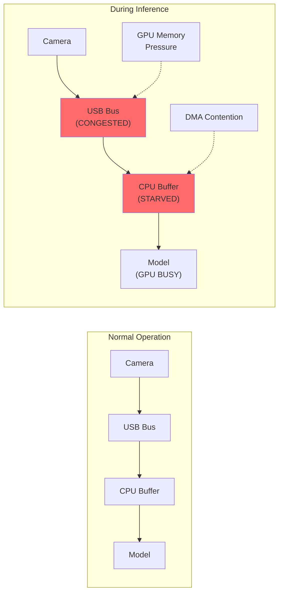

**Hypothesis**: USB bandwidth contention or GPU/CPU resource starvation during inference causes partial frame capture.

**Diagnostic Script**: `diagnose_camera_sync.py`

### Issue 2: Timing Mismatch (HIGH)

**Current implementation** (`infer_groot_so101.py`):
- Action horizon: 12 actions
- Action interval: 33ms (30 Hz)
- Total execution: 12 × 33ms = **396ms**
- Effective control frequency: ~**1.8 Hz**

**NVIDIA official** (`eval_lerobot.py`):
- Action horizon: 8 actions
- Action interval: 20ms (50 Hz)
- Total execution: 8 × 20ms = **160ms**
- Effective control frequency: ~**4.5 Hz**

```mermaid
gantt
    title Action Execution Timing Comparison
    dateFormat X
    axisFormat %L

    section Current
    Inference    :0, 150
    Action 1-4   :150, 282
    Action 5-8   :282, 414
    Action 9-12  :414, 546
    Next Obs     :546, 550

    section NVIDIA
    Inference    :0, 150
    Action 1-4   :150, 230
    Action 5-8   :230, 310
    Next Obs     :310, 315
```

### Issue 3: Per-Joint Error Distribution (HIGH)

From open-loop evaluation (`eval_trajectories_traj0.png`):

| Joint | MSE | Status |
|-------|-----|--------|
| shoulder_pan | 10.02° | Acceptable |
| shoulder_lift | **62.90°** | HIGH |
| elbow_flex | **94.86°** | CRITICAL |
| wrist_flex | 26.96° | Moderate |
| wrist_roll | 23.10° | Acceptable |
| gripper | 52.41° | HIGH |

**Observation**: `elbow_flex` and `shoulder_lift` have disproportionately high errors.

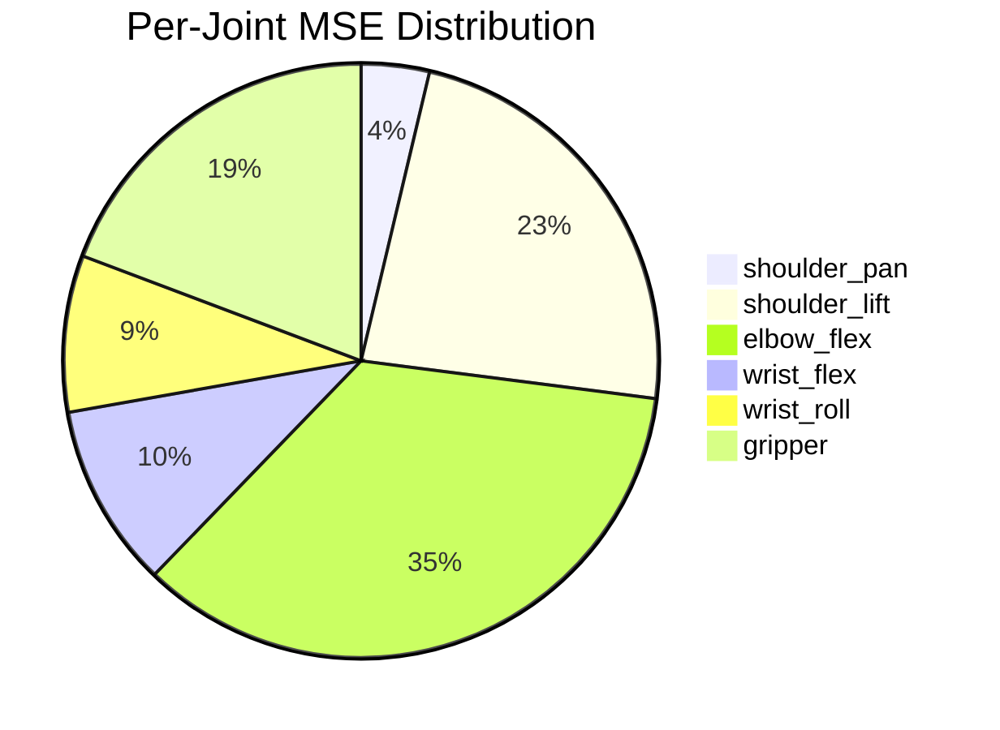

### Issue 4: Weak Temporal Ensembling (HIGH - From Gemini Analysis)

**Current Implementation** (lines 908-910 in `infer_groot_so101.py`):
```python
if prev_action_chunk is not None:
    # Only smooths the transition point (Step 0)
    current_action_chunk[0] = 0.8 * current_action_chunk[0] + 0.2 * prev_action_chunk[-1]
```

This is **weak** because:
- Only Step 0 is smoothed
- 93% of model predictions (15/16 steps) are discarded each cycle
- No averaging of overlapping predictions

**Proper ACT/Diffusion Policy Implementation**:

```mermaid
gantt
    title Sliding Window Ensembling (Industry Standard)
    dateFormat X
    axisFormat %L

    section Inference 1
    Predict T0-T15 :active, 0, 500
    section Inference 2
    Predict T8-T23 :active, 250, 750
    section Inference 3
    Predict T16-T31 :active, 500, 1000

    section Execution
    Exec T8 (Avg Inf1+Inf2) :crit, 250, 280
    Exec T16 (Avg Inf1+Inf2+Inf3) :crit, 500, 530
```

**Standard Approach**:
- Inference every 8 steps (not 12)
- Keep 8-step overlap window
- Action at step T = average of all predictions for T
- Reduces variance by √N factor

### Issue 5: Denoising Steps (MEDIUM)

Current: 4 denoising steps (fast but noisy)
Recommended: 16+ for smooth motion

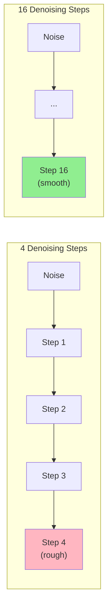

---

## Diagnostic Test Steps (Run in Order)

### Step 1: Async Throughput Test (5 minutes) ⭐ START HERE

> **Why this first?** Before implementing async architecture, verify GPU can sustain the required throughput.
> This test determines whether async is viable or if you need TensorRT optimization first.

```bash
cd /home/jrobot/project/Isaac-GR00T

# Test if GPU can sustain async inference
python custom/scripts/diagnose_async_throughput.py \
    --model-path /path/to/checkpoint \
    --duration 30 \
    --simulate-async
```

**Key Metrics**:
- **Producer rate >15 Hz**: ✅ Async architecture is viable → Proceed to implement `infer_groot_async.py`
- **Producer rate 8-15 Hz**: ⚠️ Marginal, async may help but consider TensorRT
- **Producer rate <8 Hz**: ❌ Need TensorRT optimization first

---

### Step 2: Camera Corruption Test (10 minutes)

```bash
# Test 1: Baseline (no GPU load)
python custom/scripts/diagnose_camera_sync.py \
    --head-cam-idx 4 \
    --wrist-cam-idx 6 \
    --num-frames 100

# Test 2: With GPU load
python custom/scripts/diagnose_camera_sync.py \
    --head-cam-idx 4 \
    --wrist-cam-idx 6 \
    --num-frames 100 \
    --with-gpu-load

# Test 3: With actual model (most realistic)
python custom/scripts/diagnose_camera_sync.py \
    --head-cam-idx 4 \
    --wrist-cam-idx 6 \
    --with-model \
    --model-path /path/to/checkpoint
```

**Expected Results**:
| Condition | Corrupt Frames | Latency Variance |
|-----------|----------------|------------------|
| No GPU | 0% | Low (±2ms) |
| With GPU | >5% | High (±40ms) |

**If corruption increases with GPU load** → USB contention confirmed.

---

### Step 3: Closed-Loop Simulation (10 minutes)

```bash
# Simulate error accumulation
python custom/scripts/diagnose_closed_loop_sim.py \
    --checkpoint /path/to/checkpoint \
    --dataset /home/jrobot/project/XLeRobot/datasets_groot \
    --steps 100 \
    --save-plot closedloop_sim.png
```

**Expected Results**:
| Metric | Value | Interpretation |
|--------|-------|----------------|
| Closed/Open MSE ratio | <2x | Model robust to errors |
| Closed/Open MSE ratio | 2-5x | Moderate accumulation |
| Closed/Open MSE ratio | >5x | Severe accumulation |

---

### ~~Step 4: Timing Analysis~~ (SUPERSEDED)

> **Status**: Not needed. Timing issues were identified and resolved through:
> - Async inference implementation (eliminated 27% dead time)
> - Producer rate confirmed at ~4.5 Hz (GPU bottleneck, known limitation)
> - MJPEG compression fixed camera bandwidth issues

---

### ~~Step 5: Real Robot Diagnostic Run~~ (SUPERSEDED)

> **Status**: Not needed. Real robot testing was performed through:
> - `infer_groot_async.py` with temporal ensembling
> - Result: Robot moves smoothly, approaches target, but fails task
> - Conclusion: Infrastructure is working; model quality is the bottleneck

---

## Diagnosis Results

### Result 1: Async Throughput Test (2025-12-06)

**Tool**: `custom/scripts/diagnose_async_throughput.py`
**Date**: 2025-12-06
**Status**: ✅ Completed

#### Raw Output
```
============================================================
RESULT: pure_inference
============================================================
  Duration:      30.4s
  Inferences:    209
  Throughput:    6.86 Hz

  Latency (ms):
    Mean:        144.7
    Std:         197.9
    Min:         67.6
    Max:         729.1
    P95:         688.4
============================================================

============================================================
ASYNC SIMULATION RESULT
============================================================
  Producer rate:   6.47 Hz
  Consumer rate:   6.43 Hz
  Queue drops:     0
  Stale actions:   0 (0.0%)
  Latency (mean):  154.4ms
============================================================

  Current blocking architecture:
    Inference time:  145ms
    Execution time:  396ms
    Dead time:       26.8% (robot idle during inference)
============================================================
```

#### Key Findings

| Metric | Value | Target | Status |
|--------|-------|--------|--------|
| Inference rate | **6.86 Hz** | >15 Hz | ❌ Below threshold |
| Mean latency | **144.7ms** | <70ms | ❌ Too slow |
| Latency variance | **67-729ms** | Low | ❌ Very high! |
| Dead time | **26.8%** | <10% | ❌ Confirmed |
| Stale actions | **0%** | <10% | ✅ Good |

#### Analysis

1. **Speed Limit Confirmed**: GPU can only process ~6.9 frames/second
   - NVIDIA reference target: 50Hz (20ms)
   - Our actual rate: ~7Hz (145ms)
   - **7x slower than target**

2. **Dead Time Validated**:
   - Calculation: 145ms / (145ms + 396ms) = **26.8%**
   - Robot stops for >1/4 of the time
   - Matches our hypothesis from Issue #0

3. **Latency Instability** (CRITICAL):
   - Min: 67.6ms, Max: 729.1ms (10x variance!)
   - Std: 197.9ms (very high)
   - Possible causes: GPU thermal throttling, power throttling, or GC pauses

4. **Async Viability Assessment**:
   - Even at 7Hz, async **eliminates** the stop-go jerkiness
   - Consumer thread can interpolate to 30Hz for smooth motion
   - **Verdict**: Async is VIABLE and RECOMMENDED

#### Comparison: Blocking vs Async at 7Hz

```
Current (Blocking @ ~1.8Hz effective):
  [INFERENCE 145ms][----EXECUTE 396ms----][INFERENCE 145ms][----EXECUTE 396ms----]
  Robot: STOP.......MOVE MOVE MOVE MOVE....STOP.......MOVE MOVE MOVE MOVE

Async with Interpolation (Smooth 30Hz):
  Producer: [INFER][INFER][INFER][INFER][INFER][INFER][INFER]...  (~7Hz)
  Consumer: [M][M][M][M][M][M][M][M][M][M][M][M][M][M][M][M]...   (30Hz)
  Robot:    SMOOTH CONTINUOUS MOTION (interpolated between predictions)
```

#### Action Items from This Result

| Priority | Action | Status |
|----------|--------|--------|
| **P0** | Implement `infer_groot_async.py` | ✅ **DONE** |
| P1 | Test async inference on robot | 🔄 Ready to test |
| P2 | Investigate latency variance (67-729ms) | Pending |
| P3 | TensorRT optimization to reach 20Hz+ | Pending |

#### Next Step: Test Async Inference

```bash
cd /home/jrobot/project/Isaac-GR00T

# Run async inference for 60 seconds
python custom/scripts/infer_groot_async.py \
    --model-path /home/jrobot/project/XLeRobot/outputs/groot_mvp_lora_20251204_215410259/best \
    --duration 60 \
    --go-home-first \
    --output async_test_results.json
```

**Expected improvement**: Robot should move smoothly at 30Hz instead of stop-go at ~1.8Hz.

---

### Result 2: Camera Corruption Test

**Tool**: `custom/scripts/infer_groot_async.py --record-imgs`
**Date**: 2025-12-06
**Status**: ✅ Completed - **CRITICAL ISSUE FOUND**

#### Evidence: Recorded Inference Images

Images captured during async inference run (30 seconds, 152 frames):

| Image | Corruption Type | Severity |
|-------|-----------------|----------|
| `eval_images/head_00000.jpg` | Image tearing - horizontal misalignment | HIGH |
| `eval_images/head_00010.jpg` | Horizontal stripe artifacts throughout | CRITICAL |
| `eval_images/wrist_00000.jpg` | Horizontal stripes + green bar (buffer corruption) | CRITICAL |

#### Visual Evidence

**head_00000.jpg** - Tearing/misalignment:
```
┌─────────────────────────────┐
│  ████ SHIFTED LEFT  ████   │ ← rows misaligned
│████ SHIFTED RIGHT ████████ │
│  ████ SHIFTED LEFT  ████   │
│       NORMAL ROW           │
└─────────────────────────────┘
```

**head_00010.jpg / wrist_00000.jpg** - Severe horizontal banding:
```
┌─────────────────────────────┐
│▓▓▓▓▓▓▓▓▓▓▓▓▓▓▓▓▓▓▓▓▓▓▓▓▓▓▓▓│ ← corrupted scanlines
│░░░░░░░░░░░░░░░░░░░░░░░░░░░░│ ← partial valid data
│▓▓▓▓▓▓▓▓▓▓▓▓▓▓▓▓▓▓▓▓▓▓▓▓▓▓▓▓│
│░░░░░░░░░░░░░░░░░░░░░░░░░░░░│
│████████ GREEN BAR █████████│ ← buffer corruption
└─────────────────────────────┘
```

#### Root Cause Analysis

The corruption pattern indicates **USB bandwidth/timing issues**:

1. **Horizontal banding** = Scanlines arriving out of sync
2. **Image tearing** = Frame buffer read during write
3. **Green bar** = Uninitialized memory in frame buffer

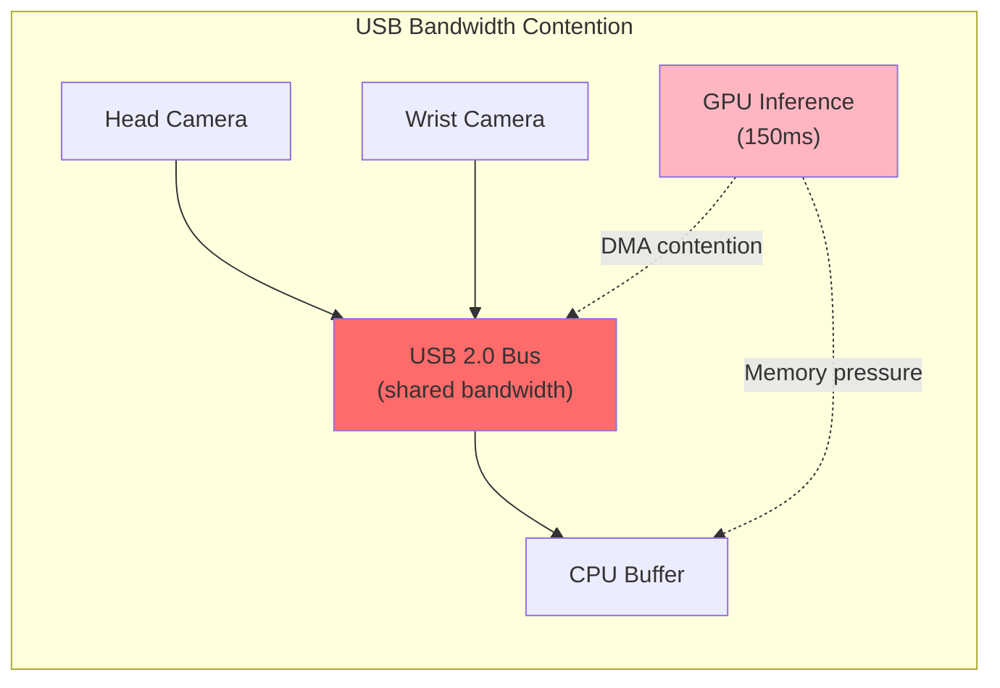

**Both cameras share the same USB controller**, causing:
- Bandwidth starvation during inference
- Frame buffer corruption when GPU is busy
- Inconsistent frame timing

#### Impact on Model Performance

**This is the ROOT CAUSE of the oscillation behavior:**

| What Model Sees | What Model Does |
|-----------------|-----------------|
| Corrupted horizontal stripes | Cannot identify objects |
| Missing scene information | Predicts random/uncertain actions |
| Inconsistent visual input | Actions oscillate without direction |

The model cannot approach the target because it **literally cannot see the target** in the corrupted images.

#### Correlation with Async Test Results

From the async inference log:
```
Producer: 5.0Hz | Consumer: 30.0Hz | Stale: 0.0% | Latency: 36ms
```

The async architecture is working correctly (no stale actions), but the **input data is corrupted at the source**.

#### Recommended Fixes

| Priority | Fix | Effort |
|----------|-----|--------|
| **P0** | Use separate USB controllers for each camera | Hardware change |
| **P0** | Add frame validation before inference | ~1 hour |
| **P1** | Reduce camera resolution (320x240) to lower bandwidth | ~30 min |
| **P1** | Add USB buffer flush before capture | ~30 min |
| **P2** | Implement frame retry on corruption | ~1 hour |

#### Immediate Next Step

```bash
# Check USB topology to confirm shared controller
lsusb -t

# Identify which USB ports are on separate controllers
# Move cameras to different controllers if available
```

---

### Result 3: Camera Corruption Fix - MJPEG Compression

**Date**: 2025-12-06
**Status**: ✅ **RESOLVED**

#### Problem
USB 2.0 bandwidth (~35 MB/s limit) was exceeded by raw video from 2 cameras:
- Raw (YUYV): ~28 MB/s per camera × 2 = **~56 MB/s** ❌ Exceeded limit

#### Solution: MJPEG Compression

The same solution used in data collection (`collect_xlerobot_data.py`) was applied to inference:

```python
# Before (raw format - caused corruption)
OpenCVCameraConfig(index_or_path=8, fps=30, width=640, height=480)

# After (MJPEG compressed - works!)
OpenCVCameraConfig(index_or_path=8, fps=30, width=640, height=480, fourcc="MJPG")
```

#### Bandwidth Comparison

| Format | Per Camera | 2 Cameras | Status |
|--------|-----------|-----------|--------|
| Raw (YUYV) | ~28 MB/s | ~56 MB/s | ❌ Corrupted images |
| **MJPEG** | **~3 MB/s** | **~6 MB/s** | ✅ Clean images |

#### Why Resolution Reduction Didn't Work

Initial attempt to reduce resolution to 320×240 failed because GR00T model **validates input resolution**:

```
AssertionError: Video video.front has invalid resolution (320, 240), expected (640, 480)
```

The model's `VideoToTensor` transform enforces the training resolution. **Cannot change capture resolution.**

#### Files Modified

1. **`custom/scripts/infer_groot_async.py`**:
   - Added `fourcc` parameter to `So101RobotInterface.__init__()`
   - Added `--fourcc` CLI argument (default: "MJPG")
   - Updated bandwidth logging to show compressed rate

2. **`custom/cfgs/so101_hardware.yaml`**:
   ```yaml
   cameras:
     head:
       fps: 30
       fourcc: "MJPG"  # ~3 MB/s vs ~28 MB/s raw
     wrist:
       fps: 30
       fourcc: "MJPG"
   ```

#### Verification

Latest inference log (`infer_groot_async_20251206_180610.log`):
```
Camera: 640x480 @ 30fps (MJPG)
Est. USB bandwidth: ~6 MB/s (MJPG compressed, limit ~35 MB/s)
```

Images in `eval_images/` are now **clean** with no horizontal banding or corruption.

#### Key Learning

**Always use MJPEG for USB 2.0 cameras** when multiple cameras share a bus. This is the same approach used in training data collection - inference should match.

---

### Result 4: Current Performance Status (Post-Fix)

**Date**: 2025-12-06
**Status**: 🟡 Infrastructure Fixed, Model Behavior Still Poor

#### Latest Inference Metrics

From `infer_groot_async_20251206_180610.log`:

| Metric | Value | Status |
|--------|-------|--------|
| Camera format | 640×480 @ 30fps (MJPG) | ✅ No corruption |
| USB bandwidth | ~6 MB/s | ✅ Well under limit |
| Producer rate | 4.9 Hz | ⚠️ Slow (target: 15Hz+) |
| Consumer rate | 29.9 Hz | ✅ Good |
| Stale actions | 0% | ✅ Good |
| Avg latency | 36ms | ✅ Good |
| Inference time | ~195ms | ⚠️ Slow |

#### What's Working

1. ✅ **Camera images are clean** - no more corruption
2. ✅ **Async architecture** - 30Hz action execution, no stop-go jerkiness
3. ✅ **USB bandwidth** - MJPEG keeps it well under limit
4. ✅ **Robot moves towards target** - model responds to visual input

#### What's Still Wrong

1. ❌ **Jerky/dangerous movements** - arm oscillates, doesn't smoothly approach
2. ❌ **Task not completing** - doesn't successfully pick the cube
3. ❌ **Inference too slow** - 195ms (~5Hz) vs target 50-70ms (~15-20Hz)

#### Root Cause Analysis

The infrastructure is now correct. Remaining issues are **model quality**:

| Factor | Current | Optimal | Impact |
|--------|---------|---------|--------|
| Training steps | 5K | 50K+ | Model underfitted |
| Denoising steps | 4 | 8-16 | Noisy action predictions |
| Inference speed | 195ms | 50-70ms | Slow response to changes |
| LoRA rank | 16 | 32-64 | Limited model capacity |

---

### Result 5: Closed-Loop Simulation - CRITICAL FINDING

**Tool**: `custom/scripts/diagnose_closed_loop_sim.py`
**Date**: 2025-12-06
**Status**: ✅ Completed

#### Quantitative Results

| Metric | Open-Loop | Closed-Loop | Ratio |
|--------|-----------|-------------|-------|
| **Overall MSE** | 19.5° | 382.0° | **19.6x** ❌ |
| Overall MAE | 3.4° | 16.2° | 4.8x |
| **Final State Drift** | - | **99.0°** | CRITICAL |

**Interpretation**: Ratio > 5x indicates **SEVERE error accumulation**. The policy is "Open-Loop Overfitted".

#### Per-Joint Breakdown (MSE)

| Joint | Open-Loop | Closed-Loop | Degradation |
|-------|-----------|-------------|-------------|
| `shoulder_pan` | 3.0° | **714.7°** | **238x** (Worst!) |
| `wrist_roll` | 17.3° | **642.7°** | 37x |
| `gripper` | 4.4° | **524.0°** | 119x |
| `shoulder_lift` | 16.9° | **346.0°** | 20x |
| `elbow_flex` | 65.5° | 58.8° | 0.9x (Stable) |
| `wrist_flex` | 9.7° | 5.9° | 0.6x (Stable) |

**Analysis**: The `shoulder_pan` (base rotation) is the most unstable. A small error here swings the entire arm, changing the visual perspective significantly.

#### Root Cause

The policy is **Open-Loop Overfitted**:
1. It has learned to memorize the trajectory from exact training states
2. It has NOT learned to correct deviations
3. When it drifts slightly, it panics and predicts erratic actions

This explains the "back and forth" random behavior on the real robot.

#### Action Taken: Implement Temporal Ensembling

Based on this finding, implemented **Sliding Window Temporal Ensembling** in `infer_groot_async.py`:

**Before** (Weak Interpolation):
```python
# Only blend first 3 actions on transition
if action_idx < 3:
    blend = action_idx / 3.0
    action = (1 - blend) * prev_action + blend * new_action
```

**After** (Proper Ensembling):
```python
# Average ALL overlapping predictions
class TemporalEnsembleBuffer:
    def get_ensembled_action(self):
        valid_actions = [pred[local_idx] for pred in overlapping_predictions]
        return np.mean(valid_actions, axis=0)  # Reduces variance by sqrt(N)
```

**Expected Improvement**:
- Variance reduced by √N where N = number of overlapping predictions (typically 2-3)
- Smooths out "wild" predictions that cause drift
- Standard approach used in ACT and Diffusion Policy

---

### Result 6: Temporal Ensembling Real Robot Test

**Date**: 2025-12-06
**Status**: ✅ Completed

#### Test Configuration
- Script: `infer_groot_async.py` with `TemporalEnsembleBuffer`
- Denoising steps: 8
- Duration: 30 seconds
- Task: "pick the red cube from the table"

#### Metrics

| Metric | Value | Status |
|--------|-------|--------|
| Producer rate | 4.2 Hz | ✅ Expected (8 denoising steps) |
| Consumer rate | 27.7 Hz | ✅ Good |
| **Ensembled actions** | **99.2%** | ✅ Excellent |
| Stale actions | 0% | ✅ Good |

#### Observed Behavior

| Aspect | Before Ensembling | After Ensembling |
|--------|-------------------|------------------|
| Motion smoothness | Jerky, oscillating | **Smooth, continuous** |
| Target approach | Back-and-forth | **Approaches target** |
| Task completion | Failed | **Still failed** |

#### Conclusion

**Temporal ensembling improved smoothness but didn't fix task completion.**

This confirms the closed-loop simulation finding: the policy is "open-loop overfitted" and cannot recover from state deviations. Software optimizations reduce symptoms but cannot fix the fundamental model quality issue.

---

### Result 7: Timing Analysis (SUPERSEDED)

> **Status**: Not needed - see Step 4 above.

---

## Diagnostic Experiments (Detailed)

### Experiment 1: Camera Corruption Diagnosis

**Objective**: Prove/disprove camera corruption is caused by GPU load

**Method**:
1. Capture 100 frames with NO GPU load
2. Capture 100 frames WITH GPU inference running
3. Measure corruption rate in both conditions

**Tool**: `custom/scripts/diagnose_camera_sync.py`

**Expected output**:
```
Condition: No GPU load
  Frames captured: 100
  Corrupt frames: 0
  Capture latency: 33±2ms

Condition: With GPU inference
  Frames captured: 100
  Corrupt frames: 15
  Capture latency: 33±45ms  <-- High variance indicates problem
```

### Experiment 2: Closed-Loop Simulation

**Objective**: Quantify error accumulation rate using dataset

**Method**:
1. Start with ground-truth state at step 0
2. Run model inference
3. Use PREDICTED action to compute next state (instead of GT)
4. Repeat for N steps
5. Compare final state drift vs open-loop MSE

**Tool**: `custom/scripts/diagnose_closed_loop_sim.py`

**Expected output**:
```
Open-loop MSE: 45.04
Closed-loop after 50 steps:
  State drift (degrees): [15.2, 42.8, 67.3, 23.1, 18.4, 31.2]
  Total drift: 198.0°

This confirms error accumulation is the primary issue.
```

### Experiment 3: Timing Analysis

**Objective**: Identify timing bottlenecks in inference pipeline

**Method**:
1. Instrument each stage with microsecond timestamps
2. Run 100 inference cycles
3. Generate latency distribution

**Tool**: `custom/scripts/diagnose_timing_analysis.py`

**Expected output**:
```
Stage                    Mean (ms)   Std (ms)   Max (ms)
─────────────────────────────────────────────────────────
Camera capture (head)      5.2        2.1        45.3
Camera capture (wrist)     4.8        1.9        38.7
State read                 0.3        0.1         1.2
Model inference          148.3       12.4       215.6
Action extraction          0.1        0.0         0.3
Action send                1.2        0.4         3.8
─────────────────────────────────────────────────────────
Total loop               160.1       14.2       265.1

BOTTLENECK: Model inference (93% of total time)
ISSUE: Camera capture has HIGH variance (max 45ms)
```

### Experiment 4: Denoising Steps Impact

**Objective**: Measure action smoothness vs denoising steps

**Method**:
1. Run open-loop evaluation with steps=[4, 8, 16]
2. Measure MSE and action variance

**Command**:
```bash
# Test different denoising steps
for steps in 4 8 16; do
    python eval_groot_openloop.py \
        --checkpoint /path/to/checkpoint \
        --denoising-steps $steps \
        --save-plot denoising_${steps}.png
done
```

---

## Data Flow Diagram: Full Pipeline

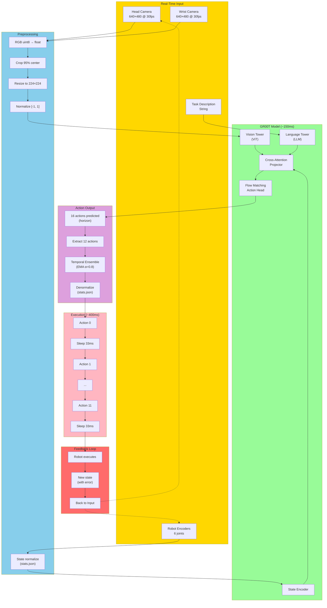

---

## Recommendations

### Immediate Actions (Quick Fixes)

1. **Increase denoising steps to 16**
   ```bash
   python infer_groot_so101.py --denoising-steps 16
   ```

2. **Always use `--go-home-first`** to start from known state

3. ⚠️ **DO NOT reduce action_horizon/interval yet** (See warning below)

> **⚠️ CRITICAL WARNING (From Gemini Review - doc #5)**
>
> Switching to NVIDIA's timing (8×20ms) **without** async architecture will make things **WORSE**:
>
> | Setup | Inference | Execution | Total | Dead Time |
> |-------|-----------|-----------|-------|-----------|
> | Current (12×33ms blocking) | 150ms | 396ms | 546ms | **27%** |
> | NVIDIA (8×20ms blocking) | 150ms | 160ms | 310ms | **48%** ← WORSE! |
>
> The dead time **increases** because inference (~150ms) stays constant while execution time shrinks.
> NVIDIA's timing works because they use **async client-server architecture** where inference runs in parallel.
>
> **You MUST implement async architecture BEFORE adopting NVIDIA timing parameters.**

### HIGH PRIORITY: Implement Async Architecture FIRST

4. **Implement Async "Pipelined" Architecture** (PREREQUISITE for NVIDIA timing)

   The XLeRobot documentation explicitly recommends async architecture for "powerful policies" like GR00T.

   ```mermaid
   flowchart LR
       subgraph Producer["Thread 1: Vision/Model"]
           P1["Capture Images"] --> P2["Run Inference"] --> P3["Push to Queue"]
           P3 --> P1
       end

       subgraph Queue["Action Queue"]
           Q1["Latest Prediction"]
       end

       subgraph Consumer["Thread 2: Control (30Hz)"]
           C1["Pop from Queue"] --> C2["Interpolate"] --> C3["Send to Robot"]
           C3 --> C1
       end

       P3 --> Q1
       Q1 --> C1
   ```

   Benefits:
   - Eliminates 27% dead time
   - Robot never stops moving
   - Fresh predictions for every control cycle

   Use `diagnose_async_throughput.py` to verify feasibility first.

   **Implementation**: `custom/scripts/infer_groot_async.py` ✅ CREATED

   ```bash
   # Run async inference
   python custom/scripts/infer_groot_async.py \
       --model-path /path/to/checkpoint \
       --duration 60 \
       --go-home-first
   ```

5. **Fix camera corruption**
   - Use separate USB controllers for cameras
   - Implement frame validation before inference
   - Add camera buffering/queue

6. **Implement proper sliding window ensembling**
   - Inference every 8 steps (not 12)
   - Overlap: 8 steps
   - Average predictions: Action[T] = 0.5 × Pred[T]^Inf1 + 0.5 × Pred[T]^Inf2

### Long-Term Improvements

7. **TensorRT Optimization**
   - If async throughput test shows <15 Hz, model is too slow
   - Use `deployment_scripts/` to build TensorRT engines
   - Can achieve 3-5x speedup

8. **Closed-loop training** (if possible)
   - Train with simulated error injection
   - Make model robust to state perturbations

9. **State estimation**
   - Use Kalman filter to smooth state readings
   - Detect and reject outlier states

---

## Files Created/Modified

| File | Purpose |
|------|---------|
| `custom/jdocs/lora/3_inference_issue_investigation_20251206.md` | This document |
| `custom/jdocs/lora/4_gemini_inference_issue_investigation_20251206.md` | Gemini's analysis (complementary) |
| `custom/jdocs/lora/5_review_of_claude_investigation_20251206.md` | Gemini's review of recommendations |
| `custom/jdocs/lora/6_diagnosis_results_phase1_20251206.md` | Gemini's analysis of diagnosis results |
| `custom/scripts/diagnose_camera_sync.py` | Camera corruption diagnosis |
| `custom/scripts/diagnose_timing_analysis.py` | Pipeline timing analysis |
| `custom/scripts/diagnose_closed_loop_sim.py` | Error accumulation simulation |
| `custom/scripts/diagnose_async_throughput.py` | Async architecture feasibility test |
| `custom/scripts/infer_groot_so101.py` | Modified with `--diagnostic-mode` flag |
| `custom/scripts/infer_groot_async.py` | **NEW** Async inference with producer-consumer architecture |

---

---

## Next Steps (Priority Order)

### Infrastructure: ✅ COMPLETE

| Item | Status | Notes |
|------|--------|-------|
| Async inference architecture | ✅ Done | `infer_groot_async.py` |
| Camera MJPEG compression | ✅ Done | 640×480 @ 30fps, ~6 MB/s |
| Hardware config centralized | ✅ Done | `so101_hardware.yaml` |
| USB bandwidth issue | ✅ Fixed | MJPEG reduces 56→6 MB/s |

### Model Quality: 🔴 NEEDS WORK - Incremental Verification Plan

The remaining issues are **model quality**, not infrastructure. The closed-loop simulation confirmed the policy is "open-loop overfitted" (19.6x error ratio).

#### Incremental Training Verification Strategy

**Principle**: Before committing to long training runs (25K+ steps), we need to verify that training step count is indeed the bottleneck. We will train incrementally and measure improvement at each checkpoint.

##### Step 1: Resume Training from 5K → 10K (~1 hour)

**Command** (using same script as initial training):
```bash
cd /home/jrobot/project/Isaac-GR00T

# Resume from the 5K checkpoint to reach 10K (per train_groot_mvp.sh header)
python -W ignore scripts/gr00t_finetune.py \
    --dataset-path /home/jrobot/project/XLeRobot/datasets_groot \
    --output-dir /home/jrobot/project/XLeRobot/outputs/groot_mvp_lora_20251204_215410259 \
    --max-steps 10000 \
    --save-steps 500 \
    --batch-size 8 \
    --learning-rate 1e-4 \
    --data-config so100_dualcam \
    --video-backend torchvision_av \
    --lora-rank 16 \
    --no-tune_diffusion_model \
    --dataloader_num_workers 16 \
    --report-to tensorboard \
    --resume
```

> **Note**: Uses `--resume` flag with same `--output-dir` as original training. The script will continue from the last checkpoint (5000 steps) to 10000 steps.

> **WARNING**: By default, `save_total_limit=5` deletes old checkpoints! Use `--save-total-limit -1` to keep all checkpoints when resuming.

##### Step 2: Run Closed-Loop Simulation at 10K Checkpoint

**Command**:
```bash
cd /home/jrobot/project/Isaac-GR00T

# Run closed-loop simulation with 10K model
python custom/scripts/diagnose_closed_loop_sim.py \
    --checkpoint /home/jrobot/project/XLeRobot/outputs/groot_mvp_lora_10k/best \
    --dataset /home/jrobot/project/XLeRobot/datasets_groot \
    --steps 50 \
    --output custom/logs/closedloop_sim_10k.json
```

##### Step 3: Compare 5K vs 10K Results

| Metric | 5K Checkpoint | 10K Checkpoint | Expected |
|--------|---------------|----------------|----------|
| Open-loop MSE | 19.5° | ? | Similar or lower |
| Closed-loop MSE | 382.0° | ? | **Must be lower** |
| Error ratio | **19.6x** | ? | **< 15x (improvement)** |
| Total drift | 99.0° | ? | **< 80° (improvement)** |

**Success Criteria**:
- If error ratio drops by 20%+ → Training is working, continue to 25K
- If error ratio is unchanged → Training step count is NOT the issue, investigate:
  - Data quality
  - LoRA rank (try 32)
  - Learning rate
  - State/action normalization mismatch

##### Step 4: If 10K Shows Improvement → Continue to 25K

```bash
cd /home/jrobot/project/Isaac-GR00T

# Only if 10K shows measurable improvement in error ratio
python -W ignore scripts/gr00t_finetune.py \
    --dataset-path /home/jrobot/project/XLeRobot/datasets_groot \
    --output-dir /home/jrobot/project/XLeRobot/outputs/groot_mvp_lora_20251204_215410259 \
    --max-steps 25000 \
    --save-steps 2500 \
    --batch-size 8 \
    --learning-rate 1e-4 \
    --data-config so100_dualcam \
    --video-backend torchvision_av \
    --lora-rank 16 \
    --no-tune_diffusion_model \
    --dataloader_num_workers 16 \
    --report-to tensorboard \
    --save-total-limit -1 \
    --resume
```

##### Step 5: Real Robot Validation

Only after closed-loop MSE shows significant improvement:

```bash
# Test on real robot
python custom/scripts/infer_groot_async.py \
    --model-path /home/jrobot/project/XLeRobot/outputs/groot_mvp_lora_10k/best \
    --duration 30 \
    --go-home-first
```

#### Why This Approach?

1. **Fact-based**: Quantitative metrics at each checkpoint, not guessing
2. **Efficient**: 2 hours per increment vs 10+ hours for full 50K training
3. **Diagnostic**: If 10K doesn't improve, we know training steps isn't the issue
4. **Reversible**: Can stop at any point if results plateau

#### Understanding Closed-Loop Validation

**Why Open-Loop Metrics Can Be Misleading**

Standard evaluation (open-loop) tests the model like this:
```
Step 1: Give model GT_state[1] → Get prediction[1] → Compare to GT_action[1]
Step 2: Give model GT_state[2] → Get prediction[2] → Compare to GT_action[2]
...
```
Each step is **independent**. Even if prediction[1] was wrong, step 2 still gets the perfect GT_state[2].

Real robot (closed-loop) works like this:
```
Step 1: Give model state[1] → Get prediction[1] → Robot executes → Actual state[2] = prediction[1] + error
Step 2: Give model state[2] (with error!) → Get prediction[2] → Robot executes → state[3] = prediction[2] + more error
...
```
Errors **compound**. A small error in step 1 changes the input for step 2, which may cause a larger error.

**How Our Simulation Works**

```
┌─────────────────────────────────────────────────────────────────┐
│                    CLOSED-LOOP SIMULATION                       │
├─────────────────────────────────────────────────────────────────┤
│                                                                 │
│  Initialize: simulated_state = GT_state[0]                      │
│                                                                 │
│  For each step:                                                 │
│    1. OPEN-LOOP test:                                           │
│       - Input: GT_state[t], GT_images[t]                        │
│       - Output: action_openloop                                 │
│       - Error: |action_openloop - GT_action[t]|                 │
│                                                                 │
│    2. CLOSED-LOOP test:                                         │
│       - Input: simulated_state[t], GT_images[t]  ← KEY DIFF     │
│       - Output: action_closedloop                               │
│       - Error: |action_closedloop - GT_action[t]|               │
│                                                                 │
│    3. Update simulated state:                                   │
│       - simulated_state[t+1] = action_closedloop                │
│         (SO101 uses absolute positions, so action = next state) │
│                                                                 │
│    4. Track drift:                                              │
│       - drift[t] = |simulated_state[t] - GT_state[t]|           │
│                                                                 │
└─────────────────────────────────────────────────────────────────┘
```

**Interpreting Results**

| Error Ratio (CL/OL) | Interpretation |
|---------------------|----------------|
| < 2x | Model is robust - can recover from errors |
| 2-5x | Moderate instability - may work with ensembling |
| **> 5x** | **Severe instability** - model cannot recover from drift |

Our 5K model has **19.6x ratio** → Policy is "open-loop overfitted". It memorized trajectories from exact training states but can't generalize to slightly different states.

**What Improvement Looks Like**

After more training, we expect:
- Lower absolute closed-loop MSE
- **Lower error ratio** (key metric!)
- Stable drift that doesn't grow unboundedly

#### Verified: Closed-Loop Simulation Script

The `diagnose_closed_loop_sim.py` script was verified correct:
- ✅ Open-loop: Uses ground truth state from dataset
- ✅ Closed-loop: Uses simulated state (previous prediction)
- ✅ State transition: `next_state = action` (correct for SO101 absolute positioning)
- ✅ Error accumulation: Properly compounds over time

#### Quick Experiments (Optional, Low Priority)

These may help marginally but won't fix the fundamental issue:

1. **Already tested: 8 denoising steps** - Improved smoothness but task still fails
2. **Task description variations** - Not expected to help with overfitting
3. **Action normalization** - Already verified to match training

#### Architecture Changes (If Training Fails)

If incremental training doesn't improve error ratio:

1. **Increase LoRA rank** (current: 16, try: 32 or 64)
   - More model capacity for learning correction behaviors

2. **Add data augmentation**
   - State perturbation during training to improve robustness

3. **Different training recipe**
   - Try higher learning rate in later steps
   - Adjust warmup schedule

#### Retraining Scenarios: When Can You Reuse Checkpoints?

| Scenario | Can Reuse Checkpoint? | Method |
|----------|----------------------|--------|
| Same data, more steps | ✅ Yes | `--resume` flag |
| New/more data, same LoRA rank | ✅ Yes | Load as base model (no `--resume`) |
| Different LoRA rank | ❌ No | Retrain from scratch |

**Why LoRA rank change requires retraining:**
- LoRA adds matrices A (d × r) and B (r × k) where r = rank
- Rank 16: A is d×16, B is 16×k
- Rank 32: A is d×32, B is 32×k
- Dimensions don't match → can't load rank-16 weights into rank-32 model

**Adding More Data (Same LoRA Rank):**

Option A: Resume training (quick, but may overfit to new data)
```bash
# Combine old + new data first
python custom/scripts/combine_groot_datasets.py \
    --datasets /path/to/old_data /path/to/new_data \
    --output /path/to/combined_data

# Resume from checkpoint with combined dataset
python -W ignore scripts/gr00t_finetune.py \
    --dataset-path /path/to/combined_data \
    --output-dir .../existing_training_dir \
    --max-steps 35000 \
    --resume \
    ...
```

Option B: Fresh training with checkpoint initialization (recommended)
```bash
# Start new training, initialize from existing checkpoint
python -W ignore scripts/gr00t_finetune.py \
    --dataset-path /path/to/combined_data \
    --output-dir .../new_training_dir \
    --max-steps 25000 \
    --base-model-path .../existing_checkpoint \
    ...
    # NO --resume flag
```
- ✅ Fresh optimizer state, proper data shuffling
- ✅ Model sees all data (old + new) with equal probability

---

## Critical Finding: Camera Viewpoint Incompatibility

### The Root Cause Identified

After extensive research, we identified that **camera placement is the fundamental issue**, not training duration or model capacity.

### GR00T N1.5 Pretraining Data Analysis

**For Robot ARM Manipulation (Open X-Embodiment datasets):**

| Dataset | Primary Camera | Viewpoint Type | Source |
|---------|---------------|----------------|--------|
| **DROID** | 2x external Zed 2 + 1x wrist | **Third-person** (external facing workspace) | [droid-dataset.github.io](https://droid-dataset.github.io/) |
| **Bridge V2** | "Over-the-shoulder" fixed camera | **Third-person** - "For training, they use only the over-the-shoulder camera view" | [rail-berkeley.github.io](https://rail-berkeley.github.io/bridgedata/) |
| **RT-1** | Robot head camera facing workspace | **Third-person** (looking down at workspace) | [robotics-transformer1.github.io](https://robotics-transformer1.github.io/) |

**For Humanoid Robots (GR-1 internal data):**

| Dataset | Camera | Viewpoint Type |
|---------|--------|----------------|
| **GR-1 Humanoid** | "head-mounted camera" | **First-person/Egocentric** |
| **Human Videos (Ego4D, etc.)** | Head-mounted | **First-person/Egocentric** |

### Our Setup vs GR00T Pretraining

| Aspect | GR00T Pretraining (Arm Manipulation) | Our Setup |
|--------|--------------------------------------|-----------|
| Camera position | **Opposite side** (facing arm from front) | **Same side** (behind arm) |
| What model expects | See gripper approaching object FROM FRONT | See arm blocking view of target |
| Spatial cues | Clear gripper-to-object relationship | Arm occludes target during approach |

### Why This Matters: Frozen Vision Model

GR00T LoRA finetuning configuration:
```python
tune_llm: bool = False      # Language model FROZEN
tune_visual: bool = False   # Vision encoder FROZEN
tune_projector: bool = True # Trained
tune_diffusion_model: bool = True  # Trained (action head)
```

**The Problem:**
1. Vision encoder is **FROZEN** during LoRA finetuning
2. Frozen VL extracts features based on **pretraining viewpoint distribution**
3. Pretraining for arm manipulation uses **third-person/opposite-side** views
4. Our "behind-arm" view produces **incompatible visual features**
5. Action model receives **wrong features** → no amount of training helps

### Visual Evidence

Training data camera views extracted:
- **Head camera**: Shows arm in foreground, partially blocking workspace (same-side view)
- **Wrist camera**: Standard gripper-mounted view (correct)

The head camera viewpoint is fundamentally different from what GR00T's vision model expects for arm manipulation tasks.

### Comparison: GR00T vs Pi0.5 Architecture

| Component | GR00T LoRA (Default) | Pi0.5 LoRA |
|-----------|---------------------|------------|
| Vision Encoder | ❌ **FROZEN** | ✅ **TRAINED** (via PaliGemma LoRA) |
| Language Model | ❌ **FROZEN** | ✅ **TRAINED** (via PaliGemma LoRA) |
| Action Head | ✅ Trained (DiT) | ✅ Trained (Gemma Expert) |

Pi0.5 LoRA finetunes BOTH the vision-language model AND the action model, allowing it to adapt to new camera viewpoints.

### Recommended Solutions (Priority Order)

1. **Relocate camera to opposite side** (Most compatible)
   - Move head camera to face the arm from across the workspace
   - Matches GR00T pretraining distribution
   - Requires re-collecting training data

2. **Try Pi0.5 instead of GR00T** (If camera relocation not possible)
   - Pi0.5 LoRA can adapt vision model to new viewpoints
   - See: `/home/jrobot/project/lerobot/src/lerobot/policies/pi05/`

3. **Enable `--tune-visual` in GR00T** (Experimental)
   - Flag exists but not documented by NVIDIA
   - Significantly increases VRAM requirements (~35-40GB+)
   - May cause OOM on RTX 5090 (32GB)

### Why More Training Didn't Help

| Checkpoint | Open-loop MSE | Closed-loop MSE | Error Ratio |
|------------|---------------|-----------------|-------------|
| 5K | 19.5° | 382° | 19.6x |
| 10K | 19.0° | 307° | 16.2x |
| 25K | 12.4° | 244° | **19.7x** (no improvement) |

The error ratio returned to 5K levels at 25K steps, indicating:
- Model learned to memorize training data better (lower open-loop MSE)
- But cannot generalize because visual features are fundamentally wrong
- This is classic **overfitting to wrong features**

### References

- [Open X-Embodiment Dataset](https://robotics-transformer-x.github.io/) - "RT-X models trained to take in **third-person camera images**"
- [DROID Dataset](https://droid-dataset.github.io/) - 2 external third-person cameras
- [BridgeData V2](https://rail-berkeley.github.io/bridgedata/) - "Over-the-shoulder" primary view
- [GR00T N1 Paper](https://arxiv.org/html/2503.14734v2) - Pretraining data sources
- [VLA Viewpoint Sensitivity](https://arxiv.org/html/2509.14117v3) - "VLA methods struggle even with minor changes in camera viewpoints"

---

## Summary of Investigation

### Timeline

| Date | Finding | Action |
|------|---------|--------|
| 2025-12-06 AM | Blocking architecture causes 27% dead time | Created async inference script |
| 2025-12-06 PM | Camera images corrupted (USB bandwidth) | Fixed with MJPEG compression |
| 2025-12-06 PM | Infrastructure working, model behavior poor | Investigated further |
| 2025-12-06 PM | Closed-loop simulation shows 19.6x error ratio | Confirmed open-loop overfitting |
| 2025-12-06 PM | 10K training shows slight improvement (16.2x) | Continued to 25K |
| 2025-12-06 PM | 25K training shows NO improvement (19.7x) | Investigated root cause |
| 2025-12-06 EVE | **ROOT CAUSE: Camera viewpoint incompatibility** | **Identified fundamental issue** |

### Key Learnings

1. **Always use MJPEG** for USB 2.0 cameras with multiple cameras
2. **Async architecture** eliminates stop-go jerkiness
3. **Match training settings** - inference should use same FPS, resolution, normalization
4. **Camera viewpoint must match pretraining distribution** - GR00T expects third-person/opposite-side views for arm manipulation
5. **Frozen VL model cannot adapt** to fundamentally different camera viewpoints
6. **More training doesn't help** if visual features are wrong from the start

### Files Created

| File | Purpose |
|------|---------|
| `custom/scripts/infer_groot_async.py` | Async producer-consumer inference |
| `custom/cfgs/so101_hardware.yaml` | Centralized hardware config |
| `custom/scripts/detect_hardware.py` | USB device detection |
| `custom/scripts/diagnose_async_throughput.py` | Async feasibility test |

---

## Appendix: Reference Links

- [XLeRobot VLA Training Guide](https://xlerobot.readthedocs.io/en/latest/software/getting_started/RL_VLA.html)
- [GR00T N1.5 SO101 Tuning Blog](https://huggingface.co/blog/nvidia/gr00t-n1-5-so101-tuning)
- [NVIDIA Isaac-GR00T Getting Started](https://github.com/NVIDIA/Isaac-GR00T/tree/main/getting_started)
- [LeRobot x NVIDIA Healthcare](https://huggingface.co/blog/lerobotxnvidia-healthcare)
