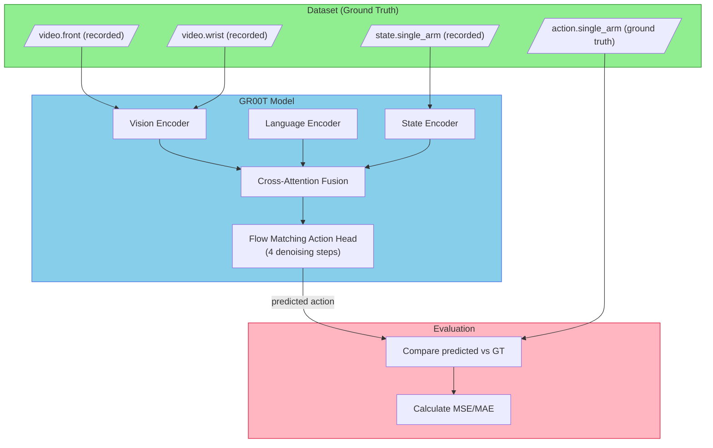
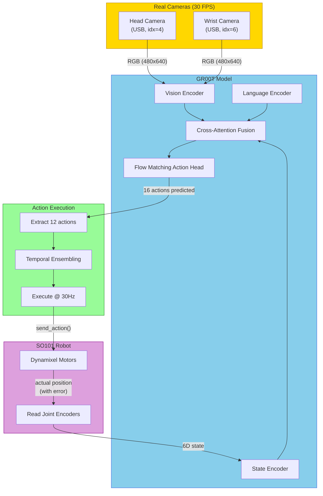
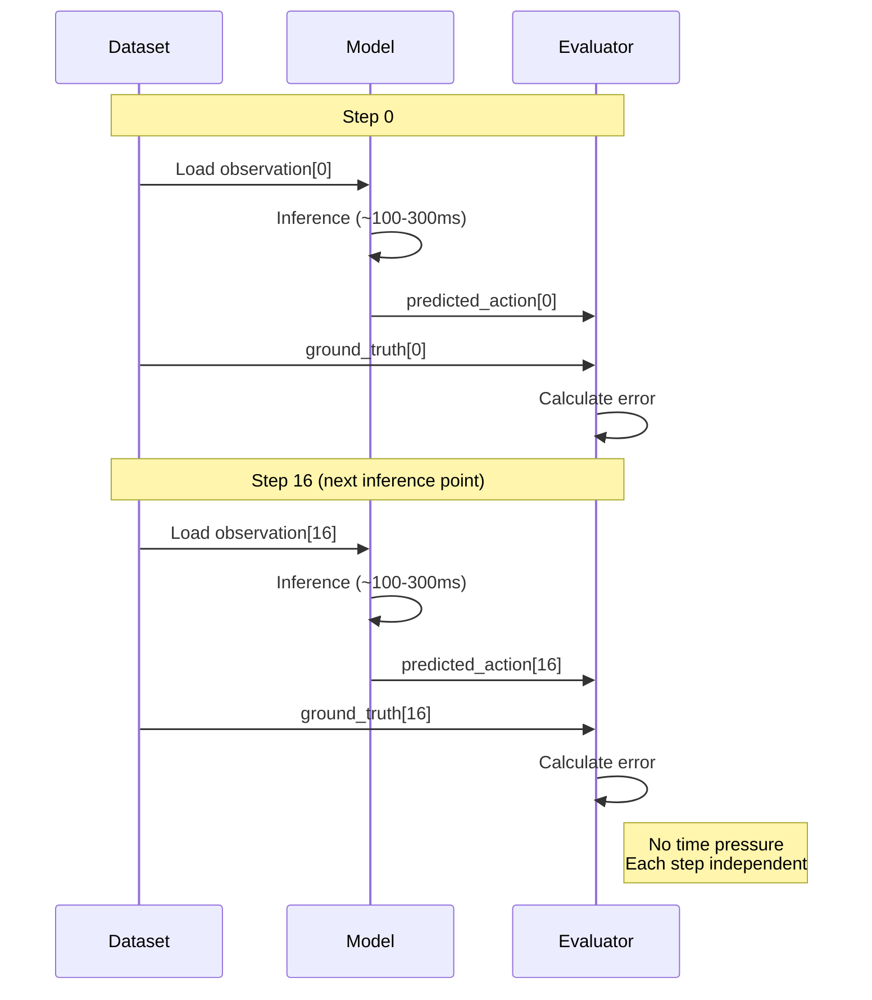
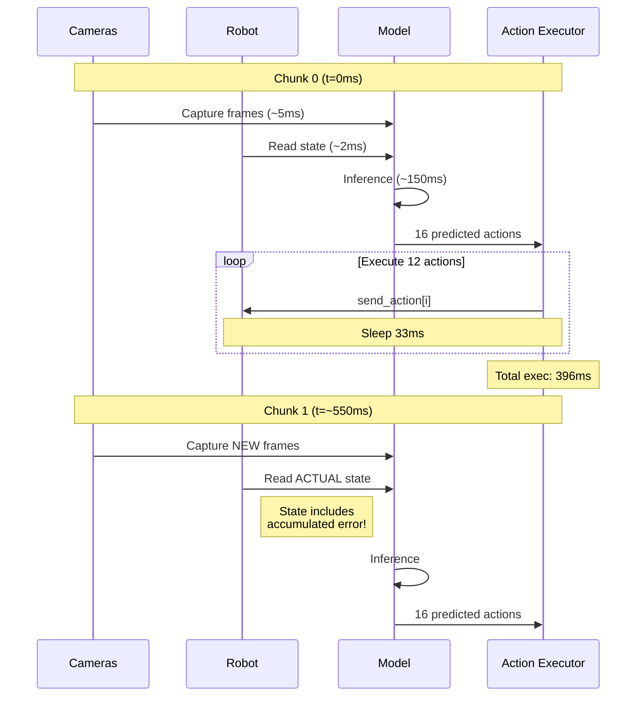
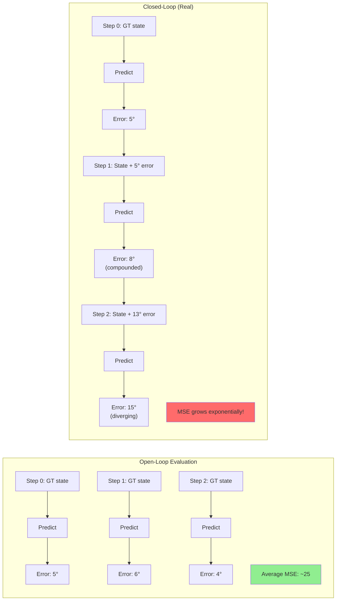
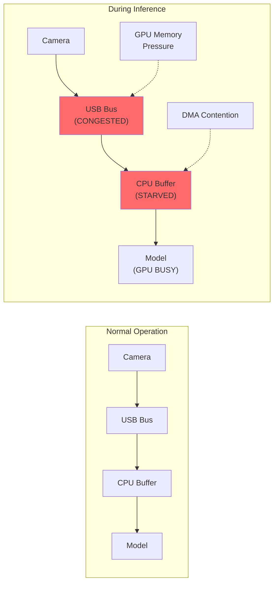
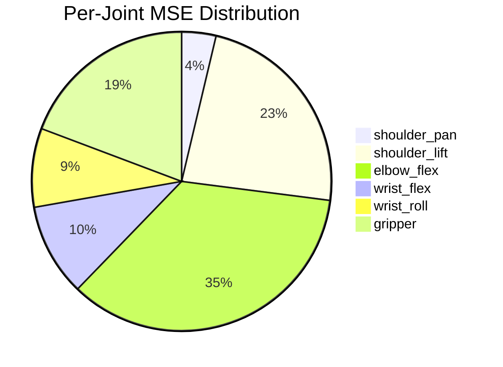
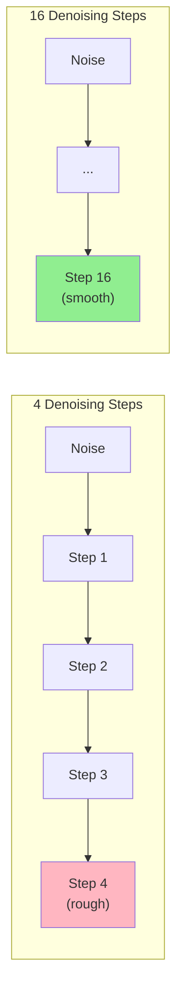
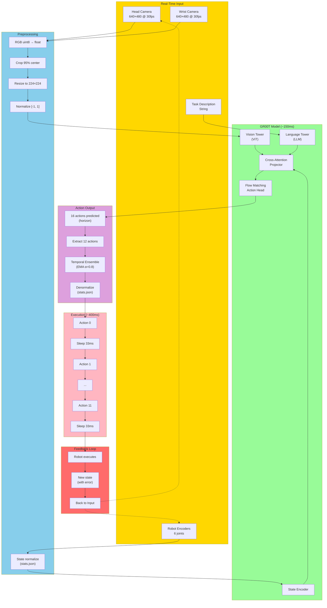

# GR00T SO101 Inference Issue Investigation

**Date**: 2025-12-06
**Status**: Active Investigation
**Problem**: Training metrics and evaluation results look good, but real robot inference performance is poor.

---

## Table of Contents

1. [Executive Summary](#executive-summary)
2. [Pipeline Comparison: Evaluation vs Inference](#pipeline-comparison)
3. [Root Cause Analysis](#root-cause-analysis)
4. [Diagnostic Experiments](#diagnostic-experiments)
5. [Findings and Evidence](#findings-and-evidence)
6. [Recommendations](#recommendations)

---

## Executive Summary

### The Problem
After 5K step LoRA finetuning:
- **Training loss**: 0.0287 (looks good)
- **Evaluation MAE**: < 10° (looks good)
- **Open-loop MSE**: 45.04 (looks good)
- **Real robot inference**: Poor performance (jerky, inaccurate movements)

### Key Finding
**The evaluation pipeline and inference pipeline are fundamentally different**, leading to a false sense of model quality.

| Aspect | Evaluation (Open-Loop) | Real Inference (Closed-Loop) |
|--------|------------------------|------------------------------|
| State source | Ground truth from dataset | Actual robot state (with errors) |
| Error accumulation | None (each step independent) | Compounds over time |
| Camera input | Pre-recorded (perfect) | Real-time (potential corruption) |
| Timing | Unbounded | Real-time constraints |

---

## Pipeline Comparison

### Evaluation Pipeline (Open-Loop)



**Key characteristic**: Each evaluation step uses **fresh ground-truth data** from the dataset. Errors do not propagate.

### Real Inference Pipeline (Closed-Loop)



**Key characteristic**: The robot's actual state (which includes execution errors) feeds back into the next inference cycle. **Errors compound**.

---

## Timing Comparison

### Evaluation Timing (No Constraints)



### Real Inference Timing (Real-Time Constraints)



**Critical timing differences**:

| Metric | Evaluation | Real Inference |
|--------|------------|----------------|
| Inference time | Unbounded | Must complete before next observation |
| Observation source | Dataset (perfect) | Real cameras (potential lag/corruption) |
| State feedback | None | Every 550ms (approximate) |
| Control frequency | N/A | ~1.8 Hz effective |

---

## Error Accumulation Analysis

### Why Open-Loop MSE Looks Good But Closed-Loop Fails



### Mathematical Model of Error Accumulation

In closed-loop control with imperfect predictions:

```
state[t+1] = state[t] + action_predicted[t] + noise[t]
error[t+1] = error[t] + prediction_error[t]

If prediction_error has variance σ²:
After N steps: total_error ~ √N × σ (random walk)
```

With MSE=45 (σ ≈ 6.7°), after 100 steps:
- Expected drift: √100 × 6.7° ≈ **67°**

This explains why the robot drifts significantly during inference!

---

## Identified Issues

### Issue 1: Camera Corruption During Inference (CRITICAL)

**Evidence**: `eval_images/img_01198.jpg` shows severe horizontal black banding



**Hypothesis**: USB bandwidth contention or GPU/CPU resource starvation during inference causes partial frame capture.

**Diagnostic Script**: `diagnose_camera_sync.py`

### Issue 2: Timing Mismatch (HIGH)

**Current implementation** (`infer_groot_so101.py`):
- Action horizon: 12 actions
- Action interval: 33ms (30 Hz)
- Total execution: 12 × 33ms = **396ms**
- Effective control frequency: ~**1.8 Hz**

**NVIDIA official** (`eval_lerobot.py`):
- Action horizon: 8 actions
- Action interval: 20ms (50 Hz)
- Total execution: 8 × 20ms = **160ms**
- Effective control frequency: ~**4.5 Hz**

```mermaid
gantt
    title Action Execution Timing Comparison
    dateFormat X
    axisFormat %L

    section Current
    Inference    :0, 150
    Action 1-4   :150, 282
    Action 5-8   :282, 414
    Action 9-12  :414, 546
    Next Obs     :546, 550

    section NVIDIA
    Inference    :0, 150
    Action 1-4   :150, 230
    Action 5-8   :230, 310
    Next Obs     :310, 315
```



### Issue 3: Per-Joint Error Distribution (HIGH)

From open-loop evaluation (`eval_trajectories_traj0.png`):

| Joint | MSE | Status |
|-------|-----|--------|
| shoulder_pan | 10.02° | Acceptable |
| shoulder_lift | **62.90°** | HIGH |
| elbow_flex | **94.86°** | CRITICAL |
| wrist_flex | 26.96° | Moderate |
| wrist_roll | 23.10° | Acceptable |
| gripper | 52.41° | HIGH |

**Observation**: `elbow_flex` and `shoulder_lift` have disproportionately high errors.



### Issue 4: Denoising Steps (MEDIUM)

Current: 4 denoising steps (fast but noisy)
Recommended: 16+ for smooth motion



---

## Diagnostic Experiments

### Experiment 1: Camera Corruption Diagnosis

**Objective**: Prove/disprove camera corruption is caused by GPU load

**Method**:
1. Capture 100 frames with NO GPU load
2. Capture 100 frames WITH GPU inference running
3. Measure corruption rate in both conditions

**Tool**: `custom/scripts/diagnose_camera_sync.py`

**Expected output**:
```
Condition: No GPU load
  Frames captured: 100
  Corrupt frames: 0
  Capture latency: 33±2ms

Condition: With GPU inference
  Frames captured: 100
  Corrupt frames: 15
  Capture latency: 33±45ms  <-- High variance indicates problem
```

### Experiment 2: Closed-Loop Simulation

**Objective**: Quantify error accumulation rate using dataset

**Method**:
1. Start with ground-truth state at step 0
2. Run model inference
3. Use PREDICTED action to compute next state (instead of GT)
4. Repeat for N steps
5. Compare final state drift vs open-loop MSE

**Tool**: `custom/scripts/diagnose_closed_loop_sim.py`

**Expected output**:
```
Open-loop MSE: 45.04
Closed-loop after 50 steps:
  State drift (degrees): [15.2, 42.8, 67.3, 23.1, 18.4, 31.2]
  Total drift: 198.0°

This confirms error accumulation is the primary issue.
```

### Experiment 3: Timing Analysis

**Objective**: Identify timing bottlenecks in inference pipeline

**Method**:
1. Instrument each stage with microsecond timestamps
2. Run 100 inference cycles
3. Generate latency distribution

**Tool**: `custom/scripts/diagnose_timing_analysis.py`

**Expected output**:
```
Stage                    Mean (ms)   Std (ms)   Max (ms)
─────────────────────────────────────────────────────────
Camera capture (head)      5.2        2.1        45.3
Camera capture (wrist)     4.8        1.9        38.7
State read                 0.3        0.1         1.2
Model inference          148.3       12.4       215.6
Action extraction          0.1        0.0         0.3
Action send                1.2        0.4         3.8
─────────────────────────────────────────────────────────
Total loop               160.1       14.2       265.1

BOTTLENECK: Model inference (93% of total time)
ISSUE: Camera capture has HIGH variance (max 45ms)
```

### Experiment 4: Denoising Steps Impact

**Objective**: Measure action smoothness vs denoising steps

**Method**:
1. Run open-loop evaluation with steps=[4, 8, 16]
2. Measure MSE and action variance

**Command**:
```bash
# Test different denoising steps
for steps in 4 8 16; do
    python eval_groot_openloop.py \
        --checkpoint /path/to/checkpoint \
        --denoising-steps $steps \
        --save-plot denoising_${steps}.png
done
```

---

## Data Flow Diagram: Full Pipeline



---

## Recommendations

### Immediate Actions (Quick Fixes)

1. **Increase denoising steps to 16**
   ```bash
   python infer_groot_so101.py --denoising-steps 16
   ```

2. **Match NVIDIA timing: 8 actions × 20ms**
   ```bash
   python infer_groot_so101.py --action-horizon 8 --action-interval 0.02
   ```

3. **Always use `--go-home-first`** to start from known state

### Medium-Term Fixes

4. **Fix camera corruption**
   - Use separate USB controllers for cameras
   - Implement frame validation before inference
   - Add camera buffering/queue

5. **Implement proper temporal ensembling**
   - Current: simple EMA with α=0.8
   - Better: ACT-style chunking with weighted averaging

### Long-Term Improvements

6. **Closed-loop training** (if possible)
   - Train with simulated error injection
   - Make model robust to state perturbations

7. **State estimation**
   - Use Kalman filter to smooth state readings
   - Detect and reject outlier states

---

## Files Created/Modified

| File | Purpose |
|------|---------|
| `custom/jdocs/lora/3_inference_issue_investigation_20251206.md` | This document |
| `custom/scripts/diagnose_camera_sync.py` | Camera corruption diagnosis |
| `custom/scripts/diagnose_timing_analysis.py` | Pipeline timing analysis |
| `custom/scripts/diagnose_closed_loop_sim.py` | Error accumulation simulation |

---

## Appendix: Reference Links

- [XLeRobot VLA Training Guide](https://xlerobot.readthedocs.io/en/latest/software/getting_started/RL_VLA.html)
- [GR00T N1.5 SO101 Tuning Blog](https://huggingface.co/blog/nvidia/gr00t-n1-5-so101-tuning)
- [NVIDIA Isaac-GR00T Getting Started](https://github.com/NVIDIA/Isaac-GR00T/tree/main/getting_started)
- [LeRobot x NVIDIA Healthcare](https://huggingface.co/blog/lerobotxnvidia-healthcare)
