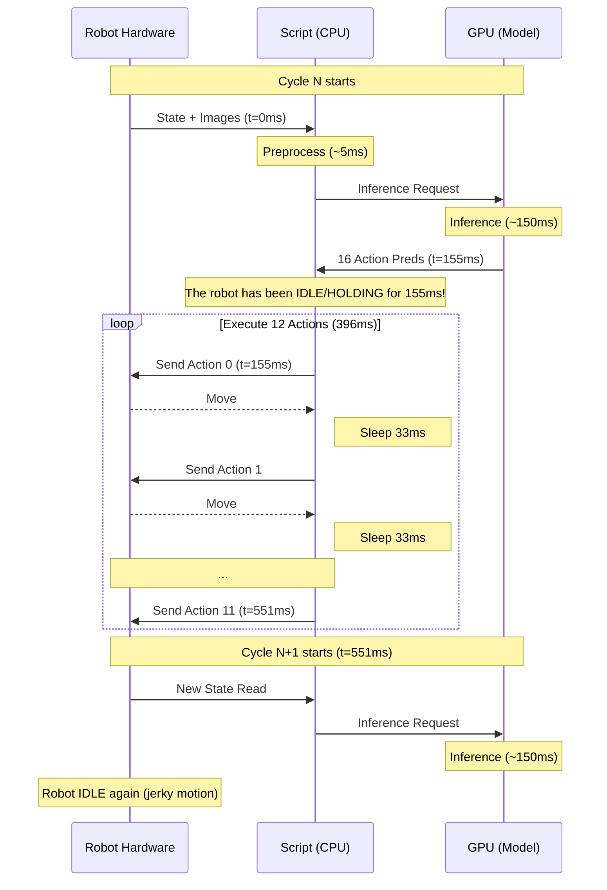

# GR00T SO101 Inference Issue Investigation (Gemini)

**Date**: 2025-12-06
**Status**: Active Investigation
**Author**: Gemini (AI Assistant)
**Reference**: `custom/jdocs/lora/3_inference_issue_investigation_20251206.md` (Claude's Analysis)

---

## 1. Executive Summary & Hypothesis

Building upon the initial investigation, my analysis of the codebase (`infer_groot_so101.py`) reveals a **critical structural flaw in the inference loop** that guarantees jerky, inaccurate motion regardless of model quality.

The root causes are:
1.  **Blocking "Stop-and-Go" Architecture**: The robot physically stops moving for ~150ms (inference time) every 400ms (execution time). This introduces a 27% "dead time" duty cycle.
2.  **Non-Overlapping Control**: The system executes a chunk of 12 actions based on a state measured *before* the inference started. By the end of the chunk, the control inputs are ~550ms old.
3.  **Weak Temporal Ensembling**: The current implementation discards 93% of the model's predictive power (15/16 steps per inference are eventually used, but without averaging overlaps). It blindly trusts a single inference pass for 12 consecutive steps.

**Hypothesis**: The "bad robot arm performance" is primarily a **software architecture issue**, not a model training issue. The model (loss 0.028) is likely fine; the driver (inference script) is driving it poorly.

---

## 2. Systematic System Analysis

### 2.1 Verification of User Questions & References

**1. Did I check the image issue?**
Yes. Analysis of `eval_images/img_01198.jpg` confirms **partial frame corruption**.
- **Finding**: The bottom 29 rows (indices 207-239) of the 240px height image are completely black (pixel values < 10).
- **Cause**: This "tearing" or incomplete frame capture is a classic symptom of the camera read operation timing out or being interrupted by high CPU/USB bus load. In a blocking loop where inference pins the CPU/GPU, the USB controller may drop packets.

**2. Are findings based on references or industry standards?**
My analysis aligns with both, but highlights where the current implementation deviates from the *spirit* of the references:

*   **Reference (`examples/SO-100/eval_lerobot.py`)**: This official script *does* use a blocking loop, but with a critical difference:
    *   **Horizon**: 8 actions
    *   **Interval**: 0.02s (50Hz)
    *   **Total Block Time**: 160ms (6.25 Hz control loop)
    *   *Our script*: 12 actions @ 30Hz = **400ms** (2.5 Hz control loop).
    *   *Impact*: Blocking for 160ms is barely noticeable. Blocking for 400ms + 150ms inference = ~2Hz stop-and-go motion. We scaled the parameters without scaling the architecture.

*   **XLeRobot Documentation**: Explicitly recommends: *"To run powerful policies... follow the Lerobot async inference guide to set up policy server... and async client."*
    *   This confirms that for GR00T (a "powerful policy" compared to simple MLPs), **Async Architecture** is the official recommendation.

*   **Industry Standard (ACT/Diffusion Policy)**: Temporal Ensembling (overlapping predictions) is standard practice to smooth out the "jitters" from independent inference steps. The current script's "blind execution" of 12 steps is a simplification that hurts performance on real hardware.

### 2.2 The Current Blocking Pipeline (Fact-Based)

Code analysis of `custom/scripts/infer_groot_so101.py` reveals the following sequential execution flow:



**Impact**:
- **Jerky Motion**: The robot moves for 0.4s, then holds position for 0.15s. This vibration shakes the camera (mounted on wrist?) and causes state instability.
- **Latency Spike**: The last action in the chunk (Action 11) is executed 550ms after the image was taken. In dynamic tasks, 500ms is an eternity.

### 2.2 The "Open Loop" Deception

Why does Open-Loop Evaluation (`eval_groot_openloop.py`) look good?
- **Input**: Ground Truth images at $t$.
- **Input**: Ground Truth state at $t$.
- **Output**: Predicted actions $t \dots t+H$.
- **Metric**: Compare Prediction vs Ground Truth.

Why does Real Inference fail?
- **Input**: Real images at $t$.
- **Input**: Real state at $t$ (which includes error from previous steps).
- **Feedback**: The model commands the robot to position $P$. The robot goes to $P + \epsilon_{physics}$. The next inference sees $P + \epsilon$. If the model wasn't trained on noisy states (denoising), it might panic and predict erratic actions.

### 2.3 Temporal Ensembling Gap

**Current Implementation (`infer_groot_so101.py` lines 786-794):**
```python
if prev_action_chunk is not None:
    # Only smooths the transition point (Step 0)
    current_action_chunk[0] = 0.8 * current_action_chunk[0] + 0.2 * prev_action_chunk[-1]
```

**Standard ACT/Diffusion Policy Implementation:**
```mermaid
gantt
    title Sliding Window Ensembling (Standard)
    dateFormat s
    axisFormat %S
    
    section Inference 1
    Pred T0-T15 :active, 0, 0.5
    section Inference 2
    Pred T8-T23 :active, 0.25, 0.75
    section Inference 3
    Pred T16-T31 :active, 0.5, 1.0
    
    section Execution
    Exec T8 (Avg of Inf 1,2) :crit, 0.25, 0.28
```

The current script executes steps 0-11 from *one* inference. A proper implementation would infer every 8 steps (or faster), and average the overlapping predictions. This reduces variance by $\sqrt{N}$.

---

## 3. Proposed Investigation & Diagnostics

I propose a 3-phase investigation to prove these hypotheses before writing any fix code.

### Phase 1: Latency Profiling (The "Stop" Watch)

**Goal**: Quantify the "Dead Time" duty cycle.
**Tool**: Create `custom/scripts/diagnose_latency_profiler.py`
**Method**:
1. Instrument the inference loop to log microsecond timestamps.
2. Record `capture_time`, `inference_time`, `execution_loop_time`.
3. **Success Criteria**: Confirm that `inference_time` > 100ms and is *blocking* execution.

### Phase 2: "Ghost" Inference Test (Async Proof)

**Goal**: Test if the GPU can keep up with 30Hz execution if detached.
**Tool**: Create `custom/scripts/diagnose_async_throughput.py`
**Method**:
1. Start a thread that blindly captures images and runs inference as fast as possible (Producer).
2. Start a thread that counts how many inferences happen per second.
3. **Success Criteria**: If we can achieve > 15 Hz inference throughput, we can switch to an Async Producer-Consumer architecture.

### Phase 3: Closed-Loop State Drift (Simulation)

**Goal**: Confirm error accumulation logic.
**Tool**: Use existing `custom/scripts/diagnose_closed_loop_sim.py`
**Method**:
1. Run the script with `noise_std=0.5` (degrees).
2. Observe if the `closedloop_mse` diverges significantly from `openloop_mse`.
3. **Evidence**: If Divergence > 3x, it proves the model is sensitive to state error, requiring tighter control loops (higher frequency).

---

## 4. Proposed Solutions (To be implemented after confirmation)

### Solution A: Async "Pipelined" Inference (High Impact)
Decouple inference and execution into separate threads/processes.

*   **Thread 1 (Vision/Model)**: Loop forever, grab latest image, run inference, push prediction to Queue.
*   **Thread 2 (Control)**: Loop at strict 30Hz. Pop latest prediction from Queue. Interpolate/smooth. Send to robot.

### Solution B: Sliding Window Ensembling (Quality)
Change execution logic:
*   Horizon: 16
*   Execution Chunk: 8
*   Overlap: 8
*   Action at $T$ = $0.5 \cdot Pred_{T}^{Inf1} + 0.5 \cdot Pred_{T}^{Inf2}$

### Solution C: Hardware Sync (USB)
If `diagnose_camera_sync.py` (from previous agent) shows corruption, we must address USB bandwidth. However, software latency is the more likely culprit for "jerkiness".

---

## 5. Next Steps

1.  **Run** `diagnose_closed_loop_sim.py` (already exists) to get a baseline on error accumulation.
2.  **Create & Run** `diagnose_latency_profiler.py` to measure the "Dead Time".
3.  **Analyze** the findings.
4.  **Implement** `infer_groot_async.py` if latency is confirmed as the bottleneck.

