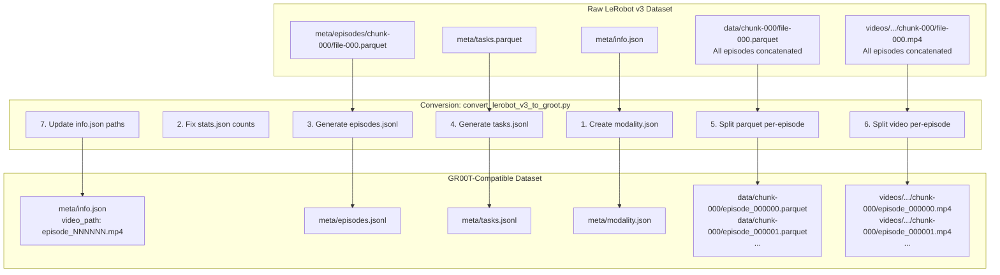
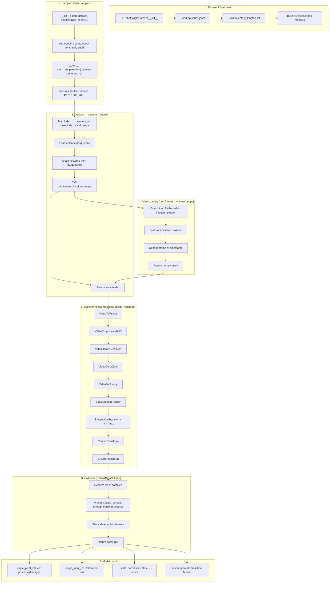
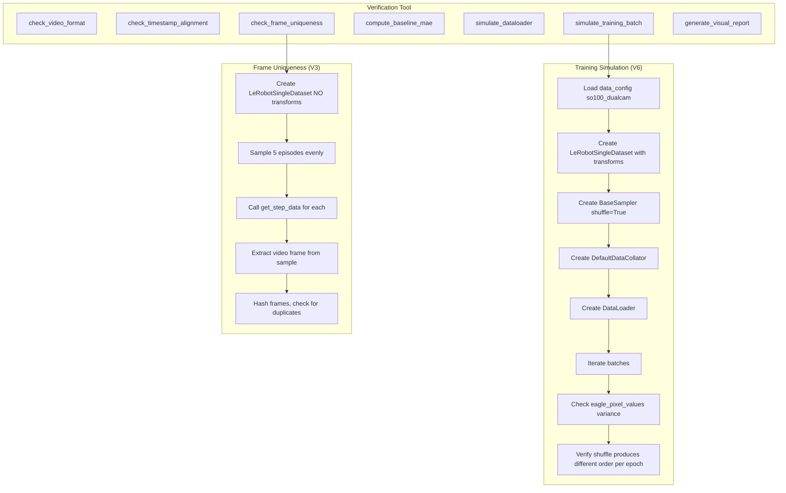
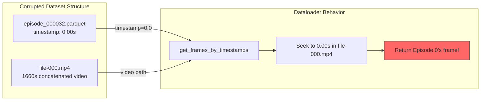

# Dataset & Training Pipeline Investigation Report

**Date**: 2025-12-13
**Author**: Claude
**Purpose**: Document how data flows from raw dataset through training, and how verification simulates this process.

---

## Table of Contents

1. [Executive Summary](#executive-summary)
2. [Data Conversion Pipeline](#data-conversion-pipeline)
3. [Training Data Loading Pipeline](#training-data-loading-pipeline)
4. [Verification Simulation](#verification-simulation)
5. [Visual Verification Tools](#visual-verification-tools)
6. [Key Findings](#key-findings)

---

## Executive Summary

This report traces the complete data flow from raw LeRobot v3 dataset through GR00T training, showing:
- How conversion/combination transforms the data
- How the training dataloader loads, shuffles, and batches data
- How our verification tool simulates this exact process
- Tools available for visual double-checking

**Critical Finding**: The corrupted `datasets_groot` passes basic file checks but fails when we simulate the actual training dataloader - proving that verification must use the same code path as training.

---

## Data Conversion Pipeline

### Overview



### Critical Data Transformations

#### 1. Video Splitting

**Before (LeRobot v3):**
```
videos/observation.images.head/chunk-000/
└── file-000.mp4  (1660 seconds, all 70 episodes concatenated)
```

**After (GR00T):**
```
videos/observation.images.head/chunk-000/
├── episode_000000.mp4  (38.37 seconds)
├── episode_000001.mp4  (38.60 seconds)
├── episode_000002.mp4  (42.10 seconds)
...
└── episode_000069.mp4  (25.13 seconds)
```

#### 2. Parquet Splitting with Timestamp Reset

**Before (LeRobot v3) - file-000.parquet:**
```
index | episode_index | timestamp | frame_index | observation.state | action
------|---------------|-----------|-------------|-------------------|-------
0     | 0             | 0.000     | 0           | [0.2, -98.9, ...]| [0.3, -99.1, ...]
1     | 0             | 0.033     | 1           | [0.2, -98.9, ...]| [0.3, -99.0, ...]
...
1151  | 0             | 38.367    | 1151        | [1.5, -45.2, ...]| [1.6, -45.0, ...]
1152  | 1             | 38.400    | 0           | [0.1, -99.0, ...]| [0.2, -98.8, ...]  <-- Timestamp continues!
...
```

**After (GR00T) - episode_000000.parquet:**
```
index | episode_index | timestamp | frame_index | observation.state | action
------|---------------|-----------|-------------|-------------------|-------
0     | 0             | 0.000     | 0           | [0.2, -98.9, ...]| [0.3, -99.1, ...]
1     | 0             | 0.033     | 1           | [0.2, -98.9, ...]| [0.3, -99.0, ...]
...
1151  | 0             | 38.367    | 1151        | [1.5, -45.2, ...]| [1.6, -45.0, ...]
```

**After (GR00T) - episode_000001.parquet:**
```
index | episode_index | timestamp | frame_index | observation.state | action
------|---------------|-----------|-------------|-------------------|-------
0     | 1             | 0.000     | 0           | [0.1, -99.0, ...]| [0.2, -98.8, ...]  <-- Timestamp RESET to 0!
1     | 1             | 0.033     | 1           | [0.1, -99.0, ...]| [0.2, -98.7, ...]
...
```

**Why This Matters**: Per-episode videos start at timestamp 0. The parquet timestamps must also start at 0 to match. The dataloader seeks video frames by timestamp.

---

## Training Data Loading Pipeline

### Complete Training Data Flow



### Detailed Step-by-Step with Data Samples

#### Step 1: Dataset Initialization

```python
# gr00t/data/dataset.py - LeRobotSingleDataset.__init__
dataset = LeRobotSingleDataset(
    dataset_path="/home/jrobot/project/XLeRobot/datasets_copy/left/pick_and_place",
    modality_configs=modality_config,  # video, state, action keys
    video_backend="torchvision_av",
    transforms=transforms,
    embodiment_tag="new_embodiment",
)

# Internal state after init:
# dataset.trajectory_lengths = [1152, 1158, 1263, 964, 917, ...]  # frames per episode
# dataset.all_steps = [(0, 0), (0, 1), ..., (0, 1151), (1, 0), (1, 1), ...]
# len(dataset) = 49869  # total frames across all episodes
```

#### Step 2: Sampler Generates Shuffled Indices

```python
# gr00t/experiment/trainer.py - BaseSampler
sampler = BaseSampler(dataset, shuffle=True, seed=42)
sampler.set_epoch(0)

# __iter__ implementation:
g = torch.Generator()
g.manual_seed(42 + 0)  # seed + epoch
indices = torch.randperm(49869, generator=g).tolist()
# indices = [23847, 1203, 45102, 8934, 31256, ...]  # shuffled order
```

#### Step 3: Dataset.__getitem__ Maps Index to Sample

```python
# For index 23847:
trajectory_id, base_index = dataset.all_steps[23847]
# trajectory_id = 32 (episode 32)
# base_index = 547 (frame 547 within episode 32)

# Load parquet for episode 32
parquet_path = "data/chunk-000/episode_000032.parquet"
df = pd.read_parquet(parquet_path)

# Get timestamp for frame 547
timestamp = df.iloc[547]["timestamp"]  # e.g., 18.233 seconds
```

#### Step 4: Video Loading by Timestamp

```python
# gr00t/utils/video.py - get_frames_by_timestamps
video_path = "videos/observation.images.head/chunk-000/episode_000032.mp4"
timestamps = [18.233]  # from parquet

# For per-episode video: seeks to 18.233s in episode_000032.mp4
# Returns frame at that timestamp
frame = get_frames_by_timestamps(video_path, timestamps, backend="torchvision_av")
# frame.shape = (1, 480, 640, 3)  # [T, H, W, C]
```

**THE BUG (in corrupted dataset):**
```python
# Corrupted dataset has consolidated video + reset timestamps:
video_path = "videos/observation.images.head/chunk-000/file-000.mp4"  # ALL episodes
timestamps = [0.0]  # Reset to 0 for every episode!

# Episode 32 should seek to ~400s in the concatenated video
# But timestamp says 0.0, so it seeks to 0s = Episode 0's frames!
frame = get_frames_by_timestamps(video_path, [0.0], ...)
# Returns Episode 0's frame, not Episode 32's!
```

#### Step 5: Transforms Process the Sample

```python
# Sample before transforms:
sample = {
    "video.front": np.array([[[...]]])  # [1, 480, 640, 3]
    "video.wrist": np.array([[[...]]])  # [1, 480, 640, 3]
    "state.single_arm": np.array([0.2, -98.9, 97.4, 50.6, -0.4])
    "state.gripper": np.array([0.5])
    "action.single_arm": np.array([[0.3, -99.1, ...], ...])  # [16, 5]
    "action.gripper": np.array([[0.5], ...])  # [16, 1]
    "annotation.human.task_description": "pick up the red cube..."
}

# After VideoToTensor + VideoCrop + VideoResize + VideoColorJitter + VideoToNumpy:
sample["video.front"].shape = (1, 224, 224, 3)

# After StateActionTransform (min_max normalization):
sample["state.single_arm"] = normalized_to_[-1, 1]

# After ConcatTransform:
sample["video"] = concatenated [1, 2, 224, 224, 3]  # 2 cameras
sample["state"] = concatenated [1, 6]
sample["action"] = concatenated [16, 6]

# After GR00TTransform:
sample["eagle_content"] = {
    "image_inputs": [PIL.Image, PIL.Image],  # processed for Eagle VLM
    "text_list": ["<|user|>\n<|image|><|image|>pick up the red cube..."],
}
sample["state"] = padded to [1, 64]
sample["action"] = padded to [16, 32]
```

#### Step 6: Collation Creates Batch

```python
# DefaultDataCollator receives list of 4 samples (batch_size=4)
batch = collate(samples, eagle_processor)

# Processes eagle_content through eagle_processor:
eagle_inputs = eagle_processor(
    text=text_list,  # 4 texts
    images=image_inputs,  # 8 images (4 samples x 2 cameras)
    return_tensors="pt",
    padding=True
)

# Final batch:
batch = {
    "eagle_pixel_values": tensor [8, 3, 384, 384],  # processed images
    "eagle_input_ids": tensor [4, seq_len],  # tokenized text
    "eagle_attention_mask": tensor [4, seq_len],
    "state": tensor [4, 1, 64],
    "state_mask": tensor [4, 1, 64],
    "action": tensor [4, 16, 32],
    "action_mask": tensor [4, 16, 32],
}
```

#### Step 7: Model Training

```python
# gr00t/experiment/trainer.py - DualBrainTrainer.compute_loss
outputs = model(batch)
loss = outputs["loss"]
# Backprop, optimizer step, etc.
```

---

## Verification Simulation

### How verify_dataset_integrity.py Simulates Training



### Key Verification Code Paths

#### Frame Uniqueness Check (Uses Same Code as Training)

```python
# verify_dataset_integrity.py - check_frame_uniqueness
def check_frame_uniqueness(...):
    # Use the EXACT same dataset class as training
    dataset = LeRobotSingleDataset(
        dataset_path=str(dataset_path),
        modality_configs=modality_config,
        video_backend="torchvision_av",
        transforms=None,  # No transforms to see raw frames
        embodiment_tag="new_embodiment",
    )

    for ep_idx in sample_eps:
        # Use the EXACT same method as training
        sample = dataset.get_step_data(ep_idx, 0)

        # This internally calls:
        # 1. Load parquet for episode
        # 2. Get timestamp from parquet
        # 3. Call get_frames_by_timestamps(video_path, timestamp)
        # 4. Return video frame

        frame = sample["video.front"][0]
        hash = md5(frame.tobytes())

        # If multiple episodes have same hash -> CORRUPTED
```

#### Full Training Simulation

```python
# verify_dataset_integrity.py - simulate_training_batch
def simulate_training_batch(...):
    # Exact same setup as gr00t/experiment/runner.py
    data_cfg = load_data_config("so100_dualcam")
    modality_config = data_cfg.modality_config()
    transforms = data_cfg.transform()

    dataset = LeRobotSingleDataset(
        dataset_path=str(dataset_path),
        modality_configs=modality_config,
        video_backend="torchvision_av",
        transforms=transforms,  # Same transforms as training
        embodiment_tag="new_embodiment",
    )

    # Same sampler as training
    sampler = BaseSampler(dataset, shuffle=True, seed=42)

    # Same collator as training
    data_collator = DefaultDataCollator()

    # Same DataLoader config as training
    dataloader = DataLoader(
        dataset,
        batch_size=4,
        sampler=sampler,
        collate_fn=data_collator,
    )

    # Actually iterate and check
    for batch in dataloader:
        # Check video variance in eagle_pixel_values
        # If variance near 0 -> all frames identical -> CORRUPTED
```

---

## Visual Verification Tools

### 1. Training Inputs Visualization (Main Report)

**Generated by**: `verify_dataset_integrity.py --visual`

**Location**: `{dataset}/verification_report/training_inputs_visualization.png`

**What it shows**: For 4 sample episodes, displays the EXACT data that gets fed to the model:

```
┌─────────────────────────────────────────────────────────────────────────────────┐
│ TRAINING INPUT VERIFICATION - Exact data fed to model                           │
├─────────────────────────────────────────────────────────────────────────────────┤
│ Episode 0, Step 576/1152                                                        │
│ Task: pick up the red cube and place it on the white plate                      │
│                                                                                 │
│ ┌──────────────┐  ┌──────────────┐   STATE (observation):    ACTION (16 steps): │
│ │              │  │              │     shoulder_pan: 0.20°   t+0: [0.3, -99.1..] │
│ │  video.front │  │  video.wrist │     shoulder_lift: -98.9° t+7: [1.2, -85.3..] │
│ │  (head cam)  │  │  (wrist cam) │     elbow_flex: 97.4°     t+15: [2.5, -45.0..]│
│ │              │  │              │     wrist_flex: 50.6°                         │
│ └──────────────┘  └──────────────┘     wrist_roll: -0.4°                         │
│                                        gripper: 0.5°                             │
│ Frame hash: a3b2c1d4                                                            │
├─────────────────────────────────────────────────────────────────────────────────┤
│ Episode 17, Step 489/979                                                        │
│ ... (similar layout for each sample)                                            │
└─────────────────────────────────────────────────────────────────────────────────┘
```

**How to read this report**:

| Element | What it shows | What to check |
|---------|---------------|---------------|
| **Episode X, Step Y/Z** | Sample from episode X, at step Y out of Z total | Steps should vary (not all step 0) |
| **Task** | The language instruction fed to the model | Should match your task description |
| **video.front** | Head camera view at this timestep | Should show scene from robot's POV |
| **video.wrist** | Wrist camera view at this timestep | Should show gripper/object interaction |
| **STATE** | 6 joint angles at observation time | Values should be in reasonable range (-180° to 180°) |
| **ACTION** | 16-step action horizon (t+0 to t+15) | Shows predicted trajectory; values should vary over time |
| **Frame hash** | MD5 hash of the video frame | **CRITICAL**: All hashes should be DIFFERENT across episodes |

**How to verify dataset is working**:
1. ✅ Each episode shows DIFFERENT camera views (different scene/object positions)
2. ✅ Frame hashes are UNIQUE across all episodes
3. ✅ State values are reasonable joint angles
4. ✅ Action values change across the 16-step horizon
5. ✅ Task description matches your training task

**Red flags (dataset corrupted)**:
- ❌ All episodes show the SAME camera image
- ❌ Frame hashes are IDENTICAL
- ❌ State/action values are all zeros or NaN

---

### Understanding the 16-Step Action Horizon

**What it means**: The model predicts 16 future action steps at once (action chunking).

```
Training sample structure:
┌─────────────────────────────────────────────────────────────────────┐
│ INPUT (what model sees):                                            │
│   - video.front[t=0]: current head camera frame                     │
│   - video.wrist[t=0]: current wrist camera frame                    │
│   - state[t=0]: current 6 joint angles                              │
│   - task: "pick up the red cube and place it on the white plate"    │
│                                                                     │
│ OUTPUT (what model predicts, all 16 used in loss):                  │
│   - action[t=0]:  joint angles to execute at t+0                    │
│   - action[t=1]:  joint angles to execute at t+1                    │
│   - action[t=2]:  joint angles to execute at t+2                    │
│   - ...                                                             │
│   - action[t=15]: joint angles to execute at t+15                   │
└─────────────────────────────────────────────────────────────────────┘
```

**Loss calculation** (from `flow_matching_action_head.py`):
```python
# ALL 16 action steps contribute to the loss
loss = MSE(predicted_16_actions, ground_truth_16_actions) * action_mask
loss = loss.sum() / action_mask.sum()
```

**Why 16 steps?** Action chunking helps the model learn smooth trajectories. At inference, the model predicts 16 steps, but typically only the first few (e.g., 8) are executed before re-predicting.

---

### The Fundamental Verification Logic

**The core question**: Does video + state + action come from the SAME timestep of the SAME episode?

```
CORRECT alignment (what we verify):
  episode_000032.parquet, row 547:
    ├── timestamp: 18.233s
    ├── state: [0.2, -98.9, 97.4, 50.6, -0.4, 0.5]
    └── action: [[0.3, -99.1, ...], [0.4, -99.0, ...], ...]
                     │
                     ▼
  episode_000032.mp4, seek to 18.233s:
    └── frame showing robot at pose matching state [0.2, -98.9, ...]
                     │
                     ▼
  Model learns: "When I see THIS scene with arm at THIS position,
                execute THIS 16-step trajectory"

CORRUPTED alignment (what we detect):
  episode_000032.parquet, row 547:
    ├── timestamp: 0.0s  ← BUG: reset to 0 instead of 18.233s
    ├── state: [0.2, -98.9, 97.4, 50.6, -0.4, 0.5]  ← correct state
    └── action: [[0.3, -99.1, ...], ...]            ← correct action
                     │
                     ▼
  file-000.mp4, seek to 0.0s:
    └── frame from EPISODE 0, not episode 32!  ← WRONG VIDEO!
                     │
                     ▼
  Model learns: "When I see EPISODE 0's scene (WRONG),
                execute episode 32's trajectory (MISMATCHED)"
  Result: Model ignores vision, becomes "blind"
```

**The visual report proves alignment by showing**:
1. Each episode loads a DIFFERENT video frame (unique hash)
2. The frame matches the episode number in the source path
3. State/action values are reasonable for robot motion


### 2. Frame Uniqueness Grid (Quick Check)

**Location**: `{dataset}/verification_report/frame_uniqueness_grid.png`

**What it shows**: First frame from 9 episodes in a 3x3 grid, with frame hashes color-coded:
- **Green hash** = Unique frame
- **Red hash** = Duplicate frame (CORRUPTION!)

```
┌─────────────────────────────────────────────────────┐
│ Ep 0          │ Ep 7          │ Ep 14         │
│ hash: a3b2c1d4│ hash: e5f6g7h8│ hash: i9j0k1l2│
│ ┌──────────┐  │ ┌──────────┐  │ ┌──────────┐  │
│ │ [image]  │  │ │ [image]  │  │ │ [image]  │  │
│ └──────────┘  │ └──────────┘  │ └──────────┘  │
├───────────────┼───────────────┼───────────────┤
│ ...           │ ...           │ ...           │
└─────────────────────────────────────────────────────┘
```

**Quick interpretation**:
- **9/9 unique** = Dataset healthy
- **1/9 unique (all same hash)** = Dataset corrupted - all episodes load same frame

### 3. JSON Verification Report

**Generated by**: `verify_dataset_integrity.py --save-report`

**Location**: `{dataset}/verification_report/verification_report.json`

**Contents**:
```json
{
  "dataset_path": "/home/jrobot/project/XLeRobot/datasets_copy/left/pick_and_place",
  "passed": true,
  "checks": {
    "video_format": {
      "passed": true,
      "message": "Using per-episode video format (correct)",
      "details": {
        "video_path_pattern": "videos/{video_key}/chunk-{episode_chunk:03d}/episode_{episode_index:06d}.mp4",
        "format": "per_episode",
        "per_episode_videos": 140,
        "consolidated_videos": 0
      }
    },
    "frame_uniqueness": {
      "passed": true,
      "message": "All 5 sampled episodes have unique first frames (via dataloader)",
      "details": {
        "episodes_sampled": [0, 14, 28, 42, 56],
        "frame_hashes": {"0": "a1b2c3d4...", "14": "e5f6g7h8...", ...},
        "duplicate_frames": [],
        "method": "LeRobotSingleDataset (same as training)"
      }
    },
    "training_simulation": {
      "passed": true,
      "message": "Successfully simulated 3 training batches (12 samples)",
      "details": {
        "batches_loaded": 3,
        "total_samples": 12,
        "batch_shapes": {
          "eagle_pixel_values": [8, 3, 384, 384],
          "state": [4, 1, 64],
          "action": [4, 16, 32]
        },
        "shuffle_test": "PASS: Different order in different epochs",
        "video_variance_test": "PASS: Video frames have variance (0.4104)"
      }
    },
    "baseline_mae": {
      "value": 1.22,
      "details": {
        "frames_analyzed": 49869,
        "mae_per_joint": [0.59, 1.91, 1.92, 0.85, 0.57, 1.45]
      }
    }
  }
}
```

### 3. Manual Verification Commands

#### View frame comparison image:
```bash
# Open with default image viewer
xdg-open /home/jrobot/project/XLeRobot/datasets_copy/left/pick_and_place/verification_report/frame_comparison_dataloader.png

# Or copy to local machine and view
scp jrobot@host:/path/to/frame_comparison_dataloader.png ./
```

#### Quick dataset check (no visual):
```bash
python custom/scripts/verify_dataset_integrity.py \
    --dataset /home/jrobot/project/XLeRobot/datasets_copy/left/pick_and_place
```

#### Full verification with visual and report:
```bash
python custom/scripts/verify_dataset_integrity.py \
    --dataset /home/jrobot/project/XLeRobot/datasets_copy/left/pick_and_place \
    --visual \
    --save-report
```

### 4. Interactive Dataset Visualizer

**Location**: `custom/tools/dataset_visualizer/`

**Usage**:
```bash
cd custom/tools/dataset_visualizer
python app.py --dataset /path/to/dataset
# Opens Gradio web interface at http://localhost:7860
```

**Features**:
- Browse episodes and frames
- View video alongside state/action data
- Compare frames across episodes
- Check for duplicate frames visually

### 5. Direct Dataloader Testing

For manual debugging, you can test the dataloader directly:

```python
# test_dataloader.py
from gr00t.data.dataset import LeRobotSingleDataset
from gr00t.experiment.data_config import load_data_config

data_cfg = load_data_config("so100_dualcam")
dataset = LeRobotSingleDataset(
    dataset_path="/home/jrobot/project/XLeRobot/datasets_copy/left/pick_and_place",
    modality_configs=data_cfg.modality_config(),
    video_backend="torchvision_av",
    transforms=None,
    embodiment_tag="new_embodiment",
)

# Load frames from different episodes
for ep in [0, 35, 69]:
    sample = dataset.get_step_data(ep, 0)
    frame = sample["video.front"][0]
    print(f"Episode {ep}: frame shape={frame.shape}, mean={frame.mean():.2f}")

    # Save frame for visual inspection
    from PIL import Image
    img = Image.fromarray(frame)
    img.save(f"episode_{ep}_frame.png")
```

---

## Key Findings

### Valid Dataset (`datasets_copy/left/pick_and_place`)

```
Verification Results:
[1/5] Video format:        PASS - Using per-episode video format
[2/5] Timestamp alignment: PASS - Timestamps start near 0 for each episode
[3/5] Frame uniqueness:    PASS - All 5 sampled episodes have unique first frames
[4/5] Baseline MAE:        1.22° (reference for model comparison)
[5/6] Dataloader:          PASS - 5 samples loaded via LeRobotSingleDataset
[6/6] Training simulation: PASS - 3 batches, shuffle works, video variance 0.4104

Visual Report: 9 unique frames across sampled episodes
```

### Corrupted Dataset (`datasets_groot`)

```
Verification Results:
[1/5] Video format:        FAIL - Consolidated video WITHOUT per-episode videos
[2/5] Timestamp alignment: FAIL - Timestamps reset to 0 for episodes [35, 69]
[3/5] Frame uniqueness:    FAIL - ep14==ep0, ep28==ep0, ep42==ep0, ep56==ep0
[4/5] Baseline MAE:        1.22° (same as valid - data itself is fine)
[5/6] Dataloader:          PASS - Loads samples (but wrong frames!)
[6/6] Training simulation: PASS - Batches work (but all same frame!)

Visual Report: 1 unique frame - all 9 episodes show Episode 0's frame!
```

### Root Cause of Corruption



**The Bug**:
- Consolidated video (`file-000.mp4`) contains all episodes concatenated
- Parquet timestamps reset to 0 for each episode instead of cumulative offsets
- Dataloader seeks by timestamp → Episode 32 with timestamp 0.0s gets Episode 0's frame

**The Fix**:
- Use per-episode videos (`episode_000032.mp4`)
- Each video starts at 0s, matching the reset timestamps
- Or fix timestamps to be cumulative if using consolidated video

---

## Summary

| Component | Training Code | Verification Simulation |
|-----------|---------------|------------------------|
| Dataset | `LeRobotSingleDataset` | Same class, same params |
| Video loading | `get_frames_by_timestamps()` | Same method via `get_step_data()` |
| Sampler | `BaseSampler(shuffle=True)` | Same class, same params |
| Transforms | `data_cfg.transform()` | Same transforms |
| Collator | `DefaultDataCollator` | Same class |
| Batch keys | `eagle_pixel_values`, `state`, `action` | Checks same keys |

**The verification tool catches corruption by using the exact same code path as training.** Basic file checks (parquet exists, video exists) pass on corrupted data, but simulating the actual dataloader exposes the video/timestamp misalignment.

---

## Files Referenced

| File | Purpose |
|------|---------|
| `custom/scripts/verify_dataset_integrity.py` | Verification tool |
| `gr00t/data/dataset.py` | LeRobotSingleDataset implementation |
| `gr00t/experiment/trainer.py` | BaseSampler, DualBrainTrainer |
| `gr00t/experiment/data_config.py` | Data config with transforms |
| `gr00t/model/transforms.py` | GR00TTransform, DefaultDataCollator |
| `gr00t/utils/video.py` | get_frames_by_timestamps |
