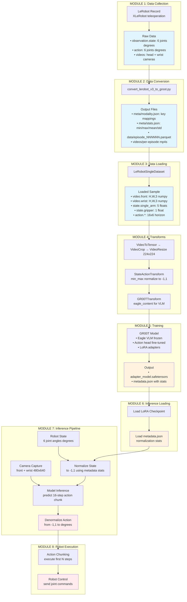
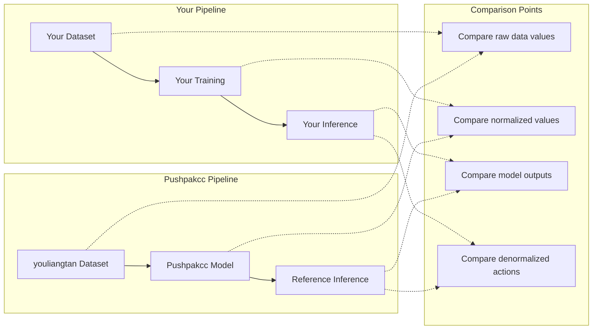

# GR00T Fine-tuning Investigation Report - Overview

**Date:** 2024-12-14
**Issue:** Good training metrics but poor robot inference performance

---

## Problem Statement

Your GR00T fine-tuned model shows:
- Training MAE: 3.9 degrees
- Acc@10: 90%
- But: Poor real robot inference and open-loop evaluation

---

## Complete Pipeline Architecture

This diagram shows the **complete data flow** from raw data collection to robot execution. Each module is a potential failure point that must be verified.

---

## Key Inspection Points Per Module

| Module | Key Inputs | Key Outputs | What to Verify |
|--------|-----------|-------------|----------------|
| **1. Collection** | Teleop commands | Raw parquet + videos | Joint values in degrees, timestamps correct |
| **2. Conversion** | LeRobot v3 data | GR00T format | modality.json mappings, per-episode splits |
| **3. Loading** | Dataset path + config | Sample dict | Video paths resolve, frames load correctly |
| **4. Transforms** | Raw sample | Normalized tensors | State/action in [-1,1], images 224x224 |
| **5. Training** | Batches | LoRA weights + metadata | Loss converges, metadata.json has correct stats |
| **6. Inference Load** | Checkpoint path | Policy object | metadata.json loaded, stats match training |
| **7. Inference Run** | Cameras + state | Action prediction | Normalized correctly, denormalized to degrees |
| **8. Execution** | Action degrees | Robot motion | Values in valid range, robot responds |

---

## Reference Models Analyzed

| Model | Embodiment Tag | Data Config | Dataset | Status |
|-------|---------------|-------------|---------|--------|
| c299m/so101-pen-in-box-v2-policy | **GR1** | so100_dualcam | c299m/so101-pen-in-box-v2 | Working |
| Pushpakcc/gr00t-so100_dualcam-finetuned | **NEW_EMBODIMENT** | so100_dualcam | youliangtan/so101-table-cleanup | Working |
| Your model | NEW_EMBODIMENT | so100_dualcam | custom pick_and_place | **Not working** |

**Key Finding:** Both GR1 and NEW_EMBODIMENT can work for SO-101!

**Pushpakcc Model Details:**
- Training: 1,460 steps (of planned 10,000), loss converged from 0.96 to 0.04
- Dataset: youliangtan/so101-table-cleanup (80 episodes, 47,513 frames)
- Robot: SO-101 with 6-DOF (5 arm + 1 gripper) - same as yours

---

## Datasets Compared

| Dataset | Version | Has modality.json | Video Path Pattern |
|---------|---------|-------------------|-------------------|
| Your dataset | v3.0 | YES | `videos/{video_key}/chunk-{chunk}/episode.mp4` |
| youliangtan/so101-table-cleanup | v2.1 | NO | `videos/chunk-{chunk}/{video_key}/episode.mp4` |
| c299m/so101-pen-in-box-v2 | v2.1 | YES | `videos/chunk-{chunk}/{video_key}/episode.mp4` |
| 5hadytru/so101_grasp_1 | v3.0 | YES | `videos/{video_key}/chunk-{chunk}/file.mp4` |

---

## Critical Findings Summary

### 1. Video Key Naming (POTENTIAL ISSUE)
Your dataset uses non-standard video keys:
- `observation.images.head` (yours) vs `observation.images.front` (reference)
- `observation.images.left_wrist` (yours) vs `observation.images.wrist` (reference)

Your modality.json correctly maps these, but verify GR00T loads them properly.

### 2. Video Path Pattern Difference
- Your v3.0: `videos/{video_key}/chunk-{chunk}/episode_{idx}.mp4`
- Reference v2.1: `videos/chunk-{chunk}/{video_key}/episode_{idx}.mp4`

The order of `{video_key}` and `chunk-{chunk}` is swapped between versions.

### 3. Data Value Ranges (LOOKS OK)
All datasets use degrees, similar ranges. No obvious issue here.

### 4. Embodiment Tag (NEEDS EXPERIMENT)
c299m uses GR1 (pre-trained projector), you use NEW_EMBODIMENT (untrained).
Both can work, but GR1 may transfer better.

---

## Recommended Investigation Approach

### Side-by-Side Comparison with Pushpakcc Model

Since Pushpakcc model uses the same embodiment tag (NEW_EMBODIMENT) and data config (so100_dualcam), we can do a **step-by-step comparison**:

**This allows us to isolate where the difference occurs.**

---

## Module Reports

See detailed analysis in:
- `11_dataset_format_comparison.md` - Dataset structure comparison
- `12_data_loading_verification.md` - Data loading pipeline verification
- `13_normalization_verification.md` - Normalization statistics verification
- `14_embodiment_tag_analysis.md` - Embodiment tag impact analysis
- `15_recommended_experiments.md` - Prioritized experiments to run

---

## Priority Investigation Order

1. **[CRITICAL] Verify video loading** - Ensure videos are being loaded correctly with your path pattern
2. **[HIGH] Verify normalization** - Ensure training stats match inference stats
3. **[HIGH] Side-by-side comparison** - Run both models on same input, compare outputs
4. **[MEDIUM] Test reference dataset** - Train on youliangtan dataset to validate pipeline
5. **[MEDIUM] Test GR1 embodiment** - Try training with GR1 instead of NEW_EMBODIMENT
