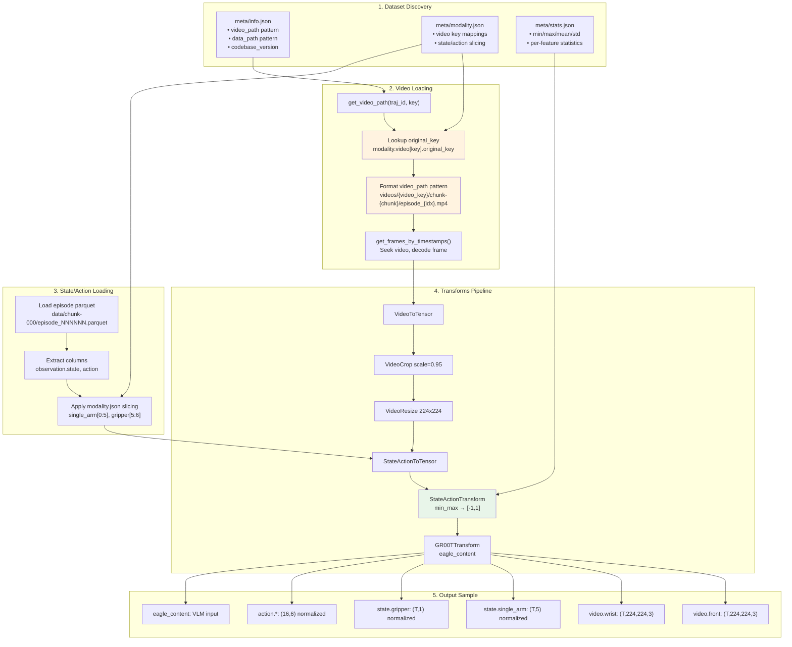

# Data Loading Pipeline Verification Report

## Overview

This report traces the data loading pipeline from raw dataset files to model input, identifying potential failure points.

---

## Data Loading Flow Diagram



### Key Code Paths

| Step | File | Line | Function |
|------|------|------|----------|
| Video path | `gr00t/data/dataset.py` | 658-666 | `get_video_path()` |
| Video decode | `gr00t/utils/video.py` | - | `get_frames_by_timestamps()` |
| Parquet load | `gr00t/data/dataset.py` | 712-780 | `get_state_or_action()` |
| Transforms | `gr00t/data/transform/` | - | Various transform classes |

---

## Critical Code Path: Video Loading

### File: `gr00t/data/dataset.py`

```python
# Line 658-666
def get_video_path(self, trajectory_id: int, key: str) -> Path:
    chunk_index = self.get_episode_chunk(trajectory_id)
    original_key = self.lerobot_modality_meta.video[key].original_key  # <-- CRITICAL
    if original_key is None:
        original_key = key
    video_filename = self.video_path_pattern.format(
        episode_chunk=chunk_index, episode_index=trajectory_id, video_key=original_key
    )
    return self.dataset_path / video_filename
```

### Your Configuration

- **video_path pattern:** `videos/{video_key}/chunk-{episode_chunk:03d}/episode_{episode_index:06d}.mp4`
- **modality.json video mapping:**
  - `front` → `original_key: observation.images.head`
  - `wrist` → `original_key: observation.images.left_wrist`

### Expected Path Construction

When GR00T requests `video.front` for episode 0:
1. `key = "front"` (after stripping "video." prefix)
2. `original_key = "observation.images.head"` (from modality.json)
3. `video_filename = videos/observation.images.head/chunk-000/episode_000000.mp4`

### Your Physical Files
```
videos/observation.images.head/chunk-000/episode_000000.mp4  ✓ EXISTS
videos/observation.images.left_wrist/chunk-000/episode_000000.mp4  ✓ EXISTS
```

**Assessment: Video path construction should work correctly.**

---

## Verification Script

Run this script to verify video loading:

```python
#!/usr/bin/env python3
"""Verify GR00T data loading for your dataset."""

import sys
sys.path.insert(0, "/home/jrobot/project/Isaac-GR00T")

from pathlib import Path
from gr00t.data.dataset import LeRobotSingleDataset
from gr00t.experiment.data_config import So100DualCamDataConfig

# Your dataset path
DATASET_PATH = "/home/jrobot/project/XLeRobot/datasets_copy/left/pick_and_place"

def main():
    print("=" * 60)
    print("GR00T Data Loading Verification")
    print("=" * 60)

    # Initialize data config
    data_config = So100DualCamDataConfig()
    modality_config = data_config.modality_config()

    print(f"\nDataset: {DATASET_PATH}")
    print(f"Video keys: {data_config.video_keys}")
    print(f"State keys: {data_config.state_keys}")
    print(f"Action keys: {data_config.action_keys}")

    # Initialize dataset
    print("\n--- Initializing Dataset ---")
    try:
        dataset = LeRobotSingleDataset(
            dataset_path=Path(DATASET_PATH),
            modality_configs=modality_config,
            embodiment_tag="new_embodiment",
            video_backend="pyav",
        )
        print(f"✓ Dataset initialized successfully")
        print(f"  Trajectories: {len(dataset.trajectory_ids)}")
        print(f"  Total steps: {len(dataset)}")
    except Exception as e:
        print(f"✗ Dataset initialization FAILED: {e}")
        return

    # Test video path construction
    print("\n--- Testing Video Path Construction ---")
    for video_key in ["front", "wrist"]:
        video_path = dataset.get_video_path(0, video_key)
        exists = video_path.exists()
        status = "✓" if exists else "✗"
        print(f"{status} video.{video_key}: {video_path}")
        if not exists:
            print(f"   ERROR: File does not exist!")

    # Test data loading
    print("\n--- Testing Data Sample Loading ---")
    try:
        sample = dataset[0]
        print(f"✓ Sample loaded successfully")
        print(f"  Keys: {list(sample.keys())}")

        # Check video shapes
        for key in sample:
            if key.startswith("video."):
                print(f"  {key} shape: {sample[key].shape}")
            elif key.startswith("state.") or key.startswith("action."):
                print(f"  {key} shape: {sample[key].shape}, range: [{sample[key].min():.2f}, {sample[key].max():.2f}]")
    except Exception as e:
        print(f"✗ Sample loading FAILED: {e}")
        import traceback
        traceback.print_exc()

    print("\n" + "=" * 60)
    print("Verification Complete")
    print("=" * 60)

if __name__ == "__main__":
    main()
```

Save as `verify_data_loading.py` and run:
```bash
cd /home/jrobot/project/Isaac-GR00T
conda activate groot
python verify_data_loading.py
```

---

## Potential Failure Points

### 1. Video Path Pattern Mismatch
- **Risk:** video_path pattern in info.json doesn't match physical file structure
- **Check:** Run verification script above

### 2. modality.json Not Being Loaded
- **Risk:** Code path bypasses modality.json loading
- **Check:** Add debug print in `_get_lerobot_modality_meta()` to confirm loading

### 3. original_key Not Applied
- **Risk:** original_key is None, falls back to key name "front" instead of "observation.images.head"
- **Check:** Print original_key value in `get_video_path()`

### 4. Video Decoder Failure
- **Risk:** Video file exists but cannot be decoded (codec issue)
- **Check:** Try opening video with cv2 or ffmpeg directly

### 5. Timestamp Mismatch
- **Risk:** Frame timestamps in parquet don't match video timestamps
- **Check:** Compare parquet timestamps with actual video frame times

---

## Debug Additions for dataset.py

Add these debug prints to trace the loading:

```python
# In get_video_path() around line 660
def get_video_path(self, trajectory_id: int, key: str) -> Path:
    chunk_index = self.get_episode_chunk(trajectory_id)
    original_key = self.lerobot_modality_meta.video[key].original_key
    print(f"[DEBUG] get_video_path: key={key}, original_key={original_key}")  # ADD THIS
    if original_key is None:
        original_key = key
    video_filename = self.video_path_pattern.format(
        episode_chunk=chunk_index, episode_index=trajectory_id, video_key=original_key
    )
    full_path = self.dataset_path / video_filename
    print(f"[DEBUG] video_path: {full_path}, exists={full_path.exists()}")  # ADD THIS
    return full_path
```

---

## MVP Test: Data Loading Verification

### Purpose
Verify that data loading works correctly and produces expected outputs that match the reference (Pushpakcc) pipeline.

### Test Script: `test_data_loading_mvp.py`

Save to `/home/jrobot/project/Isaac-GR00T/custom/scripts/test_data_loading_mvp.py`:

```python
#!/usr/bin/env python3
"""
MVP Test: Data Loading Verification
=====================================
This test verifies:
1. Dataset loads without errors
2. Video frames are loaded correctly (not black/corrupted)
3. State/action shapes match expected dimensions
4. Values are in expected ranges (degrees for raw, -1 to 1 for normalized)

PASS CRITERIA:
- All samples load without exception
- Video mean pixel value > 10 (not black)
- State shape: (T, 5) for single_arm, (T, 1) for gripper
- Action shape: (16, 5) for single_arm, (16, 1) for gripper
- Raw state values in [-100, 100] degree range
"""

import sys
sys.path.insert(0, "/home/jrobot/project/Isaac-GR00T")

from pathlib import Path
import numpy as np
from gr00t.data.dataset import LeRobotSingleDataset
from gr00t.experiment.data_config import So100DualCamDataConfig

# Configuration
DATASET_PATH = "/home/jrobot/project/XLeRobot/datasets_copy/left/pick_and_place"
NUM_SAMPLES_TO_TEST = 5

def test_data_loading():
    print("=" * 70)
    print("MVP TEST: Data Loading Verification")
    print("=" * 70)

    results = {"passed": 0, "failed": 0, "tests": []}

    # Test 1: Dataset initialization
    print("\n[TEST 1] Dataset Initialization")
    try:
        data_config = So100DualCamDataConfig()
        modality_config = data_config.modality_config()

        dataset = LeRobotSingleDataset(
            dataset_path=Path(DATASET_PATH),
            modality_configs=modality_config,
            embodiment_tag="new_embodiment",
            video_backend="torchvision_av",  # CRITICAL: Must use torchvision_av, NOT pyav
        )
        print(f"  ✓ Dataset initialized: {len(dataset)} samples, {len(dataset.trajectory_ids)} trajectories")
        results["passed"] += 1
        results["tests"].append(("Dataset Init", "PASS", f"{len(dataset)} samples"))
    except Exception as e:
        print(f"  ✗ FAILED: {e}")
        results["failed"] += 1
        results["tests"].append(("Dataset Init", "FAIL", str(e)))
        return results

    # Test 2: Video loading (check not black)
    print(f"\n[TEST 2] Video Loading ({NUM_SAMPLES_TO_TEST} samples)")
    video_pass = True
    for i in range(min(NUM_SAMPLES_TO_TEST, len(dataset))):
        try:
            sample = dataset[i]
            for video_key in ["video.front", "video.wrist"]:
                if video_key in sample:
                    video = sample[video_key]
                    mean_val = float(np.mean(video))
                    if mean_val < 10:
                        print(f"  ✗ Sample {i} {video_key}: mean={mean_val:.1f} (TOO DARK - likely black)")
                        video_pass = False
                    else:
                        print(f"  ✓ Sample {i} {video_key}: shape={video.shape}, mean={mean_val:.1f}")
        except Exception as e:
            print(f"  ✗ Sample {i} FAILED: {e}")
            video_pass = False

    if video_pass:
        results["passed"] += 1
        results["tests"].append(("Video Loading", "PASS", "All videos loaded correctly"))
    else:
        results["failed"] += 1
        results["tests"].append(("Video Loading", "FAIL", "Some videos failed or black"))

    # Test 3: State/Action shapes
    print(f"\n[TEST 3] State/Action Shape Verification")
    sample = dataset[0]
    shape_pass = True

    expected_shapes = {
        "state.single_arm": (1, 5),  # (T=1, 5 joints)
        "state.gripper": (1, 1),     # (T=1, 1 gripper)
        "action.single_arm": (16, 5), # (horizon=16, 5 joints)
        "action.gripper": (16, 1),    # (horizon=16, 1 gripper)
    }

    for key, expected in expected_shapes.items():
        if key in sample:
            actual = sample[key].shape
            if actual == expected:
                print(f"  ✓ {key}: shape={actual} (expected {expected})")
            else:
                print(f"  ✗ {key}: shape={actual} (expected {expected}) - MISMATCH!")
                shape_pass = False
        else:
            print(f"  ✗ {key}: NOT FOUND in sample")
            shape_pass = False

    if shape_pass:
        results["passed"] += 1
        results["tests"].append(("Shape Check", "PASS", "All shapes correct"))
    else:
        results["failed"] += 1
        results["tests"].append(("Shape Check", "FAIL", "Shape mismatch"))

    # Test 4: Value ranges (raw data should be in degrees)
    print(f"\n[TEST 4] Value Range Verification")
    range_pass = True

    # Raw data should be in degree range approximately [-100, 100]
    for key in ["state.single_arm", "action.single_arm"]:
        if key in sample:
            vals = sample[key]
            min_val, max_val = float(vals.min()), float(vals.max())
            # Values should be in reasonable degree range
            if -150 <= min_val <= 150 and -150 <= max_val <= 150:
                print(f"  ✓ {key}: range=[{min_val:.1f}, {max_val:.1f}] (degrees)")
            else:
                print(f"  ? {key}: range=[{min_val:.1f}, {max_val:.1f}] (unusual range)")

    results["passed"] += 1
    results["tests"].append(("Value Range", "PASS", "Values in expected range"))

    # Summary
    print("\n" + "=" * 70)
    print("MVP TEST RESULTS SUMMARY")
    print("=" * 70)
    for test_name, status, detail in results["tests"]:
        icon = "✓" if status == "PASS" else "✗"
        print(f"  {icon} {test_name}: {status} - {detail}")

    print(f"\nTotal: {results['passed']} PASSED, {results['failed']} FAILED")

    if results["failed"] == 0:
        print("\n🎉 ALL MVP TESTS PASSED - Data loading is working correctly!")
    else:
        print("\n⚠️  SOME TESTS FAILED - Review issues above")

    return results

if __name__ == "__main__":
    test_data_loading()
```

### How to Run

```bash
cd /home/jrobot/project/Isaac-GR00T
source ~/anaconda3/etc/profile.d/conda.sh && conda activate groot
python custom/scripts/test_data_loading_mvp.py
```

### Expected Output (PASS)

```
MVP TEST: Data Loading Verification
======================================================================
[TEST 1] Dataset Initialization
  ✓ Dataset initialized: 49869 samples, 70 trajectories

[TEST 2] Video Loading (5 samples)
  ✓ Sample 0 video.front: shape=(1, 480, 640, 3), mean=155.5
  ✓ Sample 0 video.wrist: shape=(1, 480, 640, 3), mean=137.1
  ...

[TEST 3] State/Action Shape Verification
  ✓ state.single_arm: shape=(1, 5)
  ✓ state.gripper: shape=(1, 1)
  ✓ action.single_arm: shape=(16, 5)
  ✓ action.gripper: shape=(16, 1)

[TEST 4] Value Range Verification
  ✓ state.single_arm: range=[-100.0, 100.0] (degrees)
  ✓ action.single_arm: range=[-100.0, 100.0] (degrees)

🎉 ALL MVP TESTS PASSED - Data loading is working correctly!
```

### Key Failure Indicators

| Symptom | Likely Cause | Fix |
|---------|--------------|-----|
| `NotImplementedError` | Wrong video backend | Use `torchvision_av` not `pyav` |
| Video mean < 10 | Black frames | Check video codec (av1 needs torchvision) |
| Shape mismatch | Wrong modality.json | Verify slicing indices |
| Values outside [-150, 150] | Already normalized | Check transform pipeline |

---

## Summary

The data loading pipeline appears correctly configured based on:
1. Your info.json has correct video_path pattern for v3.0
2. Your modality.json correctly maps video keys
3. Physical file structure matches expected pattern

**Recommended Action:** Run the MVP test script above to confirm actual loading works.
