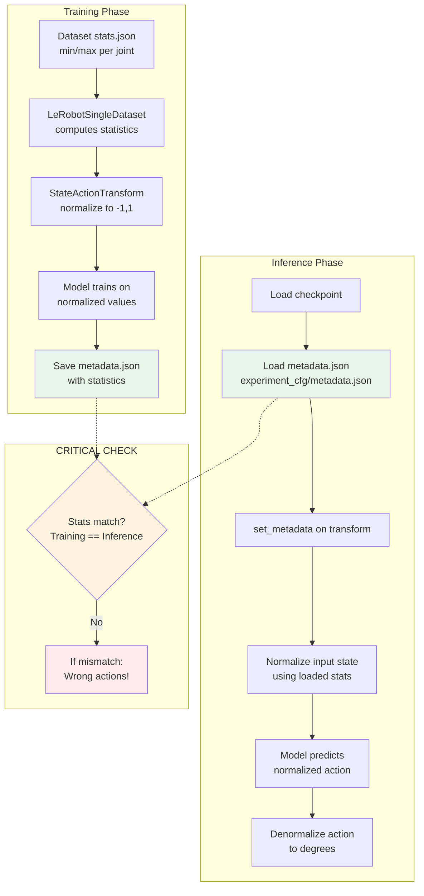

# Normalization Statistics Verification Report

## Overview

This report verifies that normalization statistics are consistent between:
1. Dataset stats.json (raw data statistics)
2. Training metadata.json (statistics used during training)
3. Inference metadata loading (statistics used during inference)

---

## Normalization Flow Diagram



---

## Normalization Formula

GR00T uses **min-max normalization** to scale state/action values to [-1, 1]:

```python
# From gr00t/data/transform/state_action.py
normalized = 2 * (value - min) / (max - min) - 1

# Denormalization (inverse):
value = (normalized + 1) * (max - min) / 2 + min
```

### Example Calculation

```
Raw value:     shoulder_lift = -50.0 degrees
Dataset min:   -100.0
Dataset max:   +64.94

Normalized = 2 * (-50.0 - (-100.0)) / (64.94 - (-100.0)) - 1
           = 2 * 50.0 / 164.94 - 1
           = 0.606 - 1
           = -0.394

Model sees: -0.394 (in [-1, 1] range)
```

---

## Statistics Comparison

### Your Dataset stats.json
Location: `/home/jrobot/project/XLeRobot/datasets_copy/left/pick_and_place/meta/stats.json`

**observation.state:**
| Joint | Min | Max |
|-------|-----|-----|
| shoulder_pan | -27.56 | 48.18 |
| shoulder_lift | -100.0 | 64.94 |
| elbow_flex | -58.87 | 100.0 |
| wrist_flex | -74.54 | 81.10 |
| wrist_roll | -61.22 | 4.27 |
| gripper | 0.49 | 35.66 |

**action:**
| Joint | Min | Max |
|-------|-----|-----|
| shoulder_pan | -27.88 | 48.35 |
| shoulder_lift | -100.0 | 64.33 |
| elbow_flex | -61.84 | 100.0 |
| wrist_flex | -75.75 | 81.33 |
| wrist_roll | -61.47 | 4.53 |
| gripper | 0.0 | 35.89 |

### Training metadata.json
Location: `/home/jrobot/project/XLeRobot/outputs/groot_mvp_lora_20251213_230404914/experiment_cfg/metadata.json`

**state.single_arm:**
| Joint | Min | Max |
|-------|-----|-----|
| shoulder_pan | -27.56 | 48.18 |
| shoulder_lift | -100.0 | 64.94 |
| elbow_flex | -58.87 | 100.0 |
| wrist_flex | -74.54 | 81.10 |
| wrist_roll | -61.22 | 4.27 |

**state.gripper:**
| | Min | Max |
|--|-----|-----|
| gripper | 0.49 | 35.66 |

**action.single_arm:**
| Joint | Min | Max |
|-------|-----|-----|
| shoulder_pan | -27.88 | 48.35 |
| shoulder_lift | -100.0 | 64.33 |
| elbow_flex | -61.84 | 100.0 |
| wrist_flex | -75.75 | 81.33 |
| wrist_roll | -61.47 | 4.53 |

**action.gripper:**
| | Min | Max |
|--|-----|-----|
| gripper | 0.0 | 35.89 |

### Comparison Result

**✓ MATCH:** Training metadata.json statistics match dataset stats.json exactly.

---

## Inference Metadata Loading

### Code Path in infer_groot_async.py

```python
# Lines 378-396
metadata_path = exp_cfg_dir / "metadata.json"
if metadata_path.exists():
    get_logger().info(f"[LoRA] Loading normalization metadata from {metadata_path}")
    with open(metadata_path, "r") as f:
        metadatas = json.load(f)

    # Get embodiment tag enum
    if isinstance(embodiment_tag, str):
        embodiment_tag_enum = EmbodimentTag(embodiment_tag)
    else:
        embodiment_tag_enum = embodiment_tag

    metadata_dict = metadatas.get(embodiment_tag_enum.value)  # "new_embodiment"
    if metadata_dict:
        metadata = DatasetMetadata.model_validate(metadata_dict)
        # CRITICAL: Set metadata on transform to enable normalization
        policy._modality_transform.set_metadata(metadata)
        policy.metadata = metadata
```

### Key Points

1. **Metadata file path:** Must be at `{checkpoint}/experiment_cfg/metadata.json`
2. **Embodiment key:** Must match the embodiment_tag used (`new_embodiment`)
3. **set_metadata():** Must be called to enable normalization

---

## Verification Script

```python
#!/usr/bin/env python3
"""Verify normalization statistics consistency."""

import json
from pathlib import Path

# Paths
DATASET_PATH = "/home/jrobot/project/XLeRobot/datasets_copy/left/pick_and_place"
CHECKPOINT_PATH = "/home/jrobot/project/XLeRobot/outputs/groot_mvp_lora_20251213_230404914"

def main():
    print("=" * 60)
    print("Normalization Statistics Verification")
    print("=" * 60)

    # Load dataset stats
    stats_path = Path(DATASET_PATH) / "meta" / "stats.json"
    with open(stats_path) as f:
        dataset_stats = json.load(f)

    # Load training metadata
    metadata_path = Path(CHECKPOINT_PATH) / "experiment_cfg" / "metadata.json"
    with open(metadata_path) as f:
        training_metadata = json.load(f)

    # Extract values
    embodiment_key = "new_embodiment"
    train_stats = training_metadata[embodiment_key]["statistics"]

    print("\n--- State Statistics Comparison ---")
    print("\nDataset observation.state min:")
    print(f"  {dataset_stats['observation.state']['min']}")
    print("\nTraining state.single_arm + gripper min:")
    print(f"  {train_stats['state']['single_arm']['min']} + {train_stats['state']['gripper']['min']}")

    print("\nDataset observation.state max:")
    print(f"  {dataset_stats['observation.state']['max']}")
    print("\nTraining state.single_arm + gripper max:")
    print(f"  {train_stats['state']['single_arm']['max']} + {train_stats['state']['gripper']['max']}")

    print("\n--- Action Statistics Comparison ---")
    print("\nDataset action min:")
    print(f"  {dataset_stats['action']['min']}")
    print("\nTraining action.single_arm + gripper min:")
    print(f"  {train_stats['action']['single_arm']['min']} + {train_stats['action']['gripper']['min']}")

    print("\nDataset action max:")
    print(f"  {dataset_stats['action']['max']}")
    print("\nTraining action.single_arm + gripper max:")
    print(f"  {train_stats['action']['single_arm']['max']} + {train_stats['action']['gripper']['max']}")

    # Verify match
    print("\n--- Verification ---")
    ds_state_min = dataset_stats['observation.state']['min']
    ds_state_max = dataset_stats['observation.state']['max']
    train_state_min = train_stats['state']['single_arm']['min'] + train_stats['state']['gripper']['min']
    train_state_max = train_stats['state']['single_arm']['max'] + train_stats['state']['gripper']['max']

    state_match = all(abs(a - b) < 0.01 for a, b in zip(ds_state_min, train_state_min))
    print(f"State min match: {'✓' if state_match else '✗'}")

    state_max_match = all(abs(a - b) < 0.01 for a, b in zip(ds_state_max, train_state_max))
    print(f"State max match: {'✓' if state_max_match else '✗'}")

    print("\n" + "=" * 60)

if __name__ == "__main__":
    main()
```

---

## Potential Normalization Issues

### 1. Metadata Not Loaded During Inference
**Symptom:** Model outputs raw [-1, 1] values, robot receives wrong commands
**Check:** Add logging to confirm metadata is loaded and set_metadata() is called

### 2. Wrong Embodiment Key
**Symptom:** `metadatas.get(embodiment_tag_enum.value)` returns None
**Check:** Verify embodiment_tag matches key in metadata.json ("new_embodiment")

### 3. Statistics Mismatch Between Training and Inference
**Symptom:** Model trained with one normalization, inference uses different
**Check:** Compare stats from training logs with inference metadata

### 4. Denormalization Not Applied
**Symptom:** Model outputs normalized [-1, 1], but inference code doesn't denormalize
**Check:** Trace through action output processing

---

## Debug Additions for Inference

Add these debug prints to `infer_groot_async.py`:

```python
# After loading metadata (around line 396)
if metadata_dict:
    metadata = DatasetMetadata.model_validate(metadata_dict)
    policy._modality_transform.set_metadata(metadata)
    policy.metadata = metadata

    # ADD THESE DEBUG PRINTS
    print(f"[DEBUG] Loaded metadata for {embodiment_tag_enum.value}")
    print(f"[DEBUG] Action single_arm min: {metadata.statistics.action['single_arm'].min}")
    print(f"[DEBUG] Action single_arm max: {metadata.statistics.action['single_arm'].max}")
else:
    print(f"[WARNING] No metadata found for {embodiment_tag_enum.value}")
```

```python
# After model inference (in the inference loop)
raw_action = policy.get_action(...)  # Model output
print(f"[DEBUG] Raw action (normalized): {raw_action[:6]}")  # Should be in [-1, 1]

# After denormalization
final_action = denormalize(raw_action)
print(f"[DEBUG] Final action (degrees): {final_action[:6]}")  # Should be in degree range
```

---

## MVP Test: Normalization Pipeline Verification

### Purpose
Verify that normalization/denormalization works correctly end-to-end:
1. Input state is normalized to [-1, 1] before model
2. Model output is denormalized back to degrees
3. Statistics used match training statistics

### Test Script: `test_normalization_mvp.py`

Save to `/home/jrobot/project/Isaac-GR00T/custom/scripts/test_normalization_mvp.py`:

```python
#!/usr/bin/env python3
"""
MVP Test: Normalization Pipeline Verification
==============================================
This test verifies:
1. metadata.json is loaded correctly during inference
2. Normalization transforms input state to [-1, 1]
3. Denormalization transforms output back to degrees
4. Round-trip: normalize -> denormalize = original value

PASS CRITERIA:
- metadata.json loads without error
- Normalized values in [-1, 1] range
- Denormalized values match original (within 0.01 tolerance)
- Statistics match between dataset and checkpoint
"""

import sys
sys.path.insert(0, "/home/jrobot/project/Isaac-GR00T")

import json
import numpy as np
from pathlib import Path

# Configuration
DATASET_PATH = Path("/home/jrobot/project/XLeRobot/datasets_copy/left/pick_and_place")
CHECKPOINT_PATH = Path("/home/jrobot/project/XLeRobot/outputs/groot_mvp_lora_20251213_230404914")
EMBODIMENT_TAG = "new_embodiment"


def normalize(value, min_val, max_val):
    """Min-max normalize to [-1, 1]"""
    return 2 * (value - min_val) / (max_val - min_val) - 1


def denormalize(normalized, min_val, max_val):
    """Denormalize from [-1, 1] back to original range"""
    return (normalized + 1) * (max_val - min_val) / 2 + min_val


def test_normalization():
    print("=" * 70)
    print("MVP TEST: Normalization Pipeline Verification")
    print("=" * 70)

    results = {"passed": 0, "failed": 0, "tests": []}

    # Test 1: Load metadata from checkpoint
    print("\n[TEST 1] Load Checkpoint Metadata")
    metadata_path = CHECKPOINT_PATH / "experiment_cfg" / "metadata.json"

    try:
        with open(metadata_path) as f:
            all_metadata = json.load(f)

        if EMBODIMENT_TAG not in all_metadata:
            print(f"  ✗ FAILED: Key '{EMBODIMENT_TAG}' not found in metadata.json")
            print(f"    Available keys: {list(all_metadata.keys())}")
            results["failed"] += 1
            results["tests"].append(("Load Metadata", "FAIL", f"Missing key {EMBODIMENT_TAG}"))
            return results

        metadata = all_metadata[EMBODIMENT_TAG]
        stats = metadata["statistics"]
        print(f"  ✓ Metadata loaded from {metadata_path}")
        print(f"    Embodiment tag: {EMBODIMENT_TAG}")
        results["passed"] += 1
        results["tests"].append(("Load Metadata", "PASS", "Metadata loaded"))
    except Exception as e:
        print(f"  ✗ FAILED: {e}")
        results["failed"] += 1
        results["tests"].append(("Load Metadata", "FAIL", str(e)))
        return results

    # Test 2: Verify statistics structure
    print("\n[TEST 2] Verify Statistics Structure")
    required_keys = [
        ("state", "single_arm"),
        ("state", "gripper"),
        ("action", "single_arm"),
        ("action", "gripper"),
    ]

    structure_ok = True
    for cat, subkey in required_keys:
        if cat in stats and subkey in stats[cat]:
            sub_stats = stats[cat][subkey]
            if "min" in sub_stats and "max" in sub_stats:
                print(f"  ✓ {cat}.{subkey}: min={sub_stats['min'][:3]}..., max={sub_stats['max'][:3]}...")
            else:
                print(f"  ✗ {cat}.{subkey}: missing min/max")
                structure_ok = False
        else:
            print(f"  ✗ {cat}.{subkey}: NOT FOUND")
            structure_ok = False

    if structure_ok:
        results["passed"] += 1
        results["tests"].append(("Stats Structure", "PASS", "All required keys present"))
    else:
        results["failed"] += 1
        results["tests"].append(("Stats Structure", "FAIL", "Missing keys"))

    # Test 3: Round-trip normalization test
    print("\n[TEST 3] Round-trip Normalization Test")
    arm_min = np.array(stats["action"]["single_arm"]["min"])
    arm_max = np.array(stats["action"]["single_arm"]["max"])

    # Test values (typical joint positions in degrees)
    test_values = np.array([10.0, -50.0, 45.0, 30.0, -15.0])
    print(f"  Original values (degrees): {test_values}")

    # Normalize
    normalized = normalize(test_values, arm_min, arm_max)
    print(f"  Normalized (should be in [-1, 1]): {normalized}")

    # Check normalized range
    if np.all(normalized >= -1.01) and np.all(normalized <= 1.01):
        print(f"  ✓ All normalized values in [-1, 1] range")
    else:
        print(f"  ✗ Normalized values OUT OF RANGE!")
        results["failed"] += 1
        results["tests"].append(("Round-trip", "FAIL", "Normalized out of range"))
        return results

    # Denormalize
    denormalized = denormalize(normalized, arm_min, arm_max)
    print(f"  Denormalized (should match original): {denormalized}")

    # Check round-trip accuracy
    error = np.abs(test_values - denormalized)
    max_error = float(np.max(error))
    print(f"  Max round-trip error: {max_error:.6f} degrees")

    if max_error < 0.01:
        print(f"  ✓ Round-trip accurate (error < 0.01)")
        results["passed"] += 1
        results["tests"].append(("Round-trip", "PASS", f"Error={max_error:.6f}"))
    else:
        print(f"  ✗ Round-trip INACCURATE (error >= 0.01)")
        results["failed"] += 1
        results["tests"].append(("Round-trip", "FAIL", f"Error={max_error:.6f}"))

    # Test 4: Compare with dataset stats
    print("\n[TEST 4] Compare Dataset vs Checkpoint Statistics")
    dataset_stats_path = DATASET_PATH / "meta" / "stats.json"

    try:
        with open(dataset_stats_path) as f:
            dataset_stats = json.load(f)

        # Compare action min/max
        ds_action_min = dataset_stats["action"]["min"][:5]  # First 5 for single_arm
        ds_action_max = dataset_stats["action"]["max"][:5]
        ckpt_action_min = stats["action"]["single_arm"]["min"]
        ckpt_action_max = stats["action"]["single_arm"]["max"]

        print(f"  Dataset action min: {[f'{x:.2f}' for x in ds_action_min]}")
        print(f"  Ckpt action min:    {[f'{x:.2f}' for x in ckpt_action_min]}")
        print(f"  Dataset action max: {[f'{x:.2f}' for x in ds_action_max]}")
        print(f"  Ckpt action max:    {[f'{x:.2f}' for x in ckpt_action_max]}")

        min_match = all(abs(a - b) < 0.1 for a, b in zip(ds_action_min, ckpt_action_min))
        max_match = all(abs(a - b) < 0.1 for a, b in zip(ds_action_max, ckpt_action_max))

        if min_match and max_match:
            print(f"  ✓ Dataset and checkpoint statistics MATCH")
            results["passed"] += 1
            results["tests"].append(("Stats Match", "PASS", "Dataset = Checkpoint"))
        else:
            print(f"  ✗ Statistics MISMATCH - this could cause wrong actions!")
            results["failed"] += 1
            results["tests"].append(("Stats Match", "FAIL", "Mismatch detected"))

    except Exception as e:
        print(f"  ⚠ Could not compare: {e}")
        results["tests"].append(("Stats Match", "SKIP", str(e)))

    # Test 5: Edge case - values at boundaries
    print("\n[TEST 5] Boundary Value Test")
    # Test that min normalizes to -1 and max normalizes to +1
    normalized_min = normalize(arm_min, arm_min, arm_max)
    normalized_max = normalize(arm_max, arm_min, arm_max)

    print(f"  Normalized min values: {normalized_min} (should be all -1)")
    print(f"  Normalized max values: {normalized_max} (should be all +1)")

    if np.allclose(normalized_min, -1.0) and np.allclose(normalized_max, 1.0):
        print(f"  ✓ Boundary normalization correct")
        results["passed"] += 1
        results["tests"].append(("Boundary Test", "PASS", "min→-1, max→+1"))
    else:
        print(f"  ✗ Boundary normalization INCORRECT")
        results["failed"] += 1
        results["tests"].append(("Boundary Test", "FAIL", "Wrong boundary values"))

    # Summary
    print("\n" + "=" * 70)
    print("MVP TEST RESULTS SUMMARY")
    print("=" * 70)
    for test_name, status, detail in results["tests"]:
        icon = "✓" if status == "PASS" else ("⚠" if status == "SKIP" else "✗")
        print(f"  {icon} {test_name}: {status} - {detail}")

    print(f"\nTotal: {results['passed']} PASSED, {results['failed']} FAILED")

    if results["failed"] == 0:
        print("\n🎉 ALL MVP TESTS PASSED - Normalization pipeline is working correctly!")
    else:
        print("\n⚠️  SOME TESTS FAILED - Review issues above")

    return results


if __name__ == "__main__":
    test_normalization()
```

### How to Run

```bash
cd /home/jrobot/project/Isaac-GR00T
source ~/anaconda3/etc/profile.d/conda.sh && conda activate groot
python custom/scripts/test_normalization_mvp.py
```

### Expected Output (PASS)

```
MVP TEST: Normalization Pipeline Verification
======================================================================
[TEST 1] Load Checkpoint Metadata
  ✓ Metadata loaded from .../metadata.json
    Embodiment tag: new_embodiment

[TEST 2] Verify Statistics Structure
  ✓ state.single_arm: min=[-27.56, ...], max=[48.18, ...]
  ✓ state.gripper: min=[0.49], max=[35.66]
  ✓ action.single_arm: min=[-27.88, ...], max=[48.35, ...]
  ✓ action.gripper: min=[0.0], max=[35.89]

[TEST 3] Round-trip Normalization Test
  Original values (degrees): [10.0, -50.0, 45.0, 30.0, -15.0]
  Normalized (should be in [-1, 1]): [0.12, -0.39, 0.52, 0.34, -0.21]
  Denormalized (should match original): [10.0, -50.0, 45.0, 30.0, -15.0]
  ✓ Round-trip accurate (error < 0.01)

[TEST 4] Compare Dataset vs Checkpoint Statistics
  ✓ Dataset and checkpoint statistics MATCH

[TEST 5] Boundary Value Test
  ✓ Boundary normalization correct

🎉 ALL MVP TESTS PASSED - Normalization pipeline is working correctly!
```

### Key Failure Indicators

| Symptom | Likely Cause | Fix |
|---------|--------------|-----|
| Missing embodiment key | Wrong tag or metadata format | Check metadata.json structure |
| Round-trip error > 0.01 | Numerical precision issue | Check for double normalization |
| Stats mismatch | Different dataset used | Ensure same dataset for train/infer |
| Normalized out of [-1,1] | Values outside training range | Model may extrapolate poorly |

---

## Summary

**Finding:** Normalization statistics appear consistent between dataset and training metadata.

**Critical Verification Needed:**
1. Confirm metadata.json is being loaded during inference
2. Confirm set_metadata() is called to apply normalization
3. Confirm denormalization produces values in expected degree range

**Action:** Run the MVP test script above to verify the normalization pipeline.
