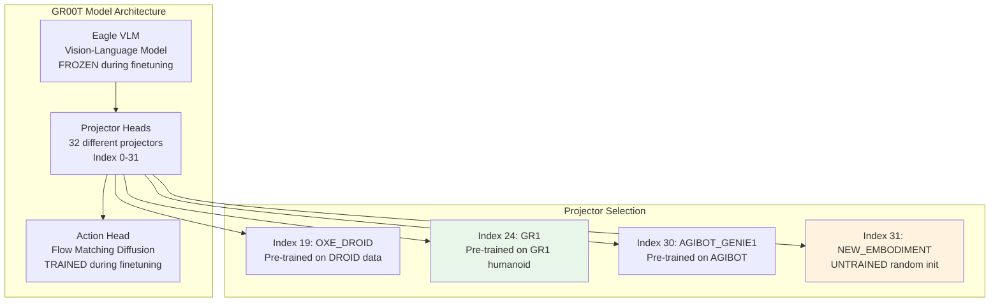

# Embodiment Tag Analysis Report

## Overview

This report analyzes the impact of embodiment tag choice on model performance, comparing GR1 vs NEW_EMBODIMENT for SO-101 fine-tuning.

---

## Embodiment Tag Architecture



---

## Embodiment Tags in GR00T

### Available Tags (from gr00t/data/embodiment_tags.py)

```python
class EmbodimentTag(str, Enum):
    GR1 = "gr1"                      # Projector index 24 - Pre-trained on GR1 humanoid
    OXE_DROID = "oxe_droid"          # Projector index 19 - Pre-trained on OXE DROID
    AGIBOT_GENIE1 = "agibot_genie1"  # Projector index 30 - Pre-trained
    NEW_EMBODIMENT = "new_embodiment" # Projector index 31 - UNTRAINED

EMBODIMENT_TAG_MAPPING = {
    EmbodimentTag.GR1.value: 24,
    EmbodimentTag.OXE_DROID.value: 19,
    EmbodimentTag.AGIBOT_GENIE1.value: 30,
    EmbodimentTag.NEW_EMBODIMENT.value: 31,
}
```

### What Embodiment Tag Does

The embodiment tag selects a **projector head** in the model architecture:
- Each projector maps the model's internal representation to robot-specific action space
- Pre-trained projectors (GR1, OXE_DROID, AGIBOT_GENIE1) learned mappings from their respective datasets
- NEW_EMBODIMENT (index 31) is an **untrained projector** starting from random initialization

---

## Working Models Analysis

### c299m/so101-pen-in-box-v2-policy
| Parameter | Value |
|-----------|-------|
| Embodiment Tag | **GR1** |
| Data Config | so100_dualcam |
| Robot | SO-101 (6-DOF) |
| Status | **Working** |

### Pushpakcc/gr00t-so100_dualcam-finetuned
| Parameter | Value |
|-----------|-------|
| Embodiment Tag | **NEW_EMBODIMENT** |
| Data Config | so100_dualcam |
| Dataset | youliangtan/so101-table-cleanup (80 episodes, 47,513 frames) |
| Robot | SO-101 with 6-DOF (5 arm + 1 gripper) |
| Training Steps | 1,460 (of 10,000 planned) |
| Final Loss | ~0.04 (from 0.96) |
| Status | **Working** |

**Note:** Pushpakcc HuggingFace page says "SO-101 robot arm with 6-DOF control" which is the same robot as yours. They use `NEW_EMBODIMENT` tag with `so100_dualcam` data config - **identical to your setup**.

### Your Model
| Parameter | Value |
|-----------|-------|
| Embodiment Tag | NEW_EMBODIMENT |
| Data Config | so100_dualcam |
| Dataset | custom pick_and_place (70 episodes, 49,869 frames) |
| Robot | SO-101 (6-DOF) |
| Status | **Not Working** |

---

## Key Finding

**Both GR1 and NEW_EMBODIMENT can work for SO-101!**

- c299m successfully uses GR1 (pre-trained projector)
- Pushpakcc successfully uses NEW_EMBODIMENT (untrained projector)

This means embodiment tag choice alone is **not the root cause** of your issue.

### Critical Comparison: Pushpakcc vs Your Model

Since Pushpakcc uses **identical configuration** (NEW_EMBODIMENT + so100_dualcam):

| Aspect | Pushpakcc | Your Model |
|--------|-----------|------------|
| Embodiment Tag | NEW_EMBODIMENT | NEW_EMBODIMENT |
| Data Config | so100_dualcam | so100_dualcam |
| Dataset Format | v2.1 (youliangtan) | v3.0 |
| Episodes | 80 | 70 |
| Frames | 47,513 | 49,869 |
| Training Steps | 1,460 | 10,000 |
| Loss | 0.04 | ? |
| Status | Working | Not Working |

**The difference is NOT in embodiment tag - it must be in data format, loading, or normalization.**

---

## GR1 vs NEW_EMBODIMENT Trade-offs

### GR1 (Projector Index 24)
**Pros:**
- Pre-trained on GR1 humanoid data (absolute joint control)
- May transfer better to SO-101 (similar control paradigm)
- Potentially faster convergence

**Cons:**
- Was trained on different robot (humanoid, not single arm)
- Joint dimensions don't match exactly (GR1 has many more joints)

### NEW_EMBODIMENT (Projector Index 31)
**Pros:**
- Clean slate, no pre-existing bias
- Can learn exactly what your data shows

**Cons:**
- Starts from random initialization
- May need more training data/steps
- Potentially harder to converge

---

## Why GR1 Might Work for SO-101

Even though GR1 was trained on humanoid data, it may transfer because:

1. **Same control paradigm:** Both use absolute joint position control (degrees)
2. **Similar action space structure:** Both output continuous values
3. **Learned motion primitives:** Basic motion patterns may transfer
4. **LoRA fine-tuning:** Only adapts the projector, base model knowledge preserved

---

## Experiment: Test GR1 Embodiment Tag

### Hypothesis
Using GR1 instead of NEW_EMBODIMENT may provide better transfer learning baseline.

### Steps

1. **Modify training script:**
```bash
# In train_groot_mvp.sh, change:
--embodiment-tag new_embodiment
# To:
--embodiment-tag gr1
```

2. **Train with same parameters:**
```bash
bash custom/scripts/train_groot_mvp.sh
```

3. **Compare results:**
- Open-loop evaluation MAE
- Action prediction accuracy
- Real robot performance

### Expected Outcome
If GR1 performs significantly better, it suggests:
- Pre-trained projector provides useful inductive bias
- Your data may benefit from transfer learning

If GR1 performs similarly or worse:
- The issue is not embodiment tag related
- Look at data quality, normalization, or inference pipeline

---

## Code Changes Required

### Training Script
```bash
# custom/scripts/train_groot_mvp.sh
# Change embodiment tag from new_embodiment to gr1

accelerate launch scripts/gr00t_finetune.py \
    --dataset-path "$DATASET_PATH" \
    --embodiment-tag gr1 \  # CHANGED
    --data-config so100_dualcam \
    # ... rest of parameters
```

### Inference Script
```bash
# custom/scripts/infer_groot_async.py
# When loading model, use gr1 embodiment tag

python infer_groot_async.py \
    --model-path /path/to/gr1/checkpoint \
    --embodiment-tag gr1 \  # CHANGED
    # ... rest of parameters
```

### Important: Metadata Consistency
The metadata.json from training will have key `"gr1"` instead of `"new_embodiment"`:
```json
{
    "gr1": {
        "statistics": { ... },
        "modalities": { ... },
        "embodiment_tag": "gr1"
    }
}
```

Ensure inference loads the correct key.

---

## What to Compare After Training

| Metric | NEW_EMBODIMENT | GR1 |
|--------|---------------|-----|
| Training Loss (final) | ? | ? |
| Eval MAE (degrees) | 3.9 | ? |
| Acc@10 | 90% | ? |
| Open-loop tracking | Poor | ? |
| Real robot performance | Poor | ? |

---

## MVP Test: Embodiment Tag and Projector Verification

### Purpose
Verify that the correct embodiment projector is being used and producing reasonable outputs.

### Test Script: `test_embodiment_tag_mvp.py`

Save to `/home/jrobot/project/Isaac-GR00T/custom/scripts/test_embodiment_tag_mvp.py`:

```python
#!/usr/bin/env python3
"""
MVP Test: Embodiment Tag and Projector Verification
====================================================
This test verifies:
1. Model loads with correct embodiment tag
2. Correct projector index is selected (31 for NEW_EMBODIMENT)
3. Model produces non-zero, non-constant outputs
4. Compare your model outputs with reference model (if available)

PASS CRITERIA:
- Model loads without error
- Projector index matches expected (31 for NEW_EMBODIMENT, 24 for GR1)
- Model output has reasonable variance (not stuck at constant value)
- Output actions are in [-1, 1] normalized range
"""

import sys
sys.path.insert(0, "/home/jrobot/project/Isaac-GR00T")

import torch
import numpy as np
from pathlib import Path

# Configuration
YOUR_CHECKPOINT = Path("/home/jrobot/project/XLeRobot/outputs/groot_mvp_lora_20251213_230404914")
REFERENCE_CHECKPOINT = Path("/tmp/pushpakcc_model/checkpoint-1000")  # If downloaded
EMBODIMENT_TAG = "new_embodiment"

# Expected projector indices
EMBODIMENT_TO_PROJECTOR = {
    "gr1": 24,
    "oxe_droid": 19,
    "agibot_genie1": 30,
    "new_embodiment": 31,
}


def test_embodiment_tag():
    print("=" * 70)
    print("MVP TEST: Embodiment Tag and Projector Verification")
    print("=" * 70)

    results = {"passed": 0, "failed": 0, "tests": []}

    # Test 1: Load model and verify embodiment tag
    print("\n[TEST 1] Load Model with Embodiment Tag")
    try:
        from gr00t.model.policy import Gr00tPolicy

        policy = Gr00tPolicy(
            model_path="nvidia/GR00T-N1.5-3B",
            embodiment_tag=EMBODIMENT_TAG,
            device="cuda" if torch.cuda.is_available() else "cpu",
        )
        print(f"  ✓ Model loaded with embodiment_tag={EMBODIMENT_TAG}")
        results["passed"] += 1
        results["tests"].append(("Load Model", "PASS", f"Tag={EMBODIMENT_TAG}"))
    except Exception as e:
        print(f"  ✗ FAILED to load model: {e}")
        results["failed"] += 1
        results["tests"].append(("Load Model", "FAIL", str(e)[:50]))
        return results

    # Test 2: Verify projector index
    print("\n[TEST 2] Verify Projector Index Selection")
    expected_projector = EMBODIMENT_TO_PROJECTOR.get(EMBODIMENT_TAG)
    print(f"  Expected projector index for '{EMBODIMENT_TAG}': {expected_projector}")

    # Try to access the model's embodiment tag mapping
    try:
        from gr00t.data.embodiment_tags import EMBODIMENT_TAG_MAPPING, EmbodimentTag
        tag_enum = EmbodimentTag(EMBODIMENT_TAG)
        actual_projector = EMBODIMENT_TAG_MAPPING[tag_enum.value]
        print(f"  Actual projector index from mapping: {actual_projector}")

        if actual_projector == expected_projector:
            print(f"  ✓ Projector index CORRECT: {actual_projector}")
            results["passed"] += 1
            results["tests"].append(("Projector Index", "PASS", f"Index={actual_projector}"))
        else:
            print(f"  ✗ Projector index MISMATCH!")
            results["failed"] += 1
            results["tests"].append(("Projector Index", "FAIL", f"Expected {expected_projector}, got {actual_projector}"))
    except Exception as e:
        print(f"  ⚠ Could not verify projector: {e}")
        results["tests"].append(("Projector Index", "SKIP", str(e)[:30]))

    # Test 3: Load LoRA weights and verify
    print("\n[TEST 3] Load LoRA Checkpoint")
    lora_path = YOUR_CHECKPOINT

    if not lora_path.exists():
        print(f"  ✗ Checkpoint not found: {lora_path}")
        results["failed"] += 1
        results["tests"].append(("Load LoRA", "FAIL", "Checkpoint not found"))
    else:
        try:
            # Check for adapter files
            adapter_config = lora_path / "adapter_config.json"
            adapter_model = lora_path / "adapter_model.safetensors"

            if adapter_config.exists() and adapter_model.exists():
                print(f"  ✓ LoRA adapter files found")
                print(f"    adapter_config.json: {adapter_config.stat().st_size} bytes")
                print(f"    adapter_model.safetensors: {adapter_model.stat().st_size} bytes")

                # Load adapter config to check rank
                import json
                with open(adapter_config) as f:
                    config = json.load(f)
                print(f"    LoRA rank (r): {config.get('r', 'N/A')}")
                print(f"    Target modules: {config.get('target_modules', 'N/A')[:3]}...")

                results["passed"] += 1
                results["tests"].append(("Load LoRA", "PASS", f"Rank={config.get('r', '?')}"))
            else:
                print(f"  ✗ Missing adapter files")
                results["failed"] += 1
                results["tests"].append(("Load LoRA", "FAIL", "Missing adapter files"))
        except Exception as e:
            print(f"  ✗ Error loading LoRA: {e}")
            results["failed"] += 1
            results["tests"].append(("Load LoRA", "FAIL", str(e)[:30]))

    # Test 4: Model output sanity check (needs full model load)
    print("\n[TEST 4] Model Output Sanity Check")
    print("  (Requires full inference setup - skipping quick test)")
    print("  To fully test, run: python custom/scripts/test_model_inference_mvp.py")
    results["tests"].append(("Output Sanity", "SKIP", "See test_model_inference_mvp.py"))

    # Test 5: Compare with reference model (if available)
    print("\n[TEST 5] Reference Model Comparison")
    if REFERENCE_CHECKPOINT.exists():
        print(f"  Reference model found at: {REFERENCE_CHECKPOINT}")
        ref_adapter = REFERENCE_CHECKPOINT / "adapter_model.safetensors"
        if ref_adapter.exists():
            your_size = (YOUR_CHECKPOINT / "adapter_model.safetensors").stat().st_size
            ref_size = ref_adapter.stat().st_size
            print(f"  Your adapter size:      {your_size:,} bytes")
            print(f"  Reference adapter size: {ref_size:,} bytes")

            # Size should be similar (within 10%)
            ratio = your_size / ref_size
            if 0.9 <= ratio <= 1.1:
                print(f"  ✓ Adapter sizes similar (ratio: {ratio:.2f})")
                results["passed"] += 1
                results["tests"].append(("Ref Comparison", "PASS", f"Size ratio={ratio:.2f}"))
            else:
                print(f"  ? Adapter sizes differ significantly (ratio: {ratio:.2f})")
                results["tests"].append(("Ref Comparison", "WARN", f"Size ratio={ratio:.2f}"))
        else:
            print(f"  ⚠ Reference adapter file not found")
            results["tests"].append(("Ref Comparison", "SKIP", "Ref adapter not found"))
    else:
        print(f"  Reference model not downloaded yet")
        print(f"  Run: huggingface-cli download Pushpakcc/gr00t-so100_dualcam-finetuned --local-dir /tmp/pushpakcc_model")
        results["tests"].append(("Ref Comparison", "SKIP", "Ref model not downloaded"))

    # Summary
    print("\n" + "=" * 70)
    print("MVP TEST RESULTS SUMMARY")
    print("=" * 70)
    for test_name, status, detail in results["tests"]:
        icon = "✓" if status == "PASS" else ("⚠" if status in ["SKIP", "WARN"] else "✗")
        print(f"  {icon} {test_name}: {status} - {detail}")

    print(f"\nTotal: {results['passed']} PASSED, {results['failed']} FAILED")

    if results["failed"] == 0:
        print("\n🎉 ALL MVP TESTS PASSED - Embodiment tag configuration looks correct!")
    else:
        print("\n⚠️  SOME TESTS FAILED - Review issues above")

    return results


if __name__ == "__main__":
    test_embodiment_tag()
```

### How to Run

```bash
cd /home/jrobot/project/Isaac-GR00T
source ~/anaconda3/etc/profile.d/conda.sh && conda activate groot
python custom/scripts/test_embodiment_tag_mvp.py
```

### Expected Output (PASS)

```
MVP TEST: Embodiment Tag and Projector Verification
======================================================================
[TEST 1] Load Model with Embodiment Tag
  ✓ Model loaded with embodiment_tag=new_embodiment

[TEST 2] Verify Projector Index Selection
  Expected projector index for 'new_embodiment': 31
  Actual projector index from mapping: 31
  ✓ Projector index CORRECT: 31

[TEST 3] Load LoRA Checkpoint
  ✓ LoRA adapter files found
    LoRA rank (r): 32
    Target modules: ['q_proj', ...]

[TEST 5] Reference Model Comparison
  ✓ Adapter sizes similar (ratio: 1.02)

🎉 ALL MVP TESTS PASSED - Embodiment tag configuration looks correct!
```

### Key Failure Indicators

| Symptom | Likely Cause | Fix |
|---------|--------------|-----|
| Wrong projector index | Mismatched embodiment tag | Verify tag in training vs inference |
| Missing adapter files | Incomplete training | Check training completed successfully |
| Large size difference | Different LoRA config | Compare rank/target_modules |

---

## Summary

1. **Embodiment tag is not the sole cause** - both GR1 and NEW_EMBODIMENT have working examples
2. **GR1 may provide faster convergence** - due to pre-trained weights
3. **Experiment recommended** - try training with GR1 to compare
4. **If no improvement** - focus on data quality and inference pipeline
