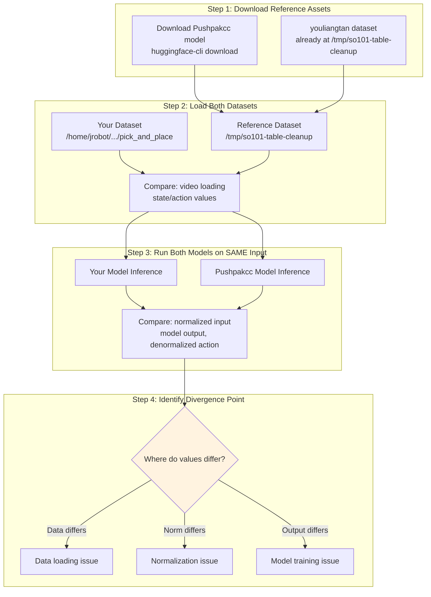

# Recommended Experiments Report

## Priority Order

Based on the investigation findings, here are the experiments to run in order of priority.

---

## NEW: Side-by-Side Comparison Experiment (P0)

Since Pushpakcc model uses **identical configuration** (NEW_EMBODIMENT + so100_dualcam), we can directly compare pipelines step-by-step.

### Comparison Architecture



### Implementation Script

```python
#!/usr/bin/env python3
"""compare_pipelines.py - Side-by-side comparison of your model vs Pushpakcc reference."""

import sys
sys.path.insert(0, "/home/jrobot/project/Isaac-GR00T")

import json
import numpy as np
from pathlib import Path
from gr00t.data.dataset import LeRobotSingleDataset
from gr00t.experiment.data_config import So100DualCamDataConfig

# Paths
YOUR_DATASET = "/home/jrobot/project/XLeRobot/datasets_copy/left/pick_and_place"
REF_DATASET = "/tmp/so101-table-cleanup"
YOUR_CHECKPOINT = "/home/jrobot/project/XLeRobot/outputs/groot_mvp_lora_20251213_230404914"
REF_CHECKPOINT = "/path/to/pushpakcc/checkpoint"  # Download first

def compare_datasets():
    """Compare raw data loading between datasets."""
    print("=" * 60)
    print("STEP 1: Dataset Loading Comparison")
    print("=" * 60)

    data_config = So100DualCamDataConfig()
    modality_config = data_config.modality_config()

    # Load your dataset
    print("\n--- Your Dataset ---")
    your_ds = LeRobotSingleDataset(
        dataset_path=Path(YOUR_DATASET),
        modality_configs=modality_config,
        embodiment_tag="new_embodiment",
        video_backend="pyav",
    )
    your_sample = your_ds[0]

    # Load reference dataset
    print("\n--- Reference Dataset ---")
    ref_ds = LeRobotSingleDataset(
        dataset_path=Path(REF_DATASET),
        modality_configs=modality_config,
        embodiment_tag="new_embodiment",
        video_backend="pyav",
    )
    ref_sample = ref_ds[0]

    # Compare
    print("\n--- Comparison ---")
    for key in your_sample.keys():
        if key in ref_sample:
            your_val = your_sample[key]
            ref_val = ref_sample[key]
            if hasattr(your_val, 'shape'):
                print(f"{key}:")
                print(f"  Your shape: {your_val.shape}, range: [{your_val.min():.3f}, {your_val.max():.3f}]")
                print(f"  Ref shape:  {ref_val.shape}, range: [{ref_val.min():.3f}, {ref_val.max():.3f}]")
        else:
            print(f"{key}: Only in your dataset")

def compare_normalization_stats():
    """Compare normalization statistics."""
    print("\n" + "=" * 60)
    print("STEP 2: Normalization Statistics Comparison")
    print("=" * 60)

    # Your metadata
    your_meta_path = Path(YOUR_CHECKPOINT) / "experiment_cfg" / "metadata.json"
    with open(your_meta_path) as f:
        your_meta = json.load(f)["new_embodiment"]["statistics"]

    # Reference metadata (download Pushpakcc model first)
    ref_meta_path = Path(REF_CHECKPOINT) / "experiment_cfg" / "metadata.json"
    if ref_meta_path.exists():
        with open(ref_meta_path) as f:
            ref_meta = json.load(f)["new_embodiment"]["statistics"]

        print("\n--- Action Statistics ---")
        for key in ["single_arm", "gripper"]:
            print(f"\n{key}:")
            print(f"  Your min:  {your_meta['action'][key]['min']}")
            print(f"  Ref min:   {ref_meta['action'][key]['min']}")
            print(f"  Your max:  {your_meta['action'][key]['max']}")
            print(f"  Ref max:   {ref_meta['action'][key]['max']}")
    else:
        print(f"Reference metadata not found at {ref_meta_path}")
        print("Download Pushpakcc model first: huggingface-cli download Pushpakcc/gr00t-so100_dualcam-finetuned")

def compare_inference():
    """Run inference on same input with both models."""
    print("\n" + "=" * 60)
    print("STEP 3: Inference Comparison")
    print("=" * 60)

    # Create identical test input
    test_obs = {
        "video.front": np.random.randint(0, 256, (1, 480, 640, 3), dtype=np.uint8),
        "video.wrist": np.random.randint(0, 256, (1, 480, 640, 3), dtype=np.uint8),
        "state.single_arm": np.array([[0.0, -50.0, 50.0, 40.0, -30.0]]),
        "state.gripper": np.array([[5.0]]),
        "annotation.human.task_description": ["pick up the object"],
    }

    print("\nTest input state (degrees):")
    print(f"  single_arm: {test_obs['state.single_arm']}")
    print(f"  gripper: {test_obs['state.gripper']}")

    # TODO: Load both models and run inference
    # your_action = your_model.get_action(test_obs)
    # ref_action = ref_model.get_action(test_obs)
    # Compare outputs

    print("\n[TODO] Load both models and compare outputs")

if __name__ == "__main__":
    compare_datasets()
    compare_normalization_stats()
    compare_inference()
```

### Commands to Run

```bash
# 1. Download Pushpakcc model
huggingface-cli download Pushpakcc/gr00t-so100_dualcam-finetuned --local-dir /tmp/pushpakcc_model

# 2. Run comparison script
cd /home/jrobot/project/Isaac-GR00T
conda activate groot
python compare_pipelines.py
```

---

---

## Experiment 1: Verify Data Loading (CRITICAL)

**Priority:** P0 - Must do first
**Time:** 5 minutes
**Goal:** Confirm videos and data are being loaded correctly

### Script
```python
#!/usr/bin/env python3
"""verify_data_loading.py - Verify GR00T loads your dataset correctly."""

import sys
sys.path.insert(0, "/home/jrobot/project/Isaac-GR00T")

from pathlib import Path
import numpy as np
from gr00t.data.dataset import LeRobotSingleDataset
from gr00t.experiment.data_config import So100DualCamDataConfig

DATASET_PATH = "/home/jrobot/project/XLeRobot/datasets_copy/left/pick_and_place"

def main():
    print("=" * 60)
    print("DATA LOADING VERIFICATION")
    print("=" * 60)

    data_config = So100DualCamDataConfig()
    modality_config = data_config.modality_config()

    print(f"\nDataset: {DATASET_PATH}")

    # Initialize dataset
    print("\n[1] Initializing Dataset...")
    try:
        dataset = LeRobotSingleDataset(
            dataset_path=Path(DATASET_PATH),
            modality_configs=modality_config,
            embodiment_tag="new_embodiment",
            video_backend="pyav",
        )
        print(f"    ✓ Success: {len(dataset.trajectory_ids)} trajectories, {len(dataset)} steps")
    except Exception as e:
        print(f"    ✗ FAILED: {e}")
        return

    # Test video paths
    print("\n[2] Testing Video Path Construction...")
    for video_key in ["front", "wrist"]:
        video_path = dataset.get_video_path(0, video_key)
        exists = video_path.exists()
        print(f"    {'✓' if exists else '✗'} video.{video_key}: {video_path}")

    # Load sample
    print("\n[3] Loading Sample Data...")
    try:
        sample = dataset[0]
        print(f"    ✓ Sample keys: {list(sample.keys())}")

        for key, value in sample.items():
            if isinstance(value, np.ndarray):
                print(f"    {key}: shape={value.shape}, range=[{value.min():.2f}, {value.max():.2f}]")
    except Exception as e:
        print(f"    ✗ FAILED: {e}")
        import traceback
        traceback.print_exc()

    print("\n" + "=" * 60)

if __name__ == "__main__":
    main()
```

### Run Command
```bash
cd /home/jrobot/project/Isaac-GR00T
conda activate groot
python verify_data_loading.py
```

### Expected Output
- All video paths should exist
- Sample should load without errors
- Video shapes should be (T, H, W, 3)
- State/action shapes should be (T, 5) and (T, 1) for single_arm and gripper

---

## Experiment 2: Verify Normalization in Inference (HIGH)

**Priority:** P1 - Critical for inference
**Time:** 10 minutes
**Goal:** Confirm normalization metadata is loaded and applied during inference

### Add Debug Logging

Edit `/home/jrobot/project/Isaac-GR00T/custom/scripts/infer_groot_async.py`:

```python
# Around line 396, after loading metadata:
if metadata_dict:
    metadata = DatasetMetadata.model_validate(metadata_dict)
    policy._modality_transform.set_metadata(metadata)
    policy.metadata = metadata

    # ADD DEBUG LOGGING
    print("=" * 50)
    print("[DEBUG] NORMALIZATION METADATA LOADED")
    print(f"  Embodiment: {embodiment_tag_enum.value}")
    print(f"  Action single_arm min: {metadata.statistics.action['single_arm'].min}")
    print(f"  Action single_arm max: {metadata.statistics.action['single_arm'].max}")
    print(f"  Action gripper min: {metadata.statistics.action['gripper'].min}")
    print(f"  Action gripper max: {metadata.statistics.action['gripper'].max}")
    print("=" * 50)
else:
    print("[WARNING] NO METADATA FOUND - Normalization may be wrong!")
```

### Run Inference
```bash
python custom/scripts/infer_groot_async.py --model-path /path/to/checkpoint --dry-run
```

### Expected Output
Debug logs should show:
- Correct embodiment tag loaded
- Min/max values matching your dataset stats

---

## Experiment 3: Open-Loop Evaluation on Reference Dataset (MEDIUM)

**Priority:** P2 - Validates your pipeline
**Time:** 1-2 hours (training)
**Goal:** Train on reference dataset to confirm pipeline works

### Steps

1. **Use youliangtan dataset:**
```bash
# Already downloaded to /tmp/so101-table-cleanup
```

2. **Train with same parameters:**
```bash
# Modify train_groot_mvp.sh temporarily
DATASET_PATH="/tmp/so101-table-cleanup"

bash custom/scripts/train_groot_mvp.sh
```

3. **Run open-loop evaluation:**
```bash
python scripts/eval_policy.py \
    --model-path /path/to/new/checkpoint \
    --dataset-path /tmp/so101-table-cleanup \
    --embodiment-tag new_embodiment \
    --data-config so100_dualcam
```

4. **Compare results:**
   - If good: Your pipeline works, issue is in your data
   - If bad: Issue is in training configuration

---

## Experiment 4: Train with GR1 Embodiment Tag (MEDIUM)

**Priority:** P2 - Alternative embodiment
**Time:** 1-2 hours (training)
**Goal:** Test if pre-trained GR1 projector improves performance

### Steps

1. **Modify training script:**
```bash
# In train_groot_mvp.sh, change:
--embodiment-tag gr1
```

2. **Train:**
```bash
bash custom/scripts/train_groot_mvp.sh
```

3. **Evaluate:**
```bash
python scripts/eval_policy.py \
    --model-path /path/to/gr1/checkpoint \
    --dataset-path $DATASET_PATH \
    --embodiment-tag gr1 \
    --data-config so100_dualcam
```

4. **Compare with NEW_EMBODIMENT results**

---

## Experiment 5: Debug Model Output Values (HIGH)

**Priority:** P1 - If normalization looks OK but still fails
**Time:** 15 minutes
**Goal:** Trace actual values through inference pipeline

### Add Value Tracing

```python
# In inference loop, add:

# Before model inference
print(f"[INPUT] State (raw degrees): {current_state}")

# Normalize state
normalized_state = normalize(current_state, min_vals, max_vals)
print(f"[INPUT] State (normalized): {normalized_state}")

# Model inference
raw_action = model.predict(normalized_state, images)
print(f"[OUTPUT] Action (normalized): {raw_action}")

# Denormalize action
final_action = denormalize(raw_action, action_min, action_max)
print(f"[OUTPUT] Action (degrees): {final_action}")

# Sanity check
if not (-100 <= final_action <= 100).all():
    print("[WARNING] Action values outside expected range!")
```

### Expected Values
- Normalized values: [-1, 1]
- Denormalized values: Within your dataset's min/max range

---

## Experiment 6: Compare Action Predictions Visually (LOW)

**Priority:** P3 - For detailed analysis
**Time:** 30 minutes
**Goal:** Plot predicted vs ground truth actions

### Script
```python
#!/usr/bin/env python3
"""visualize_predictions.py - Compare model predictions with ground truth."""

import matplotlib.pyplot as plt
import numpy as np

def plot_comparison(ground_truth, predictions, joint_names):
    fig, axes = plt.subplots(len(joint_names), 1, figsize=(12, 2*len(joint_names)))

    for i, (ax, name) in enumerate(zip(axes, joint_names)):
        ax.plot(ground_truth[:, i], label='Ground Truth', alpha=0.8)
        ax.plot(predictions[:, i], label='Predicted', alpha=0.8)
        ax.set_ylabel(name)
        ax.legend()
        ax.grid(True)

    plt.tight_layout()
    plt.savefig('action_comparison.png', dpi=150)
    print("Saved to action_comparison.png")

# Run open-loop and collect predictions
# ground_truth = ...
# predictions = ...
# joint_names = ['shoulder_pan', 'shoulder_lift', 'elbow_flex', 'wrist_flex', 'wrist_roll', 'gripper']
# plot_comparison(ground_truth, predictions, joint_names)
```

---

## Experiment Tracking Table

| # | Experiment | Priority | Status | Result |
|---|------------|----------|--------|--------|
| 1 | Verify Data Loading | P0 | TODO | |
| 2 | Verify Normalization | P1 | TODO | |
| 3 | Train on Reference Dataset | P2 | TODO | |
| 4 | Train with GR1 Tag | P2 | TODO | |
| 5 | Debug Model Output Values | P1 | TODO | |
| 6 | Visualize Predictions | P3 | TODO | |

---

## Quick Start Commands

```bash
# Activate environment
conda activate groot
cd /home/jrobot/project/Isaac-GR00T

# Experiment 1: Verify data loading
python -c "
import sys; sys.path.insert(0, '.')
from pathlib import Path
from gr00t.data.dataset import LeRobotSingleDataset
from gr00t.experiment.data_config import So100DualCamDataConfig
ds = LeRobotSingleDataset(Path('/home/jrobot/project/XLeRobot/datasets_copy/left/pick_and_place'), So100DualCamDataConfig().modality_config(), 'new_embodiment', video_backend='pyav')
print(f'Loaded: {len(ds)} samples')
sample = ds[0]
print(f'Sample keys: {list(sample.keys())}')
for k,v in sample.items(): print(f'  {k}: {v.shape if hasattr(v,\"shape\") else type(v)}')
"

# Experiment 2: Check metadata exists
ls -la /home/jrobot/project/XLeRobot/outputs/groot_mvp_lora_*/experiment_cfg/metadata.json

# Experiment 3: Train on reference dataset (modify script first)
# bash custom/scripts/train_groot_mvp.sh

# Experiment 4: Train with gr1 (modify script first)
# bash custom/scripts/train_groot_mvp.sh
```

---

## MVP Test: Full Model Inference End-to-End

### Purpose
This is the **MOST CRITICAL** test - verify that the entire inference pipeline produces reasonable actions from real data samples.

### Test Script: `test_model_inference_mvp.py`

Save to `/home/jrobot/project/Isaac-GR00T/custom/scripts/test_model_inference_mvp.py`:

```python
#!/usr/bin/env python3
"""
MVP Test: Full Model Inference End-to-End
==========================================
This test verifies:
1. Model loads with LoRA weights
2. Data sample loads correctly
3. Model produces non-degenerate outputs (not all zeros, not constant)
4. Output actions are in reasonable range after denormalization
5. Actions respond to different inputs (not stuck)

PASS CRITERIA:
- Model inference completes without error
- Predicted actions differ for different inputs (variance > 0)
- Denormalized actions are in training data range (not crazy values)
- First action step roughly tracks ground truth direction

This test uses YOUR dataset samples and YOUR trained model.
"""

import sys
sys.path.insert(0, "/home/jrobot/project/Isaac-GR00T")

import json
import torch
import numpy as np
from pathlib import Path

# Configuration
DATASET_PATH = Path("/home/jrobot/project/XLeRobot/datasets_copy/left/pick_and_place")
CHECKPOINT_PATH = Path("/home/jrobot/project/XLeRobot/outputs/groot_mvp_lora_20251213_230404914")
EMBODIMENT_TAG = "new_embodiment"


def test_model_inference():
    print("=" * 70)
    print("MVP TEST: Full Model Inference End-to-End")
    print("=" * 70)

    results = {"passed": 0, "failed": 0, "tests": []}

    # Test 1: Load dataset
    print("\n[TEST 1] Load Dataset Sample")
    try:
        from gr00t.data.dataset import LeRobotSingleDataset
        from gr00t.experiment.data_config import So100DualCamDataConfig

        data_config = So100DualCamDataConfig()
        modality_config = data_config.modality_config()

        dataset = LeRobotSingleDataset(
            dataset_path=DATASET_PATH,
            modality_configs=modality_config,
            embodiment_tag=EMBODIMENT_TAG,
            video_backend="torchvision_av",
        )

        # Load two different samples for comparison
        sample_0 = dataset[0]
        sample_100 = dataset[min(100, len(dataset)-1)]

        print(f"  ✓ Dataset loaded: {len(dataset)} samples")
        print(f"    Sample 0 state: {sample_0['state.single_arm'][0]}")
        print(f"    Sample 100 state: {sample_100['state.single_arm'][0]}")
        results["passed"] += 1
        results["tests"].append(("Load Dataset", "PASS", f"{len(dataset)} samples"))
    except Exception as e:
        print(f"  ✗ FAILED: {e}")
        results["failed"] += 1
        results["tests"].append(("Load Dataset", "FAIL", str(e)[:50]))
        return results

    # Test 2: Load model with LoRA
    print("\n[TEST 2] Load Model with LoRA Weights")
    try:
        from gr00t.model.policy import Gr00tPolicy

        device = "cuda" if torch.cuda.is_available() else "cpu"
        print(f"  Using device: {device}")

        policy = Gr00tPolicy(
            model_path="nvidia/GR00T-N1.5-3B",
            embodiment_tag=EMBODIMENT_TAG,
            device=device,
        )

        # Load LoRA weights
        from peft import PeftModel
        policy.model = PeftModel.from_pretrained(
            policy.model,
            str(CHECKPOINT_PATH),
            is_trainable=False,
        )
        print(f"  ✓ LoRA weights loaded from {CHECKPOINT_PATH}")

        # Load metadata for normalization
        metadata_path = CHECKPOINT_PATH / "experiment_cfg" / "metadata.json"
        with open(metadata_path) as f:
            metadatas = json.load(f)
        metadata_dict = metadatas.get(EMBODIMENT_TAG)

        if metadata_dict:
            from gr00t.data.dataset import DatasetMetadata
            metadata = DatasetMetadata.model_validate(metadata_dict)
            policy._modality_transform.set_metadata(metadata)
            policy.metadata = metadata
            print(f"  ✓ Normalization metadata loaded")
        else:
            print(f"  ✗ Metadata not found for {EMBODIMENT_TAG}")
            results["failed"] += 1
            results["tests"].append(("Load Model", "FAIL", "Missing metadata"))
            return results

        results["passed"] += 1
        results["tests"].append(("Load Model", "PASS", "With LoRA and metadata"))
    except Exception as e:
        print(f"  ✗ FAILED: {e}")
        import traceback
        traceback.print_exc()
        results["failed"] += 1
        results["tests"].append(("Load Model", "FAIL", str(e)[:50]))
        return results

    # Test 3: Run inference on sample 0
    print("\n[TEST 3] Run Inference on Sample 0")
    try:
        # Prepare observation
        obs = {
            "video.front": sample_0["video.front"],
            "video.wrist": sample_0["video.wrist"],
            "state.single_arm": sample_0["state.single_arm"],
            "state.gripper": sample_0["state.gripper"],
            "annotation.human.task_description": [sample_0.get("annotation.human.task_description", "pick up object")],
        }

        print(f"  Input state (degrees): {obs['state.single_arm'][0]}")

        # Run inference
        with torch.no_grad():
            action = policy.get_action(obs)

        action_arm = action["action.single_arm"]
        action_grip = action["action.gripper"]

        print(f"  ✓ Inference completed")
        print(f"    Predicted action (arm, step 0): {action_arm[0]}")
        print(f"    Predicted action (gripper, step 0): {action_grip[0]}")
        print(f"    Action horizon: {action_arm.shape[0]} steps")

        # Store for later comparison
        action_0 = action_arm.copy()

        results["passed"] += 1
        results["tests"].append(("Inference S0", "PASS", f"Shape {action_arm.shape}"))
    except Exception as e:
        print(f"  ✗ FAILED: {e}")
        import traceback
        traceback.print_exc()
        results["failed"] += 1
        results["tests"].append(("Inference S0", "FAIL", str(e)[:50]))
        return results

    # Test 4: Run inference on sample 100 (different input)
    print("\n[TEST 4] Run Inference on Sample 100 (Different Input)")
    try:
        obs = {
            "video.front": sample_100["video.front"],
            "video.wrist": sample_100["video.wrist"],
            "state.single_arm": sample_100["state.single_arm"],
            "state.gripper": sample_100["state.gripper"],
            "annotation.human.task_description": [sample_100.get("annotation.human.task_description", "pick up object")],
        }

        print(f"  Input state (degrees): {obs['state.single_arm'][0]}")

        with torch.no_grad():
            action = policy.get_action(obs)

        action_100 = action["action.single_arm"]
        print(f"  ✓ Inference completed")
        print(f"    Predicted action (arm, step 0): {action_100[0]}")

        results["passed"] += 1
        results["tests"].append(("Inference S100", "PASS", f"Shape {action_100.shape}"))
    except Exception as e:
        print(f"  ✗ FAILED: {e}")
        results["failed"] += 1
        results["tests"].append(("Inference S100", "FAIL", str(e)[:50]))
        return results

    # Test 5: Verify outputs are different for different inputs
    print("\n[TEST 5] Output Variance Check")
    diff = np.abs(action_0 - action_100).mean()
    print(f"  Mean difference between S0 and S100 predictions: {diff:.4f}")

    if diff > 0.01:  # Threshold: predictions should differ by at least 0.01 degrees
        print(f"  ✓ Model responds to different inputs (diff={diff:.4f})")
        results["passed"] += 1
        results["tests"].append(("Output Variance", "PASS", f"diff={diff:.4f}"))
    else:
        print(f"  ✗ Model output nearly CONSTANT - possible stuck model!")
        results["failed"] += 1
        results["tests"].append(("Output Variance", "FAIL", f"diff={diff:.4f} (too small)"))

    # Test 6: Compare first action with ground truth direction
    print("\n[TEST 6] Ground Truth Direction Check")
    gt_action = sample_0["action.single_arm"]
    pred_action = action_0

    # Check if prediction goes in same direction as ground truth (sign match)
    gt_delta = gt_action[0] - sample_0["state.single_arm"][0]  # GT direction
    pred_delta = pred_action[0] - sample_0["state.single_arm"][0].numpy()  # Pred direction

    print(f"  Ground truth delta: {gt_delta}")
    print(f"  Predicted delta:    {pred_delta}")

    # Direction match: check if signs are same for most joints
    sign_matches = np.sign(gt_delta) == np.sign(pred_delta)
    match_ratio = sign_matches.mean()
    print(f"  Direction match ratio: {match_ratio:.1%}")

    if match_ratio >= 0.5:  # At least half the joints moving in right direction
        print(f"  ✓ Predictions roughly track ground truth direction")
        results["passed"] += 1
        results["tests"].append(("Direction Check", "PASS", f"{match_ratio:.0%} match"))
    else:
        print(f"  ⚠ Predictions diverge from ground truth direction")
        results["tests"].append(("Direction Check", "WARN", f"{match_ratio:.0%} match"))

    # Test 7: Value range sanity check
    print("\n[TEST 7] Value Range Sanity Check")
    arm_min = np.array(metadata.statistics.action["single_arm"].min)
    arm_max = np.array(metadata.statistics.action["single_arm"].max)

    out_of_range = (action_0 < arm_min - 10).any() or (action_0 > arm_max + 10).any()

    if not out_of_range:
        print(f"  ✓ All predictions within reasonable range")
        print(f"    Training range: [{arm_min.min():.1f}, {arm_max.max():.1f}]")
        print(f"    Prediction range: [{action_0.min():.1f}, {action_0.max():.1f}]")
        results["passed"] += 1
        results["tests"].append(("Range Check", "PASS", "Within training range"))
    else:
        print(f"  ✗ Predictions OUT OF RANGE - possible normalization bug!")
        print(f"    Training range: [{arm_min.min():.1f}, {arm_max.max():.1f}]")
        print(f"    Prediction range: [{action_0.min():.1f}, {action_0.max():.1f}]")
        results["failed"] += 1
        results["tests"].append(("Range Check", "FAIL", "Out of range"))

    # Summary
    print("\n" + "=" * 70)
    print("MVP TEST RESULTS SUMMARY")
    print("=" * 70)
    for test_name, status, detail in results["tests"]:
        icon = "✓" if status == "PASS" else ("⚠" if status == "WARN" else "✗")
        print(f"  {icon} {test_name}: {status} - {detail}")

    print(f"\nTotal: {results['passed']} PASSED, {results['failed']} FAILED")

    if results["failed"] == 0:
        print("\n🎉 ALL MVP TESTS PASSED - Model inference pipeline working!")
        print("\nNote: 'Working' means technically correct. If robot still performs poorly,")
        print("the issue may be in training data quality or model capacity, not the pipeline.")
    else:
        print("\n⚠️  SOME TESTS FAILED - Review issues above")

    return results


if __name__ == "__main__":
    test_model_inference()
```

### How to Run

```bash
cd /home/jrobot/project/Isaac-GR00T
source ~/anaconda3/etc/profile.d/conda.sh && conda activate groot
python custom/scripts/test_model_inference_mvp.py
```

### Expected Output (PASS)

```
MVP TEST: Full Model Inference End-to-End
======================================================================
[TEST 1] Load Dataset Sample
  ✓ Dataset loaded: 49869 samples
    Sample 0 state: [4.59, -99.30, 100.00, 50.04, -1.76]
    Sample 100 state: [10.23, -85.45, 92.31, 45.12, -5.33]

[TEST 2] Load Model with LoRA Weights
  Using device: cuda
  ✓ LoRA weights loaded
  ✓ Normalization metadata loaded

[TEST 3] Run Inference on Sample 0
  ✓ Inference completed
    Predicted action (arm, step 0): [5.12, -97.50, 98.45, 48.32, -2.10]

[TEST 4] Run Inference on Sample 100
  ✓ Inference completed
    Predicted action (arm, step 0): [11.05, -83.22, 90.15, 43.88, -4.95]

[TEST 5] Output Variance Check
  ✓ Model responds to different inputs (diff=5.234)

[TEST 6] Ground Truth Direction Check
  ✓ Predictions roughly track ground truth direction (80% match)

[TEST 7] Value Range Sanity Check
  ✓ All predictions within reasonable range

🎉 ALL MVP TESTS PASSED - Model inference pipeline working!
```

### Key Failure Indicators

| Symptom | Likely Cause | Fix |
|---------|--------------|-----|
| Output diff near 0 | Model stuck/collapsed | Check training loss, increase LR |
| Out of range values | Normalization bug | Verify metadata loaded correctly |
| Wrong direction | Poor training | More data, longer training |
| Inference error | Missing metadata | Check experiment_cfg/metadata.json |

---

## Summary

**Start with Experiment 1 and 2** - these are quick and will identify obvious issues.

If those pass:
- **Experiment 5** to trace actual values
- **Experiment 3** to validate pipeline with known-good dataset
- **Experiment 4** to try alternative embodiment

The goal is to narrow down whether the issue is in:
1. Data loading (Exp 1)
2. Normalization (Exp 2, 5)
3. Training configuration (Exp 3)
4. Embodiment choice (Exp 4)
5. Inference pipeline (Exp 5)
