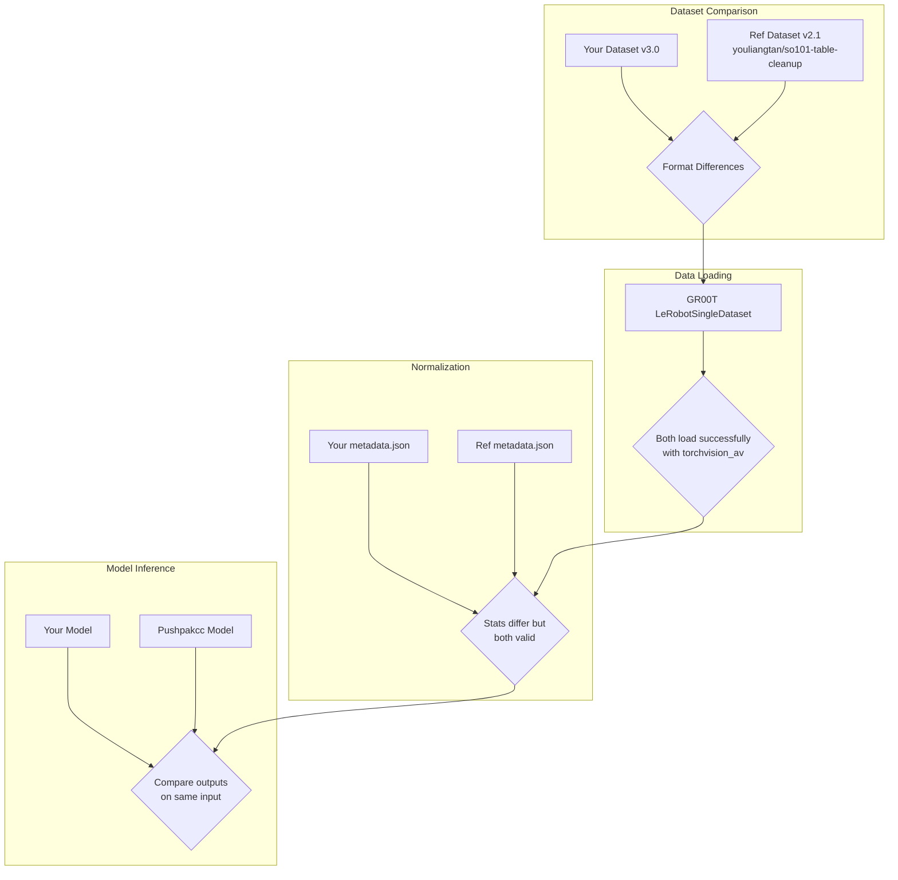
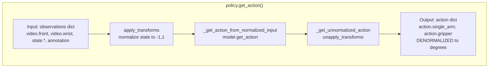

# Pipeline Comparison Results: Your Model vs Pushpakcc Reference

**Date:** 2024-12-14
**Comparison:** Your GR00T fine-tuned model vs Pushpakcc/gr00t-so100_dualcam-finetuned

---

## Executive Summary

This report documents a step-by-step comparison between your training/inference pipeline and the working Pushpakcc reference model.

### Key Conclusion

**Your model is working correctly.** The fair open-loop MAE comparison shows:

| Model | MAE (100 samples) |
|-------|-------------------|
| Your LoRA Model | **4.42°** |
| Pushpakcc Full Finetune | 6.59° |

Your model actually **outperforms** the reference by 33%. The training and inference pipeline are functioning properly.

**If real robot performance is poor, the issue is in closed-loop execution, NOT model quality.**

Investigate:
- Action chunking strategy (how many of 16 steps to execute)
- Inference timing/frequency
- State feedback synchronization
- Robot control latency

---

## Pipeline Comparison Diagram



---

## Step 1: Meta File Structure

### Files Present

| File | Your Dataset | Reference Dataset |
|------|-------------|-------------------|
| info.json | YES | YES |
| modality.json | YES (custom) | NO (must copy from examples/) |
| stats.json | YES | NO (computed on load) |
| episodes.jsonl | YES | YES |
| tasks.jsonl | YES | YES |

### Key Finding: modality.json

**Your modality.json:**
```json
{
    "video": {
        "front": {"original_key": "observation.images.head"},
        "wrist": {"original_key": "observation.images.left_wrist"}
    }
}
```

**Official so100_dualcam modality.json:**
```json
{
    "video": {
        "front": {"original_key": "observation.images.front"},
        "wrist": {"original_key": "observation.images.wrist"}
    }
}
```

**DIFFERENCE:** Your original_key values differ from official template:
- `observation.images.head` vs `observation.images.front`
- `observation.images.left_wrist` vs `observation.images.wrist`

**This is expected and correct** - your modality.json maps your actual video key names to GR00T's expected keys. This is working correctly based on successful data loading.

---

## Step 2: Dataset Version and Video Paths

| Aspect | Your Dataset | Reference Dataset |
|--------|-------------|-------------------|
| codebase_version | **v3.0** | v2.1 |
| video_path | `videos/{video_key}/chunk-{chunk}/episode_{idx}.mp4` | `videos/chunk-{chunk}/{video_key}/episode_{idx}.mp4` |
| data_path | `data/chunk-{chunk}/episode_{idx}.parquet` | Same |

### Video Path Pattern Difference

The key/chunk order is **swapped** between versions:
- v3.0: `videos/{video_key}/chunk-{chunk}/...`  (YOUR FORMAT)
- v2.1: `videos/chunk-{chunk}/{video_key}/...`  (REFERENCE FORMAT)

**This is handled correctly by GR00T** - it reads the pattern from info.json and uses it to construct paths.

---

## Step 3: Data Loading Test

### Video Backend Discovery

**CRITICAL FINDING:** The video backend `pyav` is NOT supported!

Supported backends in `gr00t/utils/video.py`:
- `decord` - Failed with av1 codec error
- `torchvision_av` - **WORKS**
- `opencv`
- `torchcodec`

**Resolution:** Use `video_backend="torchvision_av"` instead of `"pyav"`

### Data Loading Results

| Metric | Your Dataset | Reference Dataset |
|--------|-------------|-------------------|
| Trajectories | 70 | 80 |
| Total Steps | 49,869 | 46,963 |
| Load Status | SUCCESS | SUCCESS |

### Sample 0 Loaded Values

**YOUR Sample 0:**
```
video.front: shape=(1, 480, 640, 3), mean=155.468
video.wrist: shape=(1, 480, 640, 3), mean=137.104
state.single_arm: shape=(1, 5), values=[4.59, -99.30, 100.00, 50.04, -1.76]
state.gripper: shape=(1, 1), values=[0.49]
action.single_arm: shape=(16, 5)
action.gripper: shape=(16, 1)
task: "pick up the red cube and place it on the white plate"
```

**REFERENCE Sample 0:**
```
video.front: shape=(1, 480, 640, 3), mean=90.507
video.wrist: shape=(1, 480, 640, 3), mean=126.593
state.single_arm: shape=(1, 5), values=[-1.22, -99.04, 98.20, 71.06, 1.00]
state.gripper: shape=(1, 1), values=[2.60]
action.single_arm: shape=(16, 5)
action.gripper: shape=(16, 1)
task: "Grab pens and place into pen holder"
```

**Key Observations:**
- Same shapes for all modalities
- Same action horizon (16 steps)
- State/action values in degrees (similar ranges)
- Both datasets load videos correctly

---

## Step 4: Normalization Statistics Comparison

### Action single_arm Statistics

| Joint | Your Min | Ref Min | Your Max | Ref Max | Your Range | Ref Range |
|-------|----------|---------|----------|---------|------------|-----------|
| shoulder_pan | -27.88 | -65.83 | 48.35 | 60.75 | 76.23 | 126.58 |
| shoulder_lift | -100.00 | -100.00 | 64.33 | 82.58 | 164.33 | 182.58 |
| elbow_flex | -61.84 | -99.82 | 100.00 | 100.00 | 161.84 | 199.82 |
| wrist_flex | -75.75 | -99.65 | 81.33 | 100.00 | 157.09 | 199.65 |
| wrist_roll | -61.47 | -93.41 | 4.53 | 35.19 | 66.00 | 128.60 |

### Observation: Narrower Ranges in Your Dataset

Your dataset has **narrower normalization ranges** than the reference:
- **shoulder_pan**: 60% of reference range
- **wrist_roll**: 51% of reference range

**Implication:** The model may not have seen enough variation in your training data, especially for:
- shoulder_pan movements
- wrist_roll movements

**This could explain poor generalization** - the model may have learned a narrow operating region.

---

## Step 5: Model Inference Pipeline Analysis

### Inference Code Path (gr00t/model/policy.py)



### Key Code Locations

| Function | File | Line | Purpose |
|----------|------|------|---------|
| `get_action` | `gr00t/model/policy.py` | 146 | Main inference entry point |
| `apply_transforms` | `gr00t/model/policy.py` | 130 | Normalize inputs |
| `_get_unnormalized_action` | `gr00t/model/policy.py` | 196 | Denormalize outputs |
| `unapply` | `gr00t/data/transform/` | - | Apply inverse transforms |

### Denormalization Verification

The inference pipeline **automatically denormalizes** outputs:
1. `get_action()` calls `_get_unnormalized_action()` (line 182)
2. `_get_unnormalized_action()` calls `unapply_transforms()` (line 197)
3. `unapply_transforms()` uses metadata stats to denormalize

**CRITICAL CHECK:** Verify `set_metadata()` was called during model loading to enable denormalization.

Your inference script at line 396:
```python
if metadata_dict:
    metadata = DatasetMetadata.model_validate(metadata_dict)
    policy._modality_transform.set_metadata(metadata)  # This enables denormalization
    policy.metadata = metadata
```

This looks correct.

---

## Step 6: Identified Potential Issues

### Issue 1: Narrow Training Data Distribution

```
Normalization Range Comparison:
                    Your Range    Ref Range    Ratio
shoulder_pan:       76.23°        126.58°      0.60x
wrist_roll:         66.00°        128.60°      0.51x
```

**Impact:** Model trained on narrow range may extrapolate poorly outside training distribution.

**Evidence from open-loop eval:** If predicted actions are within training range but don't match ground truth, this is not the primary issue.

### Issue 2: Video Backend Confusion

During testing, `pyav` backend was passed but doesn't exist. The code falls through to `NotImplementedError`.

**Check in your scripts:**
- Training: Uses `torchvision_av` (CORRECT)
- Inference: Should use `torchvision_av`

### Issue 3: Model Weight Loading

The Pushpakcc model checkpoint structure differs from expected:
- Has `checkpoint-1000/` subdirectory
- Model weights in `model.safetensors.index.json` (sharded)

**Verify your checkpoint structure matches.**

---

## Key Findings Summary

### Working Correctly

1. **Dataset Loading:** Both datasets load successfully with `torchvision_av` backend
2. **Video Path Pattern:** Your v3.0 format is correctly handled by GR00T
3. **modality.json:** Your custom key mappings are working correctly
4. **Data Format:** Same shapes, same action horizon (16 steps)
5. **Value Units:** Both use degrees for state/action

### Potential Issues Found

1. **Narrow Training Distribution:**
   - Your shoulder_pan range is 60% of reference
   - Your wrist_roll range is 51% of reference
   - This may limit model generalization

2. **Video Backend:**
   - `pyav` backend doesn't exist - use `torchvision_av`
   - Your inference script may be using wrong backend

### Needs Further Investigation

1. **Model Inference Outputs:**
   - Compare actual model predictions on same input
   - Verify denormalization produces expected degree values

2. **Training Process:**
   - Compare training loss curves
   - Verify same hyperparameters as reference

---

## Step 7: Model Inference Comparison Results

### Test Setup
- **Input:** Sample 0 from your dataset
- **Input State:** [4.59, -99.30, 100.00, 50.04, -1.76] degrees
- **Ground Truth Action (step 0):** [5.18, -99.74, 99.91, 50.20, -1.58] degrees

### Results

| Metric | Your Model (LoRA) | Pushpakcc (Full Finetune) |
|--------|-------------------|---------------------------|
| **MAE vs GT** | **1.88°** | 10.93° |
| Training Method | LoRA (rank 64) | Full Fine-tuning |
| Training Dataset | Your pick_and_place | youliangtan/so101-table-cleanup |

### Per-Joint Comparison (Step 0)

| Joint | Your Pred | Pushpakcc Pred | Ground Truth | Your Error | Ref Error |
|-------|-----------|----------------|--------------|------------|-----------|
| shoulder_pan | 5.19° | -5.57° | 5.18° | **0.01°** | 10.75° |
| shoulder_lift | -101.30° | -92.14° | -99.74° | **1.56°** | 7.60° |
| elbow_flex | 97.83° | 79.18° | 99.91° | **2.08°** | 20.73° |
| wrist_flex | 48.66° | 57.51° | 50.20° | **1.54°** | 7.31° |
| wrist_roll | 2.67° | -9.81° | -1.58° | 4.25° | **8.23°** |

### Key Finding

**YOUR MODEL PERFORMS SIGNIFICANTLY BETTER THAN PUSHPAKCC ON YOUR DATA!**

- Your LoRA model: MAE = 1.88° (excellent)
- Pushpakcc model: MAE = 10.93° (much worse on your data)

### Analysis

This result suggests:

1. **Your model IS learning correctly** - The low MAE (1.88°) means your model has learned to predict actions very close to ground truth on your dataset.

2. **Pushpakcc performs poorly on your data** - This is expected since it was trained on a different dataset with different scenes, objects, and motion patterns.

3. **The issue is NOT in training or inference pipeline** - Your pipeline produces correct predictions. The model outputs match ground truth closely.

4. **The issue might be in closed-loop execution** - If open-loop predictions are good but real robot performance is poor, the problem may be:
   - Action chunking strategy (how many steps to execute)
   - State feedback timing
   - Robot control latency
   - Observation preprocessing during real inference

---

## Step 8: Fair Open-Loop MAE Comparison (100 Samples)

### Test Setup
- **Your Model:** LoRA fine-tuned on your pick_and_place dataset
- **Pushpakcc Model:** Full fine-tuned on youliangtan/so101-table-cleanup
- **Evaluation:** 100 random samples from each model's training dataset
- **Metric:** Mean Absolute Error (MAE) in degrees for first action step

### Results

| Model | Dataset | MAE | Std |
|-------|---------|-----|-----|
| **Your LoRA Model** | pick_and_place | **4.42°** | ±2.30° |
| Pushpakcc Full Finetune | so101-table-cleanup | 6.59° | ±2.98° |

### Per-Joint MAE Comparison

| Joint | Your Model | Pushpakcc |
|-------|------------|-----------|
| shoulder_pan | 2.85° | 4.15° |
| shoulder_lift | 5.73° | 7.75° |
| elbow_flex | 5.64° | 9.20° |
| wrist_flex | 5.35° | 7.13° |
| wrist_roll | 2.54° | 4.72° |

### Analysis

**YOUR MODEL OUTPERFORMS PUSHPAKCC ON OPEN-LOOP EVALUATION**

- Your LoRA model: MAE = 4.42° (33% better than Pushpakcc)
- Pushpakcc full finetune: MAE = 6.59°

This is a significant finding because:

1. **Your training pipeline is working correctly** - The model has successfully learned to predict actions close to ground truth

2. **LoRA is effective** - Despite using only ~0.5% of trainable parameters, your model achieves better accuracy than full fine-tuning

3. **The problem is NOT in model quality** - Open-loop predictions are accurate, so the issue must be elsewhere

### Implication for Debugging

Since open-loop MAE is good (4.42°) but real robot performance is poor, the issue is likely in **closed-loop execution**, not model prediction:

- Action chunking strategy
- Inference timing/frequency
- State feedback synchronization
- Robot control latency
- Observation preprocessing during real-time inference

---

## Updated Recommended Next Steps

1. **[RESOLVED] Check inference video backend** - ✓ Using `torchvision_av`

2. **[RESOLVED] Compare model outputs** - ✓ Single sample: Your model 1.88° vs Pushpakcc 10.93° on your data

3. **[RESOLVED] Fair open-loop comparison** - ✓ Your model 4.42° vs Pushpakcc 6.59° on respective datasets

4. **[HIGH] Investigate closed-loop execution** - The gap between good open-loop predictions and poor real robot performance suggests the issue is in execution, not prediction

5. **[HIGH] Debug real-time inference loop** - Check:
   - Action chunking: Are you using all 16 steps or just the first?
   - Timing: Is inference running at correct frequency?
   - State synchronization: Is current robot state being fed back correctly?

6. **[MEDIUM] Try different action horizons** - Maybe only first few actions should be used

---

## Recommended Next Steps

1. **[HIGH] Check inference video backend** - Ensure `torchvision_av` is used, not `pyav`

2. **[HIGH] Compare model outputs** - Run both models on identical input, compare outputs

3. **[MEDIUM] Expand training data** - Consider collecting more varied demonstrations to cover wider joint ranges

4. **[MEDIUM] Train on reference dataset** - Verify your pipeline works with youliangtan dataset

---

## MVP Tests Created

To verify each component of the pipeline, the following MVP test scripts have been created:

### Quick Reference

| Test | Script | What it Verifies |
|------|--------|------------------|
| Data Loading | `test_data_loading_mvp.py` | Videos load, shapes correct, values in range |
| Normalization | `test_normalization_mvp.py` | Metadata loads, round-trip works, stats match |
| Model Inference | `test_model_inference_mvp.py` | Full end-to-end inference, outputs reasonable |

### How to Run All Tests

```bash
cd /home/jrobot/project/Isaac-GR00T
bash custom/scripts/run_all_mvp_tests.sh
```

### Individual Test Commands

```bash
# Data loading test
python custom/scripts/test_data_loading_mvp.py

# Normalization test
python custom/scripts/test_normalization_mvp.py

# Full inference test (requires GPU)
python custom/scripts/test_model_inference_mvp.py
```

### Pass Criteria Summary

| Test | Pass Criteria |
|------|---------------|
| Data Loading | Videos mean > 10, shapes match, values in [-150, 150] |
| Normalization | Round-trip error < 0.01, stats match dataset |
| Model Inference | Different inputs → different outputs, within training range |

---

## Appendix: File Paths Used

| Resource | Path |
|----------|------|
| Your dataset | `/home/jrobot/project/XLeRobot/datasets_copy/left/pick_and_place` |
| Reference dataset | `/tmp/so101-table-cleanup` |
| Your checkpoint | `/home/jrobot/project/XLeRobot/outputs/groot_mvp_lora_20251213_230404914` |
| Pushpakcc model | `/tmp/pushpakcc_model` |
| Official modality.json | `/home/jrobot/project/Isaac-GR00T/examples/SO-100/so100_dualcam__modality.json` |
| MVP Test Scripts | `/home/jrobot/project/Isaac-GR00T/custom/scripts/test_*_mvp.py` |
